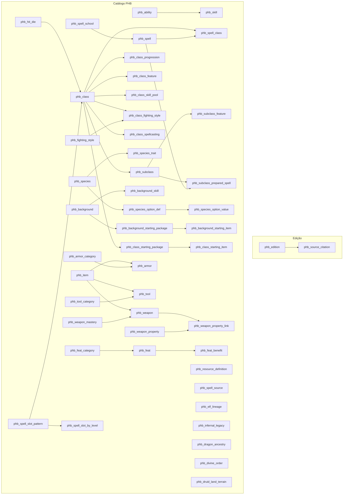

# Diagrama ER — PostgreSQL v4 (catálogo)

Schema: `rpg` | PK: `BIGSERIAL` + `slug UNIQUE` | Personagens: ver [plano-final.md](plano-final.md) fase 5

## Visão em camadas

## Entidades principais

| Tabela | PK | Relacionamentos |
|--------|-----|-----------------|
| `phb_edition` | `id` | 1:N → `phb_source_citation` |
| `phb_spell` | `id` | N:M classe; N:1 escola; citação opcional |
| `phb_class` | `id` | hub central — progression, features, spellcasting |
| `phb_subclass` | `id` | N:1 classe; magias preparadas normalizadas |
| `phb_species` | `id` | traços + EAV de opções |
| `phb_background` | `id` | perícias, talento origem, equipamento inicial |
| `phb_item` | `id` | supertipo → weapon / armor / tool |
| `phb_feat` | `id` | N:1 categoria; 1:N benefícios |

## Tipos e opções

| Tabela | Propósito |
|--------|-----------|
| `phb_resource_definition` | Fúria, Canalizar Divindade, etc. (scope species/class) |
| `phb_spell_source` | Origem polimórfica de listas de magia |
| `phb_species_option_def` / `_value` | EAV genérico (lineageId, dragonAncestryId…) |
| `phb_elf_lineage` / `phb_infernal_legacy` / `phb_dragon_ancestry` | Catálogos de escolha de espécie |
| `phb_divine_order` | Opções de clérigo (ad hoc; unificar na fase 4) |
| `phb_class_fighting_style` | Estilos disponíveis por classe |
| `phb_weapon_property_link` | Junction weapon ↔ property (fonte única) |

## Views (API SQL)

| View | Uso |
|------|-----|
| `v_spell_by_class` | Magias por classe |
| `v_phb_spell` | Detalhe de magia + edição |
| `v_phb_class` | Classe + atributos primários |
| `v_phb_subclass` | Subclasse + spell source |
| `v_phb_feat` | Talento + benefícios agregados |
| `v_class_spell_slots` | Slots por nível (jsonb_object_agg) |
| `v_phb_background` | Antecedente + opções de atributo |
| `v_phb_class_equipment` | Equipamento inicial de classe |
| `v_phb_background_equipment` | Equipamento inicial de antecedente |
| `v_phb_armor` | Armadura + categoria |
| `v_phb_class_skill_choice` | Pool de perícias por classe |
| `v_phb_subclass_prepared_spell` | Magias preparadas de subclasse |
| `v_phb_species_trait_choices` | Opções de traços polimórficos |

## Ficha de personagem (fase 5 — não implementada)

Ver especificação completa em [plano-final.md § 5](plano-final.md#fase-5--camada-de-fichas-player_character--redesign).
