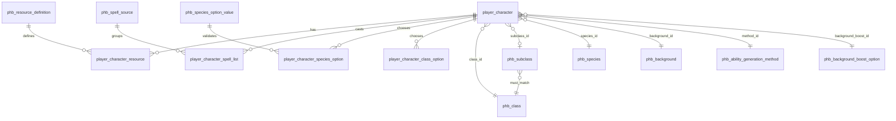

# Diagrama ER — PostgreSQL v3

Schema: `rpg` | Classe única | Híbrido: `sheet` JSONB + projeções com FKs tipadas

## Visão em camadas

```mermaid
flowchart TB
  subgraph edition [Edição]
    phb_edition
  end

  subgraph catalog [Catálogo PHB]
    phb_class --> phb_subclass
    phb_class --> phb_class_progression
    phb_class --> phb_class_feature
    phb_class --> phb_class_skill_pool
    phb_class --> phb_class_fighting_style
    phb_species --> phb_species_trait
    phb_species --> phb_species_option_def
    phb_species_option_def --> phb_species_option_value
    phb_class --> phb_class_option_def
    phb_class_option_def --> phb_class_option_value
    phb_background --> phb_background_skill
    phb_spell --> phb_spell_class
    phb_class --> phb_spell_class
    phb_subclass --> phb_subclass_prepared_spell
    phb_spell --> phb_subclass_prepared_spell
    phb_item --> phb_weapon
    phb_item --> phb_armor
    phb_item --> phb_tool
    phb_weapon --> phb_weapon_property_link
    phb_weapon_property --> phb_weapon_property_link
    phb_fighting_style --> phb_class_fighting_style
    phb_resource_definition
    phb_spell_source
    phb_ability_generation_method
    phb_background_boost_option
    phb_druid_land_terrain
  end

  subgraph character [Ficha jogador]
    player_character
    player_character --> player_character_language
    player_character --> player_character_skill
    player_character --> player_character_saving_throw
    player_character --> player_character_feat
    player_character --> player_character_equipment
    player_character --> player_character_weapon_mastery
    player_character --> player_character_expertise
    player_character --> player_character_spell_list
    player_character --> player_character_spell_slot
    player_character --> player_character_resource
    player_character --> player_character_species_option
    player_character --> player_character_class_option
  end

  phb_edition --> player_character
  phb_species --> player_character
  phb_background --> player_character
  phb_class --> player_character
  phb_subclass --> player_character
  phb_alignment --> player_character
  phb_language --> player_character_language
  phb_skill --> player_character_skill
  phb_feat --> player_character_feat
  phb_item --> player_character_equipment
  phb_weapon --> player_character_weapon_mastery
  phb_spell --> player_character_spell_list
  phb_resource_definition --> player_character_resource
  phb_spell_source --> player_character_spell_list
  phb_species_option_value --> player_character_species_option
  phb_fighting_style --> player_character_class_option
  phb_ability_generation_method --> player_character
  phb_background_boost_option --> player_character
```

## Catálogo — entidades principais

| Tabela | PK | Relacionamentos |
|--------|-----|-----------------|
| `phb_edition` | `id` | 1:N → `player_character` |
| `phb_alignment` | `id` | 1:N → `player_character` |
| `phb_language` | `id` | N:M → personagem via `player_character_language` |
| `phb_skill` | `id` | N:M classe (`phb_class_skill_pool`), antecedente, ficha |
| `phb_feat` | `id` | N:M ficha; 1:N antecedentes |
| `phb_spell` | `id` | N:M classe, subclasse, ficha |
| `phb_class` | `id` | hub central de classe |
| `phb_subclass` | `id` | N:1 `phb_class`; magias preparadas normalizadas |
| `phb_species` | `id` | traços + definições de opções |
| `phb_background` | `id` | perícias fixas + talento origem |
| `phb_item` | `id` | supertipo → weapon/armor/tool |

## Catálogo v3 — tipos e opções (novo)

| Tabela | Propósito | FKs |
|--------|-----------|-----|
| `phb_resource_definition` | Fúria, Sopro, Ancestralidade… | `species_id`, `class_id` opcionais |
| `phb_spell_source` | `class`, `elf-lineage`, `life-domain`… | `class`, `subclass`, `species`, `feat` |
| `phb_species_option_def` | `lineageId`, `giantAncestryId`… | → `phb_species` |
| `phb_species_option_value` | `high-elf`, `hill`, `red`… | → option_def |
| `phb_class_option_def` | `fightingStyleId`, `divineOrder`… | → `phb_class` |
| `phb_class_option_value` | `protector`, `thaumaturge`… | → option_def |
| `phb_weapon_property_link` | propriedades de arma | weapon ↔ property |
| `phb_class_fighting_style` | estilos por classe | class ↔ fighting_style |
| `phb_ability_generation_method` | standard-array, point-buy… | → personagem |
| `phb_background_boost_option` | two-and-one, three-plus-one | → personagem |
| `phb_druid_land_terrain` | arid, temperate… | → class_option landTerrainId |

## Ficha — `player_character`

### Colunas principais

| Coluna | Tipo | Notas |
|--------|------|-------|
| `sheet` | JSONB | round-trip com `data/characters/*.json` |
| `forca`…`carisma` | INT | projeção de `abilities` |
| `hp_*`, `ac_total` | INT | estado mutável |
| `ability_method_id` | FK | substitui JSONB parcial |
| `background_boost_id` | FK | substitui JSONB parcial |

### Filhas da ficha

| Tabela | PK | FK tipada v3 |
|--------|-----|--------------|
| `player_character_resource` | `(character_id, resource_id)` | → `phb_resource_definition` |
| `player_character_spell_list` | `(character_id, spell_id, list_type, source_id)` | → `phb_spell_source` |
| `player_character_species_option` | `(character_id, option_key)` | → `phb_species_option_value` ou skill |
| `player_character_class_option` | `(character_id, option_key)` | → fighting_style / class_option_value |
| `player_character_equipment` | `id` | UNIQUE `(character_id, slot)` WHERE equipped |

## Integridade v3 (triggers e índices)

| Regra | Mecanismo |
|-------|-----------|
| Subclasse pertence à classe | `BEFORE INSERT/UPDATE` trigger `validate_pc_subclass` |
| Subclasse só após nível de desbloqueio | trigger `validate_pc_subclass_level` |
| Um item equipado por slot | UNIQUE INDEX parcial em `player_character_equipment` |
| Expertise ⊆ perícias | validação Node (futuro: trigger) |
| `sheet` ↔ projeções | validação Node; sync trigger (fase 4) |

## Views

| View | Uso |
|------|-----|
| `v_player_character_summary` | lista UI |
| `v_spell_by_class` | catálogo magias |
| `v_character_resources` | recursos + labels |
| `v_character_spells` | magias + fonte + nível |

## Legenda v2 → v3

| v2 (texto solto) | v3 (FK) |
|------------------|---------|
| `resource_key TEXT` | `resource_id` → `phb_resource_definition` |
| `source_key TEXT` | `source_id` → `phb_spell_source` |
| `option_value TEXT` | FK → `phb_*_option_value` ou skill/style |
| `property_ids[]` | `phb_weapon_property_link` |
| `fighting_style.classes[]` | `phb_class_fighting_style` |
| `ability_generation JSONB` | `ability_method_id` + `background_boost_id` FK |

## Fora de escopo (v3)

- Multiclasse (`classLevels`)
- `phb_subclass_feature` normalizado (fase 3)

## Fase 4 — sync sheet ↔ projeções (implementado)

| Função | Direção |
|--------|---------|
| `rpg.apply_sheet_to_character(id)` | `sheet` → colunas + filhas |
| `rpg.rebuild_sheet_from_projections(id)` | projeções → `sheet` |

Triggers automáticos; seed usa `set_config('rpg.skip_sync','1')` para evitar loop no import.

Teste: `npm run validate:sync` (com banco populado).
