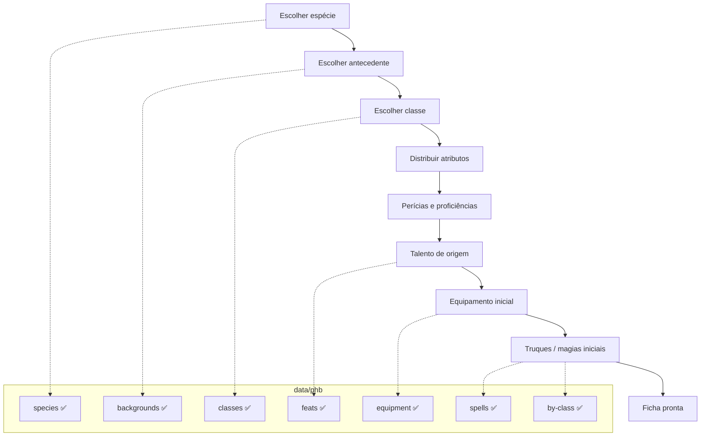

# Objetivo: fichas de personagem

Este repositório extrai o **Livro do Jogador 2024 (PT-BR)** para JSON estruturado. O objetivo final é **gerar e manter fichas de personagem** — criar, nivelar, equipar e consultar regras sem depender do PDF.

Os dados em `data/phb/` são a **biblioteca de regras**. A ficha é a **instância** de um personagem que referencia esses dados.

---

## O que uma ficha precisa cobrir

No sistema 2024, uma ficha completa reúne escolhas do jogador com valores calculados a partir das regras.

### Identidade e origem

| Campo | Origem no livro | Status dos dados |
|-------|-----------------|------------------|
| Nome, aparência, personalidade | Jogador | — |
| Espécie (traços, tamanho, velocidade) | Cap. 4 | ✅ `data/phb/species/` (10) |
| Antecedente (talento de origem, perícias, ferramenta) | Cap. 4 | ✅ `data/phb/backgrounds/` (16) |
| Idiomas (regras de criação) | Cap. 4 | **Falta extrair** (não há campo estruturado nas espécies) |

### Classe e progressão

| Campo | Origem no livro | Status dos dados |
|-------|-----------------|------------------|
| Classe, nível, subclasse | Cap. 3 | ✅ `data/phb/classes/`, `subclasses/` |
| Características por nível | Cap. 3 | ✅ `features[]` |
| Tabela de espaços de magia / truques | Cap. 3 | ✅ `progression` nas 8 classes conjuradoras |
| PV máximos por nível (`hitDie` + progressão) | Cap. 3 | Parcial — `hitDie` nas classes; tabela de PV/nível **falta** |
| Bônus de proficiência por nível | Cap. 1 | Parcial — em `progression` das 8 conjuradoras; regra geral **falta** |
| Perícias, salvaguardas, especialização | Cap. 1 + classe + antecedente | ✅ `skillIds` / `savingThrowIds` nas classes e antecedentes |

### Atributos e perícias

| Campo | Origem no livro | Status dos dados |
|-------|-----------------|------------------|
| Seis atributos e modificadores | Cap. 1 + criação | **Regras do Cap. 1 faltam** |
| Bônus de proficiência (regra geral) | Cap. 1 | **Falta** — só implícito em `progression` das conjuradoras |
| Perícias (lista e regras) | Cap. 1 | **Falta** — nomes soltos em classes/antecedentes |
| CD de magia / ataque mágico | Cap. 7 | ✅ regras em `spells/rules/intro.json` |

### Combate e recursos

| Campo | Origem no livro | Status dos dados |
|-------|-----------------|------------------|
| CA, iniciativa, deslocamento | Classe + espécie + armadura | Armaduras ✅; espécie ✅ |
| Ataques, dano, armas | Cap. 6 | ✅ `weapons/`, `armor/` |
| Condições ativas | Apêndice B | **Falta extrair** |
| Descanso, PV temporários | Cap. 1 | **Falta** |

### Magia e talentos

| Campo | Origem no livro | Status dos dados |
|-------|-----------------|------------------|
| Truques e magias conhecidas/preparadas | Cap. 3 + 7 | ✅ magias + `spells/by-class/` (8 listas) |
| Espaços de magia gastos | Cap. 3 | ✅ `progression.spellSlots` / `pactSlots` |
| Talentos (origem, geral, estilo de luta, dádiva épica) | Cap. 5 | ✅ `data/phb/feats/` |
| Invocações, canalizar divindade, etc. | Cap. 3 | ✅ em `features[]` (texto) |

### Equipamento

| Campo | Origem no livro | Status dos dados |
|-------|-----------------|------------------|
| Itens, armas, armaduras, ferramentas | Cap. 6 | ✅ `equipment/`, `armor/`, `weapons/` |
| Pacotes iniciais da classe | Cap. 3 | ✅ `startingEquipment` nas classes |
| Dinheiro (PO) | Cap. 6 | ✅ `equipment/rules/coins.json` |

---

## O que já existe no repositório

```
data/phb/
├── index.json          # índice de classes e subclasses
├── classes/            # 12 classes
├── subclasses/         # 48 subclasses
├── feats/              # 75 talentos + regras
├── backgrounds/        # 16 antecedentes + índice + regras
├── species/            # 10 espécies + índice + regras
├── equipment/          # equipamento, ferramentas, montarias, serviços
├── armor/              # armaduras
├── weapons/            # armas
├── spells/             # 391 magias + índice + regras de conjuração
│   └── by-class/       # 8 listas por classe (truques + círculos 1–9)
├── skills/             # 18 perícias + 6 atributos (índice com ids)
└── ...

data/characters/        # fichas de personagem (instâncias)
data/schema/            # JSON Schema de cada tipo de dado
```

**Volume atual:** ~586 arquivos de regras do PHB (caps. 3–7 + origens).

**Validação automatizada hoje:**

| Comando | Cobre |
|---------|--------|
| `npm run spellcasting:all` | listas por classe, progressão, PDF |
| `npm run validate:references` | skills, antecedentes, classes (schemas + ids) |
| `npm run validate:character` | fichas em `data/characters/` |

---

## Lacunas críticas para fichas

Prioridade para conseguir **criar personagem nível 1** e **subir de nível** sem o PDF:

### Extração de dados (PHB)

1. **Regras base (Cap. 1)** — atributos, método de criação, perícias, bônus de proficiência, combate, descanso.
2. **Glossário / condições (Apêndice B)** — necessário para aplicar efeitos em jogo.
3. **Idiomas (Cap. 4)** — regras de quantos idiomas o personagem conhece na criação.
4. **Tabelas de PV por nível** — hoje só `hitDie`; falta progressão estruturada nas 12 classes.
5. **Multiclasse (Apêndice A)** — se fichas precisarem de mais de uma classe.

### Modelo da ficha (camada de aplicação)

- [x] **`character.schema.json`** — escolhas, estado e **fonte** de cada elemento
- [x] **Exemplo** — `data/characters/aelindra.json`
- [x] **Validação de regras** — `validate:character` confere contagens vs tabela de progressão

A ficha separa **o que veio de onde** (classe, antecedente, espécie, subclasse, talento) em vez de listas planas.

| Referência | Na ficha |
|------------|----------|
| antecedente → talento | `feats[].featId` + `magicInitiate` |
| espécie → traços | `speciesId` + `speciesChoices` (linhagem, Sentidos Aguçados) |
| classe → magias | `spellcasting.cantrips/prepared` por chave de origem |
| pacotes iniciais | `startingPackages` + `equipment[].source` |

### Melhorias nos dados atuais (sem novo capítulo)

- Listas de magia por classe (`spells/by-class/`). ✅
- Tabelas de progressão de conjuração (truques, preparadas, slots). ✅
- Índice mestre do PHB (além do `index.json` só de classes).
- Limpeza residual: `species/rules/intro.json` (texto corrompido), legendas de arte em `spells/rules/intro.json`.
- Validador permanente para **todos** os JSON do PHB (hoje só conjuração).

## Modelo conceitual da ficha

A ficha **não** duplica texto do livro. Guarda **escolhas do jogador**, **estado de jogo** e **referências por origem**; traços completos vêm de `data/phb/species/{id}.json` + `speciesChoices`.

```json
{
  "speciesId": "elf",
  "speciesChoices": { "lineageId": "high-elf", "keenSensesSkillId": "perception" },
  "spellcasting": {
    "cantrips": {
      "class": ["…4 truques (3 da tabela + Taumaturgo)"],
      "magic-initiate": ["luz", "resistencia"],
      "elf-lineage": ["prestidigitacao-arcana"]
    },
    "prepared": {
      "class": ["…6 magias da tabela, nível 3"],
      "magic-initiate": ["escudo-da-fe"],
      "life-domain": ["auxilio", "bencao", "curar-ferimentos", "restauracao-menor"],
      "elf-lineage": ["detectar-magia"]
    },
    "slotsMax": { "1": 4, "2": 2 }
  },
  "startingPackages": { "classOption": "A", "backgroundOption": "a" },
  "equipment": [{ "itemId": "leather", "source": "class-starting", "equipped": true }]
}
```

Ver ficha completa: `data/characters/aelindra.json`.

### Campos calculados (não persistir, ou cachear)

Derivados em tempo de execução a partir dos JSON do PHB:

- Modificadores de atributo
- Bônus de proficiência
- **Texto dos traços de espécie** (Visão no Escuro, Transe, linhagem…) a partir de `speciesId` + `speciesChoices`
- CA (armadura + treinamento + escudo + efeitos)
- CD de magia e bônus de ataque mágico
- Perícias com bônus total
- Características ativas no nível atual (`features` filtradas por `level`)
- Talentos elegíveis no próximo nível

---

## Fluxo de criação de personagem



---

## Roadmap sugerido

### Fase 1 — Ficha nível 1 jogável

- [x] Extrair **espécies** e **antecedentes** (Cap. 4)
- [x] Schemas: `species.schema.json`, `background.schema.json`
- [x] Dados de classe, talento, equipamento, magia (caps. 3, 5, 6, 7)
- [x] Índice de perícias (`skills/index.json`) e normalização de `skillIds` / `itemId`
- [x] Definir schema da ficha: `character.schema.json`
- [x] Pasta `data/characters/` — exemplo `aelindra.json`
- [x] Resolver referências por `id` (equipamento e perícias nos pacotes iniciais)

### Fase 2 — Progressão e magia

- [x] Tabelas de nível estruturadas nas 8 classes conjuradoras (truques, preparadas, slots)
- [x] `spells/by-class/*.json` — índice invertido por classe
- [x] Pipeline de validação da conjuração (`spellcasting:all`)
- [ ] Tabelas de PV por nível nas 12 classes
- [ ] Lógica de subida de nível (novas features, talento ASI, magias)
- [ ] Multiclasse (Apêndice A), se necessário

### Fase 3 — Jogo em mesa

- [ ] Regras de combate e perícias (Cap. 1)
- [ ] Condições (Apêndice B)
- [ ] Atualizar PV, slots, descanso, inspiração
- [ ] Exportar ficha (PDF/HTML) ou UI

### Fase 4 — Qualidade e manutenção

- [x] Validador da conjuração (Ajv + checagens + PDF)
- [x] Validadores de referências e fichas (`validate:references`, `validate:character`)
- [ ] Validador permanente de **todo** o PHB (sem depender de PDF)
- [ ] Índice mestre `data/phb/manifest.json`
- [ ] Testes de integridade entre fichas e regras

---

## Convenções úteis para fichas

| Tipo | Padrão de `id` | Exemplo |
|------|----------------|---------|
| Espécie | slug PT ou EN | `elf`, `elfo` |
| Antecedente | slug | `acolyte`, `acolito` |
| Classe | inglês | `cleric` |
| Subclasse | inglês | `life` |
| Magia | slug PT | `curar-ferimentos` |
| Perícia | inglês (kebab) | `medicine`, `religion` |
| Atributo | português (slug) | `sabedoria`, `destreza` |
| Talento | inglês | `alert` |
| Item | inglês | `chain-mail` |

Os dados atuais já usam `id` em inglês para classes/talentos/itens e slug PT para magias. **Novas fichas devem seguir os `id` dos arquivos existentes** — consultar os `index.json` de cada capítulo.

---

## Fora do escopo imediato

- **Itens mágicos completos** — catálogo no Livro do Mestre, não no Jogador.
- **Monstros e NPCs** — Livro dos Monstros.
- **Campanhas e cenário** — outros produtos.

A ficha pode referenciar um item mágico por nome, mas o banco de dados de itens mágicos seria outro livro.

---

## Próximo passo recomendado

**Fase 1 concluída** — dados do PHB + modelo de ficha + exemplo jogável. Próximos blocos:

1. **Cap. 1 + Apêndice B** — regras de combate, perícias, condições (extração).
2. **Tabelas de PV por nível** nas 12 classes.
3. **UI ou exportação** — renderizar ficha a partir de `data/characters/` + `data/phb/`.
4. **Lógica de subida de nível** — app que consulta `features` e `progression`.
