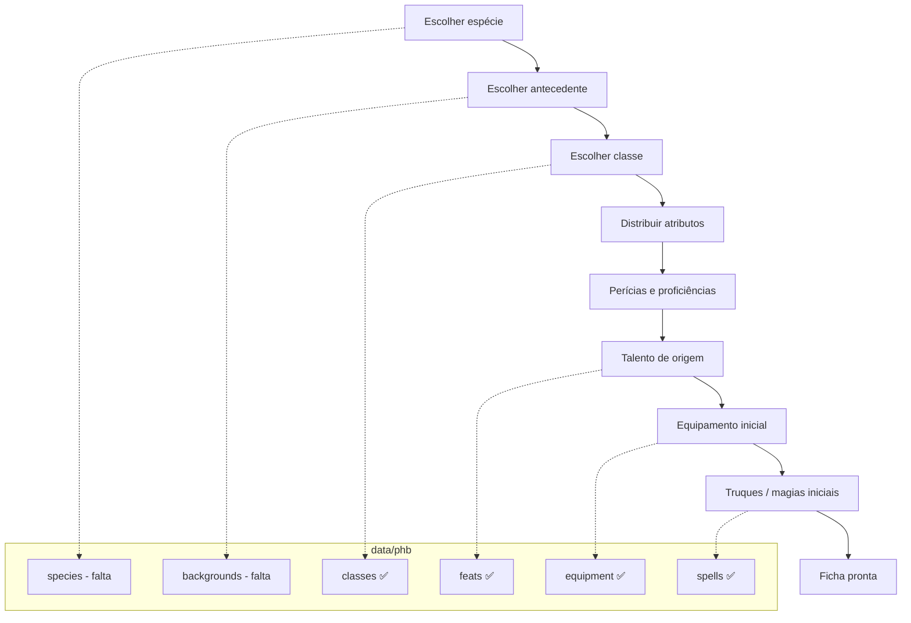

# Objetivo: fichas de personagem

Este repositório extrai o **Livro do Jogador 2024 (PT-BR)** para JSON estruturado. O objetivo final é **gerar e manter fichas de personagem** — criar, nivelar, equipar e consultar regras sem depender do PDF.

Os dados em `data/phb/` são a **biblioteca de regras**. A ficha é a **instância** de um personagem que referencia esses dados.

---

## O que uma ficha precisa cobrir

No sistema 2024, uma ficha completa reúne escolhas do jogador com valores calculados a partir das regras.

### Identidade e origem

| Campo | Origem no livro | Status dos dados |
|-------|-----------------|------------------|
| Nome, aparência, personalidade | Jogador | — |
| Espécie (traços, tamanho, velocidade, idiomas) | Cap. 2 | **Falta extrair** |
| Antecedente (talento de origem, perícias, ferramenta) | Cap. 4 | ✅ `data/phb/backgrounds/` (16) |
| Idiomas | Cap. 2 | **Falta extrair** |

### Classe e progressão

| Campo | Origem no livro | Status dos dados |
|-------|-----------------|------------------|
| Classe, nível, subclasse | Cap. 3 | ✅ `data/phb/classes/`, `subclasses/` |
| PV, dado de vida, proficiências | Cap. 3 | ✅ nas classes |
| Características por nível | Cap. 3 | ✅ `features[]` |
| Tabela de espaços de magia / truques | Cap. 3 | ⚠️ embutida em texto; não estruturada |

### Atributos e perícias

| Campo | Origem no livro | Status dos dados |
|-------|-----------------|------------------|
| Seis atributos e modificadores | Cap. 1 + criação | **Regras do Cap. 1 faltam** |
| Bônus de proficiência por nível | Cap. 1 | **Falta** |
| Perícias, salvaguardas, especialização | Cap. 1 + classe + antecedente | Parcial (classes têm `skillChoices`) |
| CD de magia / ataque mágico | Cap. 7 | ✅ regras em `spells/rules/intro.json` |

### Combate e recursos

| Campo | Origem no livro | Status dos dados |
|-------|-----------------|------------------|
| CA, iniciativa, deslocamento | Classe + espécie + armadura | Armaduras ✅; espécie falta |
| Ataques, dano, armas | Cap. 6 | ✅ `weapons/`, `armor/` |
| Condições ativas | Apêndice B | **Falta extrair** |
| Descanso, PV temporários | Cap. 1 | **Falta** |

### Magia e talentos

| Campo | Origem no livro | Status dos dados |
|-------|-----------------|------------------|
| Truques e magias conhecidas/preparadas | Cap. 3 + 7 | Magias ✅; listas por classe ⚠️ deriváveis |
| Espaços de magia gastos | Cap. 3 | Tabela não estruturada |
| Talentos (origem, geral, estilo de luta, dádiva épica) | Cap. 5 | ✅ `data/phb/feats/` |
| Invocações, canalizar divindade, etc. | Cap. 3 | ✅ em `features[]` (texto) |

### Equipamento

| Campo | Origem no livro | Status dos dados |
|-------|-----------------|------------------|
| Itens, armas, armaduras, ferramentas | Cap. 6 | ✅ `equipment/`, `armor/`, `weapons/` |
| Pacotes iniciais da classe | Cap. 3 | ✅ `startingEquipment` nas classes |
| Dinheiro (PO) | Cap. 6 | ✅ `equipment/rules/coins.json` |

---

## O que já existe no repositório

```
data/phb/
├── index.json          # índice de classes e subclasses
├── classes/            # 12 classes
├── subclasses/         # 48 subclasses
├── feats/              # 75 talentos + regras
├── backgrounds/        # 16 antecedentes + índice + regras
├── equipment/          # equipamento, ferramentas, montarias, serviços
├── armor/              # armaduras
├── weapons/            # armas
└── spells/             # 391 magias + índice + regras de conjuração

data/schema/            # JSON Schema de cada tipo de dado
```

**Volume atual:** ~547 arquivos de regras do PHB (caps. 3, 5, 6 e 7).

---

## Lacunas críticas para fichas

Prioridade para conseguir **criar personagem nível 1** e **subir de nível** sem o PDF:

1. **Espécies (Cap. 4)** — traços, tamanho, velocidade, idiomas.
2. **Regras base (Cap. 1)** — atributos, perícias, bônus de proficiência, combate, descanso.
3. **Glossário / condições (Apêndice B)** — necessário para aplicar efeitos em jogo.
4. **Multiclasse (Apêndice A)** — se fichas precisarem de mais de uma classe.
5. **Índices cruzados** — hoje as referências são strings soltas; a ficha precisa de `id` estáveis:
   - antecedente → `featId` de origem
   - classe → `subclassId`
   - magias preparadas → `spellId` (ex.: `bola-de-fogo`)
   - equipamento → `itemId` (ex.: `leather`)

### Melhorias nos dados atuais (sem novo capítulo)

- Listas de magia por classe (`spells/by-class/`) derivadas do campo `classes` de cada magia.
- Índice mestre do PHB (além do `index.json` só de classes).
- Limpeza residual em `spells/rules/intro.json` e legendas de ilustração em algumas classes.
- Tabelas de progressão estruturadas (PV por nível, espaços de magia, truques) em vez de só texto em `features`.

---

## Modelo conceitual da ficha

A ficha **não** deve duplicar texto do livro. Ela guarda escolhas e estado; o app resolve o resto consultando `data/phb/`.

```json
{
  "id": "uuid-ou-slug",
  "name": "Aelindra",
  "level": 3,
  "speciesId": "elf",
  "backgroundId": "acolyte",
  "classId": "cleric",
  "subclassId": "life",
  "abilities": {
    "forca": 10,
    "destreza": 14,
    "constituicao": 13,
    "inteligencia": 10,
    "sabedoria": 16,
    "carisma": 8
  },
  "skillProficiencies": ["medicina", "religiao"],
  "expertise": ["medicina"],
  "savingThrowProficiencies": ["sabedoria", "carisma"],
  "featIds": ["alert"],
  "knownSpellIds": ["chama-sagrada", "orientacao", "taumaturgia"],
  "preparedSpellIds": ["curar-ferimentos", "escudo-da-fe", "benção"],
  "equipment": [
    { "itemId": "chain-mail", "equipped": true, "slot": "armor" },
    { "itemId": "mace", "equipped": true, "slot": "mainHand" }
  ],
  "hp": { "current": 24, "max": 24, "temp": 0 },
  "spellSlots": { "1": 4, "2": 2 },
  "notes": ""
}
```

### Campos calculados (não persistir, ou cachear)

Derivados em tempo de execução a partir dos JSON do PHB:

- Modificadores de atributo
- Bônus de proficiência
- CA (armadura + treinamento + escudo + efeitos)
- CD de magia e bônus de ataque mágico
- Perícias com bônus total
- Características ativas no nível atual (`features` filtradas por `level`)
- Talentos elegíveis no próximo nível

---

## Fluxo de criação de personagem



---

## Roadmap sugerido

### Fase 1 — Ficha nível 1 jogável

- [ ] Extrair **espécies** e **antecedentes** (Cap. 2)
- [ ] Schemas: `species.schema.json`, `background.schema.json`
- [ ] Definir schema da ficha: `character.schema.json`
- [ ] Pasta `data/characters/` (exemplos + fichas reais do grupo)
- [ ] Resolver referências por `id` (classe, magia, talento, item)

### Fase 2 — Progressão e magia

- [ ] Tabelas de nível estruturadas nas classes (PV, slots, truques)
- [ ] `spells/by-class/*.json` ou índice invertido
- [ ] Lógica de subida de nível (novas features, talento ASI, magias)
- [ ] Multiclasse (Apêndice A), se necessário

### Fase 3 — Jogo em mesa

- [ ] Regras de combate e perícias (Cap. 1)
- [ ] Condições (Apêndice B)
- [ ] Atualizar PV, slots, descanso, inspiração
- [ ] Exportar ficha (PDF/HTML) ou UI

### Fase 4 — Qualidade e manutenção

- [ ] Validador permanente dos JSON do PHB (sem pipeline de PDF)
- [ ] Índice mestre `data/phb/manifest.json`
- [ ] Testes de integridade entre fichas e regras

---

## Convenções úteis para fichas

| Tipo | Padrão de `id` | Exemplo |
|------|----------------|---------|
| Espécie | slug PT ou EN | `elf`, `elfo` |
| Antecedente | slug | `acolyte`, `acolito` |
| Classe | inglês | `cleric` |
| Subclasse | inglês | `life` |
| Magia | slug PT | `curar-ferimentos` |
| Talento | inglês | `alert` |
| Item | inglês | `chain-mail` |

Os dados atuais já usam `id` em inglês para classes/talentos/itens e slug PT para magias. **Novas fichas devem seguir os `id` dos arquivos existentes** — consultar os `index.json` de cada capítulo.

---

## Fora do escopo imediato

- **Itens mágicos completos** — catálogo no Livro do Mestre, não no Jogador.
- **Monstros e NPCs** — Livro dos Monstros.
- **Campanhas e cenário** — outros produtos.

A ficha pode referenciar um item mágico por nome, mas o banco de dados de itens mágicos seria outro livro.

---

## Próximo passo recomendado

**Capítulo 2 (Espécies + Antecedentes)** é o que mais destrava fichas: conecta diretamente com os talentos de origem (`feats/` categoria `origin`) e com as proficiências que as classes assumem na criação.

Depois disso: schema da ficha + um personagem de exemplo em `data/characters/` para validar o modelo antes de construir interface ou exportação.
