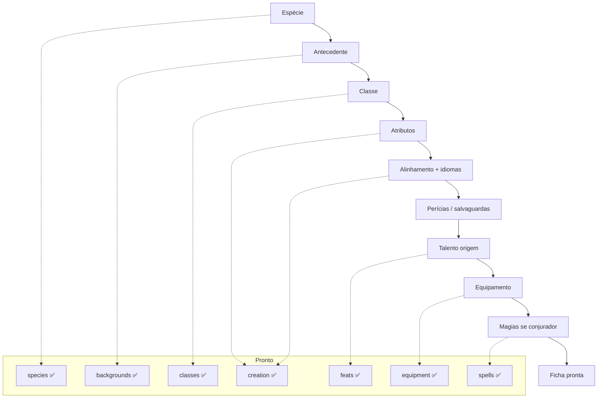

# Objetivo: fichas de personagem

Este repositório extrai o **Livro do Jogador 2024 (PT-BR)** para JSON estruturado. O foco é montar o **mínimo de dados** para montar e validar uma **ficha de personagem do jogador** — não o livro inteiro, não regras de Mestre, não monstros.

As fichas em `data/characters/` são **casos de teste de integração**: provam que espécie + antecedente + classe + magia + equipamento referenciam o acervo corretamente. **Não** é objetivo gerar UI, exportar PDF ou implementar motor de jogo.

---

## Release atual — escopo ficha do jogador

Snapshot do que consideramos **in scope** para a ficha (atualizado conforme extraímos).

### ✅ Criação nível 1 — dados prontos

| Área | Dados | Onde |
|------|--------|------|
| Origem | Espécie, antecedente | `species/`, `backgrounds/` |
| **Alinhamento** | 9 combinações + eixos | `creation/alignments.json` |
| **Atributos** | Conjunto padrão, rolagem, ponto buy, tabela por classe, bônus do antecedente | `creation/ability-generation.json` |
| **Idiomas** | Comum + 2, tabelas Comuns (1d12) e Raros | `creation/languages.json` |
| Classe | 12 classes, 48 subclasses, features, equipamento inicial | `classes/`, `subclasses/` |
| PV / nível | Dado de vida, PV fixo por nível, XP, proficiência | `hitPoints`, `rules/hp.json`, `rules/character-advancement.json` |
| Modificadores | Tabela valor → modificador | `rules/ability-modifiers.json` |
| Perícias | 18 perícias + regras de uso | `skills/` |
| Testes de D20 | Teste de atributo, salvaguarda, ataque | `rules/` |
| Magia | 391 magias, listas por classe, progressão | `spells/`, `spells/by-class/` |
| Talentos | 75 talentos | `feats/` |
| Equipamento | Armas, armaduras, itens, moedas | `weapons/`, `armor/`, `equipment/` |
| **Propriedades de armas** | Glossário + ids nas 38 armas | `weapons/properties.json`, `propertyIds`, `masteryId` |
| **Maestria em armas** | Slots por classe + escolhas na ficha | `weapons/mastery-progression.json`, `weaponMasteryWeaponIds` |
| **Propriedades de armadura** | Glossário + ids nos 13 itens | `armor/properties.json`, `propertyIds`, `acFormula` |
| **CA na ficha** | Campo derivado validado | `armorClass` + `expectedArmorClass()` |
| **Estilo de luta** | Escolha de classe | `classChoices.fightingStyleId`, `classes/fighting-styles.json` |
| Ficha de teste | Schema + validador + 2 fichas exemplo | `character.schema.json`, `validate:character` |

### ✅ Validação derivada

| Regra | Onde |
|-------|------|
| Atributos finais vs método + bônus do antecedente | `validateAbilityScores()` em `character-rules.mjs` |
| Magias de subclasse sempre preparadas | `preparedSpellsByLevel` / `preparedSpellsByTerrain` em `subclasses/*.json` |
| Maestria em armas vs nível/classe | `validateWeaponMasteryChoices()` |
| Treinamento de armadura equipada | `validateEquippedArmorTraining()` |
| CA vs armadura + escudo + estilo | `validateArmorClass()` |
| Estilo de luta (guerreiro/paladino/ranger) | `validateFightingStyle()` — inclui Combatente Abençoado/Druídico |
| Acuidade (finesse) por arma | `propertyIds: ["finesse"]` + `finesseAttackModifier()` |
| Conjuração, PV, equipamento inicial | `validate-character.mjs` |

### 🔲 Secundário (só se a ficha guardar o campo)

| Campo | Nota |
|-------|------|
| Condições ativas | Referência Apêndice C + `conditions[]` na ficha |
| Descanso | Recuperação de dados de vida / recursos |
| Percepção passiva | Calculada — fórmula em `skills/rules/passive-perception.json` |

### ⛔ Fora do escopo da ficha

Apêndice B (criaturas), raridades de item mágico (LM), combate completo, multiclasse, tipos de dano/dado como referência solta, catálogo de itens mágicos.

---

## Campos da ficha

### Texto livre (sem JSON no acervo)

Nome, aparência, personalidade, história, notas.

### Escolhas na criação

| Campo | Schema | Status |
|-------|--------|--------|
| `speciesId` + `speciesChoices` (opcional) | ✅ | Obrigatório só quando a espécie exige escolhas (ex.: linhagem élfica) |
| `backgroundId` | ✅ | |
| `classId`, `subclassId`, `classChoices` | ✅ | |
| `abilities` (6 valores finais) | ✅ | Validados vs `abilityGeneration` |
| `alignmentId` | ✅ | ex.: `neutral-good` |
| `abilityGeneration` | ✅ | `methodId` + `backgroundBoostId` |
| `languageIds` | ✅ | inclui `common` |
| `feats[]`, perícias, equipamento | ✅ | |
| `weaponMasteryWeaponIds` | ✅ | Obrigatório quando a classe concede maestria (ex.: guerreiro) |
| `armorClass` | ✅ | Total + decomposição (base, dex, escudo, estilo) |
| `classChoices.fightingStyleId` | ✅ | Guerreiro, paladino, ranger nível 1+ (ou `blessed-warrior` / `druidic-warrior`) |
| `classChoices.landTerrainId` | ✅ | Druida Círculo da Terra — terreno atual após Descanso Longo |
| `spellcasting` (opcional) | ✅ | Obrigatório só para conjuradores; omitir em guerreiro etc. |

### Estado em jogo

Nível, PV, slots usados, recursos de classe, equipamento equipado — ver `data/characters/`.

### Calculado em runtime

Modificadores, proficiência, CA, CD de magia, bônus de perícia, características do nível, percepção passiva.

---

## Acervo

```
data/phb/
├── creation/           # Cap. 2 — alinhamento, atributos, idiomas
├── species/
├── backgrounds/
├── classes/ + subclasses/
├── feats/
├── skills/ + rules/
├── rules/              # D20, PV, proficiência
├── spells/ + by-class/
└── equipment/ + armor/ + weapons/

data/characters/
  aelindra.json         # clériga elfa nível 3 (conjuração + subclasse)
  marcus.json           # guerreiro humano nível 1 (sem conjuração)
data/schema/
```

**Validação:**

```bash
npm run creation:all          # Cap. 2 criação
npm run validate:character    # fichas
npm run validate:references   # classes, antecedentes, skills
npm run rules:all             # PV, proficiência
npm run skills:all            # perícias
npm run weapons:all            # propriedades + maestria de armas
npm run armor:all              # propriedades + fórmula de CA de armaduras
npm run subclasses:all         # magias de subclasse + schema
npm run spellcasting:all      # conjuração + PDF
```

---

## Modelo da ficha

**Conjurador (nível 3+):**

```json
{
  "speciesId": "elf",
  "speciesChoices": { "lineageId": "high-elf", "keenSensesSkillId": "perception" },
  "backgroundId": "acolyte",
  "classId": "cleric",
  "subclassId": "life",
  "level": 3,
  "alignmentId": "neutral-good",
  "abilityGeneration": { "methodId": "standard-array", "backgroundBoostId": "two-and-one" },
  "languageIds": ["common", "elvish", "celestial"],
  "abilities": { "forca": 12, "destreza": 14, "constituicao": 13, "inteligencia": 11, "sabedoria": 17, "carisma": 8 },
  "spellcasting": {
    "cantrips": { "class": ["…"], "magic-initiate": ["…"], "elf-lineage": ["…"] },
    "prepared": { "class": ["…"], "life-domain": ["…"], "magic-initiate": ["…"] },
    "slotsMax": { "1": 4, "2": 2 }
  },
  "hp": { "current": 21, "max": 21 }
}
```

**Não conjurador (nível 1):** omitir `spellcasting` e `subclassId`. Incluir `weaponMasteryWeaponIds` se a classe conceder maestria. Ver `marcus.json`.

Referência completa: `data/characters/aelindra.json`, `data/characters/marcus.json`.

---

## Fluxo de criação (nível 1)



---

## Roadmap (só ficha do jogador)

### Fase 1 — Personagem nível 1 ✅

- [x] Espécies, antecedentes, classes, talentos, equipamento, magias
- [x] Perícias, PV/proficiência, regras D20
- [x] **Cap. 2** — `creation/` (alinhamento, atributos, idiomas)
- [x] Schema da ficha — `alignmentId`, `abilityGeneration`, `languageIds`
- [x] Fichas exemplo — Aelindra (nível 3) + Marcus (nível 1)
- [x] Validador: atributos finais coerentes com método + antecedente

### Fase 2 — Progressão ✅

- [x] Conjuração por nível, PV por nível
- [x] Magias de subclasse estruturadas (`preparedSpellsByLevel` em JSON)

### Fase 3 — Estado em jogo (opcional)

- [ ] Condições, descanso — se a ficha passar a rastrear

### Fase 4 — Combate na ficha ✅

- [x] Glossário de propriedades e maestrias de armas (`weapons/properties.json`)
- [x] Armas com `propertyIds`, `masteryId`, alcance/versátil/munição estruturados
- [x] **Glossário de propriedades de armadura** (`armor/properties.json`)
- [x] Armaduras com `propertyIds`, `acFormula`, `strengthMinimum`
- [x] Progressão de maestria por classe (`weapons/mastery-progression.json`)
- [x] Campo `weaponMasteryWeaponIds` na ficha + validador
- [x] Validador de treinamento de armadura equipada
- [x] **CA na ficha** (`armorClass`) validada vs equipamento + Destreza + estilo Defensivo
- [x] **Estilo de luta** (`fightingStyleId`) para guerreiro/paladino/ranger
- [x] **Acuidade (finesse)** — `propertyIds` + validador cruzado com texto legado
- [x] **Combatente Abençoado / Druídico** — alternativas em `fighting-styles.json`

### Fora do roadmap

UI, exportação, motor de combate, Apêndice B, LM, multiclasse.

---

## Convenções de `id`

| Tipo | Exemplo |
|------|---------|
| Alinhamento | `neutral-good`, `lawful-neutral` |
| Idioma | `common`, `elvish`, `celestial` |
| Método de atributos | `standard-array`, `roll`, `point-buy` |
| Bônus do antecedente | `two-and-one`, `three-plus-one` |
| Magias de subclasse | chave em `prepared` = `preparedSpellSourceKey` (ex.: `life-domain`, `moon-circle`, `devotion-oath`) |
| Terreno druida | `classChoices.landTerrainId`: `arid`, `polar`, `temperate`, `tropical` |
| Propriedade de arma | `finesse`, `light`, `thrown`, `two-handed`, … |
| Maestria de arma | `nick`, `vex`, `sap`, `cleave`, … |
| Maestria escolhida | `weapon id` (ex.: `longsword`) — não o id da propriedade |
| Propriedade de armadura | `stealth-disadvantage`, `strength-requirement`, `shield-ac-bonus` |
| Fórmula de CA | `acFormula.type`: `dex-plus-base`, `fixed`, `shield-bonus` |
| Estilo de luta | `defense`, `dueling`, `archery`, … (feat id) |
| Armadura (legado) | colunas `ac`, `strength`, `stealthDisadvantage` mantidas para leitura |
| Classe / espécie / etc. | Ver `index.json` de cada pasta |

---

## Subclasse — magias sempre preparadas

**17 subclasses** com tabela fixa estruturada (4 clérigo, 3 druida, 4 paladino, 4 bruxo, 2 ranger). Subclasses com escolha do jogador (ex.: Colégio do Conhecimento, Abjurador) ficam só no texto da feature.

Em `subclasses/{classId}-{subclassId}.json`:

```json
{
  "preparedSpellSourceKey": "life-domain",
  "preparedSpellsByLevel": {
    "3": ["auxilio", "bencao", "curar-ferimentos", "restauracao-menor"],
    "5": ["palavra-curativa-em-massa", "revivificar"]
  }
}
```

**Círculo da Terra** — escolha de terreno após Descanso Longo:

```json
{
  "preparedSpellSourceKey": "land-circle",
  "landTerrainIds": ["arid", "polar", "temperate", "tropical"],
  "preparedSpellsByTerrain": {
    "temperate": {
      "3": ["passo-nebuloso", "toque-chocante", "sono"],
      "5": ["relampago", "crescimento-de-plantas"]
    }
  }
}
```

Na ficha: `classChoices.landTerrainId` + chave `land-circle` em `spellcasting.prepared`.

O validador acumula entradas cujo nível de desbloqueio ≤ nível do personagem.

```bash
npm run subclasses:all   # apply + validate (schema + spell ids)
```

---

## Armas — propriedades e maestria

Glossário em `weapons/properties.json`. Cada arma referencia ids:

```json
{
  "id": "longsword",
  "propertyIds": ["versatile"],
  "masteryId": "sap",
  "versatileDamage": "1d10"
}
```

Maestria na ficha (guerreiro nível 1 = 3 slots):

```json
"weaponMasteryWeaponIds": ["longsword", "light-crossbow", "spear"]
```

Slots por classe/nível: `weapons/mastery-progression.json`.

Regras com ids: `weapons/rules.json` referencia o mesmo glossário de `properties.json`.

## Armaduras — propriedades e CA

Glossário em `armor/properties.json`. Cada item referencia ids e fórmula:

```json
{
  "id": "chain-mail",
  "category": "heavy",
  "propertyIds": ["stealth-disadvantage", "strength-requirement"],
  "strengthMinimum": 13,
  "acFormula": { "type": "fixed", "base": 16 }
}
```

CA na ficha (Marcus: cota de malha 16 + escudo 2 + Defensivo +1):

```json
"armorClass": {
  "total": 19,
  "base": 16,
  "dexBonus": 0,
  "shieldBonus": 2,
  "fightingStyleBonus": 1
}
```

Estilo de luta (guerreiro nível 1):

```json
"classChoices": { "fightingStyleId": "defense", "skillIds": ["history", "survival"] }
```

Regras com ids: `armor/rules.json` + `classes/fighting-styles.json`.
