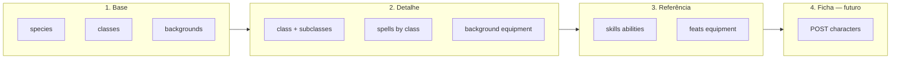

# Plano da REST API — checklist mestre

Documento de referência para implementação, testes e documentação OpenAPI.

Relacionados: [`architecture.md`](architecture.md) · [`data-model.md`](data-model.md) · [`infrastructure.md`](infrastructure.md)

## Princípios

| Decisão | Detalhe |
|---------|---------|
| Estilo | **REST** JSON, recursos por slug, sem HATEOAS na v1 |
| Catálogo | **GET público** — sem auth na fase 1–3 |
| Auth | **Fase 5 (final)** — Supabase JWT só em `game/*` |
| Regras D&D | **Dados** no Postgres; **cálculos de ficha** no BC Game (futuro) |
| Docs | **Swagger** (`/api`) em toda fase de catálogo |
| Testes | Unit + E2E por módulo; meta **≥ 80%** em services |

---

## O que o consumidor (Next.js) precisa

Fluxo típico: **criar personagem** e **consultar regras**.



### Prioridade para o usuário final

| Prioridade | Recurso REST | Uso no app |
|------------|--------------|------------|
| P0 | `GET /classes`, `/classes/:slug` | Escolha de classe | ✅ feito |
| P0 | `GET /species`, `/species/:slug` | Escolha de espécie | ✅ feito |
| P0 | `GET /backgrounds`, `/backgrounds/:slug` | Antecedente | ✅ feito |
| P0 | `GET /classes/:slug/subclasses` | Subclasse | ✅ feito |
| P1 | `GET /spells`, `/spells/:slug` | Grimoire / detalhe | ✅ feito |
| P1 | `GET /classes/:slug/spells?maxLevel=` | Lista de magias por classe | ✅ feito |
| P1 | `GET /classes/:slug/spell-slots` | Tabela de slots | ✅ feito |
| P1 | `GET /backgrounds/:slug/equipment` | Equipamento inicial | ✅ feito |
| P1 | `GET /classes/:slug/equipment` | Equipamento inicial | ✅ feito |
| P2 | `GET /feats`, `/feats/:slug` | Talentos | ✅ feito |
| P2 | `GET /skills`, `/abilities` | Referência UI | ✅ feito |
| P2 | `GET /weapons`, `/armor` | Equipamento | ✅ feito |
| P2 | `GET /species/:slug/traits` | Traços e escolhas | ✅ feito |
| P3 | `GET /alignments`, `/languages` | Formulário | ✅ feito |
| P3 | `GET /character-levels` | Tabela XP / PB | ✅ feito |
| — | `POST /characters` … | **Fase Game + Auth** | ✅ CRUD básico |

---

## Fases de entrega

| Fase | Escopo | Auth | Swagger |
|------|--------|------|---------|
| **1** | Infra API: errors, Swagger, health, paginação | Não | Setup |
| **2** | Catálogo P0 (classes, species, backgrounds, subclasses) | Não | Completo |
| **3** | Catálogo P1–P2 (spells, feats, equipment, referências) | Não | Completo |
| **4** | Regras derivadas read-only (slots, skill pools) | Não | Completo |
| **5** | Identity + Game (fichas) | **Sim** | Rotas protegidas |
| **6** | Domínio D&D (HP, level-up, validações ficha) | Sim | + exemplos |

---

## Checklist de módulos Nest (`src/catalog/`)

Legenda: `[ ]` pendente · `[~]` parcial · `[x]` feito

### Infra compartilhada (`src/shared/` ou `src/common/`)

| Item | Arquivo / pacote | Checklist |
|------|------------------|-----------|
| Filtro global de erros | `common/filters/http-exception.filter.ts` | [x] |
| Formato de erro JSON | `{ statusCode, message, error?, path, timestamp }` | [x] |
| Paginação | `common/dto/pagination.dto.ts`, `PaginatedResponseDto` | [x] |
| Health | `GET /health` → `{ status, db }` | [x] |
| Swagger | `@nestjs/swagger` em `main.ts`, prefixo `/api` | [x] |
| ValidationPipe global | `whitelist`, `transform` | [x] |

### Módulos de catálogo

| Módulo | Rotas | View / fonte | Prioridade | Status |
|--------|-------|--------------|------------|--------|
| **classes** | `GET /classes`, `GET /classes/:slug` | `v_phb_class` | P0 | [x] |
| **classes** | `GET /classes/:slug/subclasses` | `v_phb_subclass` | P0 | [x] |
| **classes** | `GET /classes/:slug/spell-slots` | `v_class_spell_slots` | P1 | [x] |
| **classes** | `GET /classes/:slug/spells` | `v_spell_by_class` | P1 | [x] |
| **classes** | `GET /classes/:slug/skills` | `v_phb_class_skill_choice` | P2 | [x] |
| **classes** | `GET /classes/:slug/equipment` | `v_phb_class_equipment` | P1 | [x] |
| **species** | `GET /species`, `GET /species/:slug` | `phb_species` + traits view | P0 | [x] |
| **species** | `GET /species/:slug/trait-choices` | `v_phb_species_trait_choices` | P2 | [x] |
| **backgrounds** | `GET /backgrounds`, `GET /backgrounds/:slug` | `v_phb_background` | P0 | [x] |
| **backgrounds** | `GET /backgrounds/:slug/equipment` | `v_phb_background_equipment` | P1 | [x] |
| **subclasses** | `GET /subclasses/:slug` | `v_phb_subclass` | P1 | [ ] |
| **subclasses** | `GET /subclasses/:slug/mechanics` | `v_phb_subclass_mechanics` | P2 | [ ] |
| **subclasses** | `GET /subclasses/:slug/spells` | `v_phb_subclass_prepared_spell` | P2 | [ ] |
| **spells** | `GET /spells`, `GET /spells/:slug` | `v_phb_spell` | P1 | [x] |
| **feats** | `GET /feats`, `GET /feats/:slug` | `v_phb_feat` | P2 | [x] |
| **skills** | `GET /skills`, `GET /skills/:slug` | `phb_skill` + ability | P2 | [x] |
| **abilities** | `GET /abilities` | `phb_ability` | P2 | [x] |
| **equipment** | `GET /weapons`, `GET /weapons/:slug` | `phb_weapon` + item | P2 | [x] |
| **equipment** | `GET /armor`, `GET /armor/:slug` | `v_phb_armor` | P2 | [x] |
| **reference** | `GET /alignments` | `phb_alignment` | P3 | [x] |
| **reference** | `GET /languages` | `phb_language` | P3 | [x] |
| **reference** | `GET /character-levels` | `phb_character_level` | P3 | [x] |

### BC Identity (fase 5 — final)

| Módulo | Item | Checklist |
|--------|------|-----------|
| **identity** | `SupabaseAuthGuard` | [x] |
| **identity** | `@CurrentUser()` decorator | [x] |
| **identity** | Swagger `@ApiBearerAuth()` em rotas game | [x] |
| **identity** | Catálogo permanece `@ApiSecurity([])` / público | [x] |

### BC Game (fase 5–6)

| Módulo | Rotas | Checklist |
|--------|-------|-----------|
| **characters** | `GET /characters`, `GET /characters/:id` | [x] |
| **characters** | `POST /characters`, `PATCH /characters/:id` | [x] |
| **characters** | `DELETE /characters/:id` | [x] |
| **characters** | Domain: HP, level, validação slugs PHB | [~] |

---

## Tratamento de erros

### Formato padrão (RFC 7800-like simplificado)

```json
{
  "statusCode": 404,
  "message": "Class 'guerreiro' not found",
  "error": "Not Found",
  "path": "/classes/guerreiro",
  "timestamp": "2026-07-03T12:00:00.000Z"
}
```

### Mapeamento

| Situação | HTTP | Nest |
|----------|------|------|
| Recurso não encontrado (slug inválido) | 404 | `NotFoundException` |
| Query param inválido | 400 | `BadRequestException` |
| Validação DTO (`class-validator`) | 400 | `ValidationPipe` automático |
| Auth ausente/inválida (fase 5) | 401 | `UnauthorizedException` |
| Acesso a ficha de outro user | 403 | `ForbiddenException` |
| Erro inesperado | 500 | filter — **sem** stack em prod |

### Checklist errors

- [x] `HttpExceptionFilter` global
- [ ] Log estruturado server-side (sem vazar stack ao client em prod)
- [ ] Mensagens em PT para `message` user-facing (opcional v1)
- [x] Testes E2E: 404 em slug inexistente por recurso

---

## Swagger (OpenAPI)

### Setup

```typescript
// main.ts (após create)
const config = new DocumentBuilder()
  .setTitle('RPG PHB API')
  .setDescription('Catálogo D&D 2024 + fichas (futuro)')
  .setVersion('1.0')
  .addBearerAuth() // usado na fase 5
  .build();
SwaggerModule.setup('api', app, SwaggerModule.createDocument(app, config));
```

### Checklist Swagger

- [x] Instalar `@nestjs/swagger`
- [x] `@ApiTags('catalog-*')` por controller
- [x] `@ApiProperty()` em todos os response DTOs (P0)
- [x] `@ApiParam({ name: 'slug' })` em rotas `:slug`
- [x] `@ApiQuery` para paginação e filtros (`maxLevel`, `page`, `limit`)
- [x] `@ApiOkResponse({ type: *ResponseDto })`
- [x] `@ApiNotFoundResponse()` nos GET `:slug`
- [ ] Export OpenAPI JSON em CI (opcional) → `openapi.json`
- [x] README: link `http://localhost:3000/api` em dev

---

## Regras de negócio D&D — onde vivem

| Tipo | Onde | Exemplo |
|------|------|---------|
| **Dados canônicos PHB** | `database/seeds/` | CD de classe, lista de magias |
| **Agregações / joins** | Views SQL `v_phb_*` | Magias por classe, equipamento |
| **Exposição read-only** | `catalog/*` service | GET sem recalcular regras |
| **Cálculos de ficha** | `game/domain/` (fase 6) | HP máx, modificador, slots usados |
| **Validação de escolhas** | `game/domain/` + `CatalogLookupService` | Classe existe? Magia na lista? |

**Não** reimplementar no TypeScript o que já está no SQL (ex.: tabela de slots em `v_class_spell_slots`).

### Checklist regras (fase 4–6)

- [x] `CatalogLookupService` — validar slugs (class, species, background, alignment, subclass)
- [ ] Documentar em Swagger descrições D&D (school, ritual, concentration)
- [ ] Fase 6: `CharacterDomainService` — HP, proficiency bonus from `character-levels`
- [ ] Testes unitários de domain com casos PHB (Guerreiro d10, Mago d6)

### Checklist refatoração application layer (fase 6)

Migrado para handlers + repository + mapper em [`src/game/characters/`](../src/game/characters/). Ver [`docs/architecture.md`](architecture.md#evitar-fat-services) e rule `application-layer`.

| Item | Checklist |
|------|-----------|
| Extrair `CharacterRepository` (persistência + `findOwnedOrFail`) | [x] |
| Extrair `character.mapper.ts` (`toDto`) | [x] |
| `CreateCharacterHandler` | [x] |
| `UpdateCharacterHandler` | [x] |
| `DeleteCharacterHandler` | [x] |
| `ListCharactersQuery` / `GetCharacterQuery` | [x] |
| `Character` aggregate + VOs (HP, level) | [ ] (`CharacterFactory` com level; aggregate completo pendente) |
| Controller injeta handlers (service removido ou vira facade) | [x] |
| Testes unitários por handler + domain (não service monolítico) | [x] |

Opcional (Catalog): ~~dividir [`classes.service.ts`](../src/catalog/classes/classes.service.ts)~~ **concluído** — todos os BCs em `queries/` + `*.mapper.ts`. Ver rule `application-layer`.

---

## Testes e coverage

### Pirâmide

| Camada | Ferramenta | O quê |
|--------|------------|-------|
| Unit | Jest | Services catalog, domain game |
| E2E | Jest + Supertest | Cada rota GET pública |
| Integração DB | Testcontainers ou DB test (opcional) | Views retornam seed |

### Meta de coverage

| Área | Meta |
|------|------|
| `catalog/**/*.service.ts` | ≥ **80%** lines |
| `game/**/domain/**` | ≥ **90%** (quando existir) |
| Controllers | E2E cobre; unit opcional |
| Global filter / pipes | 1 E2E de erro 400/404 |

### Checklist testes por módulo

Para cada módulo catalog novo:

- [x] `*.queries.spec.ts` — mock repository, findAll, findBySlug, 404 (classes, species, backgrounds)
- [~] `*.e2e-spec.ts` — GET lista 200, GET slug válido 200, slug inválido 404 (`test/catalog.e2e-spec.ts` consolidado)
- [ ] DTO snapshot ou assert campos obrigatórios
- [ ] `npm run test:cov` no CI

### Scripts sugeridos (`package.json`)

```json
{
  "test": "jest",
  "test:watch": "jest --watch",
  "test:cov": "jest --coverage",
  "test:e2e": "jest --config ./test/jest-e2e.config.js"
}
```

---

## Contrato REST — convenções

| Regra | Exemplo |
|-------|---------|
| Plural nouns | `/classes`, `/spells` |
| Slug na URL | `/classes/fighter` (slug EN do seed) |
| Nested quando 1-N claro | `/classes/fighter/spells?maxLevel=3` |
| Paginação | `?page=1&limit=20` (default limit 20, max 100) |
| JSON camelCase | `hitDie`, `primaryAbilitySlugs` |
| Sem expor `id` BIGINT | Só slug na API pública |
| Versionamento | v1 implícito; prefixo `/v1` se breaking change futuro |

---

## Ordem de implementação recomendada

```
1. shared/     errors + pagination + Swagger + health + ValidationPipe
2. species     P0
3. backgrounds P0 (+ equipment nested P1)
4. classes     completar subclasses, spells, equipment
5. spells      P1 global + detalhe
6. feats, skills, abilities, equipment
7. reference   alignments, languages, character-levels
8. test:cov    CI ≥ 80% catalog services
9. identity    SupabaseAuthGuard (ÚLTIMO antes de game)
10. game/      characters CRUD + domain D&D
```

---

## Rules / skills Cursor (derivadas)

| Tema | Rule (criar) | Skill (criar) |
|------|--------------|---------------|
| REST + Swagger | `rest-api` | `nestjs-swagger` |
| Erros | `api-errors` | — |
| Testes | `api-testing` | `nestjs-api-tests` |

Ver `.cursor/rules/` e `.cursor/skills/`.

---

## Status geral (atualizar ao implementar)

| Área | Progresso |
|------|-----------|
| Infra API (errors, swagger, health) | **100%** (fase 1) |
| Catálogo P0 | **100%** |
| Catálogo P1 | **100%** |
| Catálogo P2 | **100%** (feats, skills, abilities, weapons, armor, species traits) |
| Catálogo P3 | **100%** (alignments, languages, character-levels) |
| Testes | **~65%** (unit + E2E P0–P3; CI/cov pendente) |
| Auth | **~80%** (JWT guard + CRUD fichas; RLS Supabase pendente) |
| Game | **~40%** (CRUD; domain HP/level fase 6) |

**Última revisão:** 2026-07-03 — fase 5: Identity + characters CRUD
