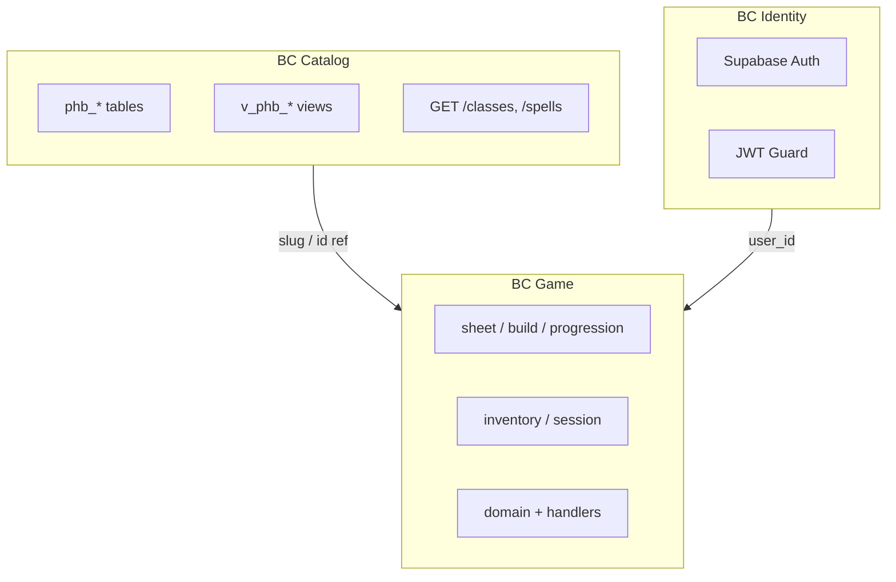
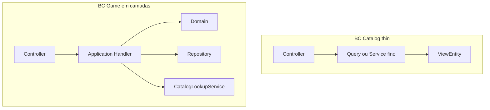

# Arquitetura — bounded contexts e camadas

Complementa [`infrastructure.md`](infrastructure.md) (stack), [`data-model.md`](data-model.md) (schema SQL) e [`api-plan.md`](api-plan.md) (REST, Swagger, testes).

## Estilo adotado

| Padrão | Escopo | Onde |
|--------|--------|------|
| **Modular monolith** | Organização do Nest | `src/` por módulo |
| **DDD estratégico** | 3 bounded contexts | Catalog, Identity, Game |
| **CQRS leve** | Read vs write | Views = query; fichas = command |
| **DDD tático** | Handlers, domain, repositories | **Só BC Game** (`sheet/`, `build/`, …) |
| **CRUD anêmico** | Catálogo PHB | `catalog/*` — intencional |

Não adotamos DDD tático completo no catálogo — o **banco SQL já é o modelo de referência**.

## Bounded contexts



### BC Catalog (atual)

- **Responsabilidade:** expor dados PHB 2024 read-only
- **Fonte de verdade:** `database/` (migrations + seeds)
- **API:** `src/catalog/` — controller → query → `@ViewEntity`
- **Sem:** agregados, domain events, mutação via API
- **Integração:** outros BCs referenciam catálogo por **slug** (contrato) ou **id** (persistência interna)

### BC Identity (atual)

- **Responsabilidade:** autenticar requests
- **Fonte de verdade:** Supabase Auth (externo)
- **API:** `src/identity/` — guards, decorators, `@CurrentUser()`
- **Sem:** modelar User como entidade de domínio rica — JWT claims bastam

### BC Game (atual)

- **Responsabilidade:** fichas, inventário, progressão, estado de mesa
- **Fonte de verdade:** tabelas `player_*` (migrations em `database/migrations/090_player/`)
- **API:** `src/game/` — submódulos `sheet/`, `build/`, `progression/`, `inventory/`, `session/`, `shared/`
- **Segurança:** ownership por `userId` + `SupabaseAuthGuard`
- **Referência ao catálogo:** slug de classe/espécie/antecedente — não duplicar regras PHB no domínio
- **Campanha / combate (7D):** ainda futuro

## CQRS leve

| Lado | Catálogo | Game |
|------|----------|------|
| **Query** | Views `v_phb_*`, GET público | GET com auth, leitura de ficha |
| **Command** | Nenhum (seeds offline) | POST/PATCH personagem, level-up, inventário, sessão |
| **Modelo leitura** | ViewEntity / SQL view | DTO de resposta |
| **Modelo escrita** | — | Handler + domain + repository |

```
Catalog:  HTTP GET → Query → ViewEntity → Postgres view
Game:     HTTP POST → Handler → Domain → Repository → Postgres
```

## Estrutura `src/` (atual)

```
src/
├── catalog/              # BC Catalog — thin (queries + mappers)
├── identity/             # BC Identity — JWT / guards
├── game/                 # BC Game
│   ├── sheet/
│   ├── build/
│   ├── progression/
│   ├── inventory/
│   ├── session/
│   └── shared/
├── entities/             # ViewEntity / entities compartilhadas
├── config/
├── app.module.ts
└── main.ts
```

## Regras de dependência

```
catalog  →  (nada de game/identity no domain)
identity   →  pode ser usado por game e catalog (guards opcionais)
game       →  pode ler catalog (service/query); referencia slug PHB
```

- **Proibido:** `catalog` importar `game`
- **Proibido:** lógica de ficha dentro de `catalog/classes`
- **Permitido:** `game` chamar `CatalogLookupService` para validar slug de classe

## Quando usar DDD tático

| Situação | Abordagem |
|----------|-----------|
| Listar magias por classe | Query + view — **sem** agregado |
| Calcular HP máximo da ficha | **VO + domain service** em `game/` |
| Validar multiclasse / regras casa | **Agregado Personagem** |
| Expor feat do PHB | Query catálogo — **sem** reimplementar benefício |

## Evitar fat services

Services que acumulam orquestração, SQL, regras de negócio, mapeamento e autorização viram difíceis de testar e manter. A solução é **separar por bounded context** — não um padrão único para todo o monolith.



### Regra de ouro

| BC | Service gordo? | Padrão |
|----|----------------|--------|
| **Catalog** | Não — alvo **&lt; ~80 linhas** por arquivo | Controller → Query → view |
| **Game** | Não — service vira fachada ou some | Controller → Handler → domain + repository |

### O que extrair (Catalog)

Quando `*.service.ts` passar de ~80 linhas ou tiver **3+ repositórios**:

1. **Mapper** — `classes.mapper.ts` com `toXxxDto`
2. **Queries** — `queries/find-class-spells.query.ts` (um arquivo por rota aninhada, método `execute()`)
3. **Lookup** — `assertClassExists` em `CatalogLookupService` (evitar duplicar por módulo)

Catálogo já segue esse padrão (`queries/` + `*.mapper.ts`).

### Game (já migrado)

Ficha e subdomínios em `src/game/`:

```
src/game/
├── sheet/           # CRUD ficha — handlers, domain, repository, mapper
├── build/           # geração de atributos
├── progression/     # level-up
├── inventory/       # inventário / slots
├── session/         # estado de mesa (HP temp, slots, conjuração)
└── shared/          # PlayerCharacter entity, CharacterRepository
```

Layout típico de `sheet/`:

```
src/game/sheet/
├── application/     # create/update/delete handlers, list/get queries
├── domain/          # validator, HP, feats, armor class, …
├── infrastructure/  # character-sheet.repository, character.mapper
├── dto/
├── characters.controller.ts
└── character-sheet.module.ts
```

| Peça | Faz | Não faz |
|------|-----|---------|
| Handler | Orquestra DTO → domain → repo | SQL direto, regra D&D complexa |
| Repository | Persistência, ownership | Validar slug PHB |
| Domain | Invariantes (nível, HP, feats) | HTTP, TypeORM |
| CatalogLookupService | Slugs existem no PHB | Calcular HP |

Contrato de talentos: **`characterFeats`** + **`featOptions`** (sem lista plana legada).

### Gatilhos de refatoração

| Sinal | Ação |
|-------|------|
| Service catalog &gt; 80 linhas | Mapper + queries |
| 3+ `toXxxDto` no mesmo service | `*.mapper.ts` |
| Regra “se… então…” D&D na ficha | `game/<submodulo>/domain/` |
| Teste unitário mocka 4+ repos | Dividir queries ou repository |
| Handler &gt; ~150 linhas | Extrair domain / validator |

Rule Cursor: `.cursor/rules/application-layer.mdc`

## Rules e skills

| Tema | Rule | Skill |
|------|------|-------|
| Contextos | `bounded-contexts` | `nestjs-bounded-context` |
| Camada aplicação | `application-layer` | `cqrs-catalog-vs-game` |
| Catálogo thin | `catalog-thin-layer` | — |
| Game DDD | `game-domain` | `cqrs-catalog-vs-game` |

Ver também: `.cursor/rules/00-orchestrator.mdc`
