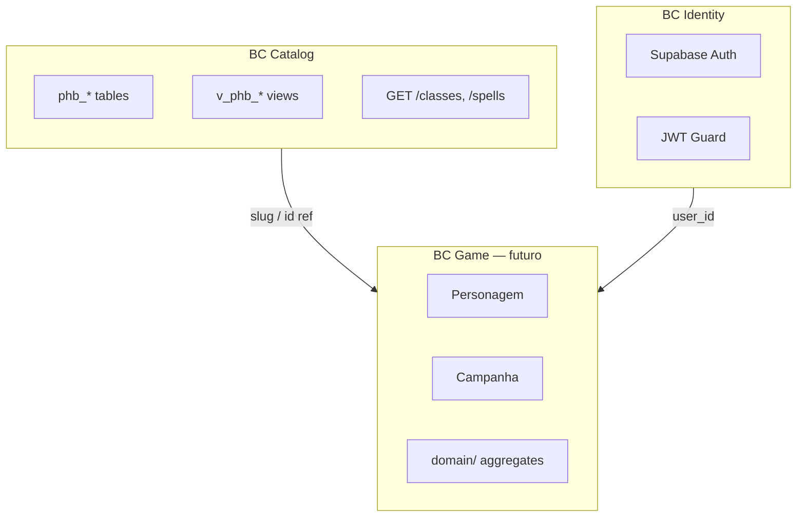

# Arquitetura — bounded contexts e camadas

Complementa [`infrastructure.md`](infrastructure.md) (stack) e [`data-model.md`](data-model.md) (schema SQL).

## Estilo adotado

| Padrão | Escopo | Onde |
|--------|--------|------|
| **Modular monolith** | Organização do Nest | `src/` por módulo |
| **DDD estratégico** | 3 bounded contexts | Catalog, Identity, Game |
| **CQRS leve** | Read vs write | Views = query; fichas = command |
| **DDD tático** | Agregados, VOs, domain services | **Só BC Game** (futuro) |
| **CRUD anêmico** | Catálogo PHB | `catalog/*` — intencional |

Não adotamos DDD tático completo no catálogo — o **banco SQL já é o modelo de referência**.

## Bounded contexts



### BC Catalog (atual)

- **Responsabilidade:** expor dados PHB 2024 read-only
- **Fonte de verdade:** `database/` (migrations + seeds)
- **API:** `src/catalog/` — controller → service → `@ViewEntity`
- **Sem:** agregados, domain events, mutação via API
- **Integração:** outros BCs referenciam catálogo por **slug** (contrato) ou **id** (persistência interna)

### BC Identity (próxima fase)

- **Responsabilidade:** autenticar requests
- **Fonte de verdade:** Supabase Auth (externo)
- **API:** `src/identity/` — guards, decorators, `@CurrentUser()`
- **Sem:** modelar User como entidade de domínio rica — JWT claims bastam

### BC Game (futuro)

- **Responsabilidade:** fichas, campanhas, inventário do jogador
- **Fonte de verdade:** tabelas `player_*` (migrations TypeORM separadas)
- **API:** `src/game/` — DDD tático onde houver regras (nível, HP, validações)
- **Segurança:** RLS `auth.uid()` + `SupabaseAuthGuard`
- **Referência ao catálogo:** slug de classe/espécie/antecedente — não duplicar regras PHB no domínio

## CQRS leve

| Lado | Catálogo | Game (futuro) |
|------|----------|---------------|
| **Query** | Views `v_phb_*`, GET público | GET com auth, leitura de ficha |
| **Command** | Nenhum (seeds offline) | POST/PATCH personagem, campanha |
| **Modelo leitura** | ViewEntity / SQL view | DTO de resposta ou projeção |
| **Modelo escrita** | — | Agregado + repository |

```
Catalog:  HTTP GET → Service → ViewEntity → Postgres view
Game:     HTTP POST → Command handler → Aggregate → Repository → Postgres table + RLS
```

## Estrutura `src/` (evolução)

```
src/
├── catalog/              # BC Catalog — thin (atual)
│   └── classes/
├── identity/             # BC Identity — guards (futuro)
│   └── guards/
├── game/                 # BC Game — DDD tático (futuro)
│   └── characters/
│       ├── domain/           # aggregate, VOs, domain services
│       ├── application/      # use cases / command handlers
│       └── infrastructure/   # TypeORM entities, repos
├── entities/             # ViewEntity compartilhadas (catalog)
├── config/
├── app.module.ts
└── main.ts
```

## Regras de dependência

```
catalog  →  (nada de game/identity no domain)
identity   →  pode ser usado por game e catalog (guards opcionais)
game       →  pode ler catalog (service/query); referencia slug PHB
```

- **Proibido:** `catalog` importar `game`
- **Proibido:** lógica de ficha dentro de `catalog/classes`
- **Permitido:** `game` chamar `CatalogLookupService` para validar slug de classe

## Quando usar DDD tático

| Situação | Abordagem |
|----------|-----------|
| Listar magias por classe | Query + view — **sem** agregado |
| Calcular HP máximo da ficha | **VO + domain service** em `game/` |
| Validar multiclasse / regras casa | **Agregado Personagem** |
| Expor feat do PHB | Query catálogo — **sem** reimplementar benefício |

## Rules e skills

| Tema | Rule | Skill |
|------|------|-------|
| Contextos | `bounded-contexts` | `nestjs-bounded-context` |
| Catálogo thin | `catalog-thin-layer` | — |
| Game DDD | `game-domain` | `cqrs-catalog-vs-game` |

Ver também: `.cursor/rules/00-orchestrator.mdc`
