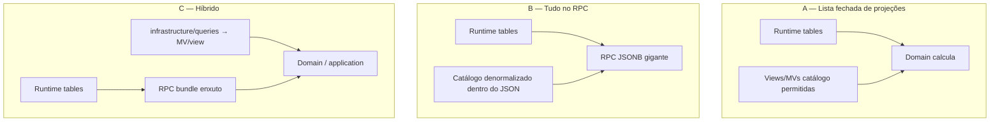

# ADR: camadas de read model — view, MV e RPC JSONB

| Campo | Valor |
|-------|--------|
| Status | **Aceito (conceitual)** — fase 2 (espelho→tabela) aplicada |
| Data | 2026-09-02 |
| Inventário | [`read-model-inventory.md`](./read-model-inventory.md) |
| Contexto | Três mecanismos de leitura (view, materialized view, RPC JSONB) coexistem; lentidão histórica veio de view no hot path da ficha, não de view no catálogo |
| Relacionado | [`catalog-patterns.md`](./catalog-patterns.md) · [`data-model.md`](./data-model.md) · [`adr-schema-consolidation.md`](./adr-schema-consolidation.md) |

## Contexto

O schema `rpg` separa **catálogo** (seeds, read-only na app) de **runtime** (ficha, mesa, campanha). Sobre as tabelas normalizadas existem:

| Mecanismo | Qtd. hoje | Papel típico |
|-----------|-----------|--------------|
| View `v_phb_*` | ~50 | Projeção de leitura do catálogo |
| Materialized view | 1 (`mv_spell_by_class`) | Cache de catálogo estático |
| RPC `RETURNS jsonb` | 3 bundles | Documento de runtime em 1 round-trip |
| JSONB em coluna | pontual (`phb_item.properties`, …) | Extensão esquema-flexível |

Este ADR **não** escolhe uma tecnologia única. Define **em qual camada cada pergunta deve ser respondida** e fecha as cinco decisões abertas da análise conceitual.

## Modelo de camadas (SSOT)

```
Camada 0  ENUM              → slug de máquina, CHECKs
Camada 1  Tabela            → verdade de escrita (seed / runtime)
Camada 2  Metadado UI       → labels, ordem (enum lookup)
Camada 3  View              → projeção virtual de catálogo
Camada 4  Materialized view → snapshot de Camada 3 (pós-seed)
Camada 5  Tabela runtime    → player_*, game_*, campaign_*
Camada 6  RPC JSONB         → documento agregado de runtime
Camada 7  JSONB coluna      → extensão variável (item DMG), não mecânica
```

**Fronteira inviolável:** Camada 3/4 **nunca** lê `player_character_*` / `game_actor_*`. Camada 6 **nunca** substitui listagem paginada de catálogo.

---

## Decisão 1 — Metadado de enum (labels, ordem)

### Opções

| Opção | Descrição | Uso no mercado |
|-------|-----------|----------------|
| **A — Tabela de lookup** | `phb_feat_category(id, slug, name, sort_order)` + FK/enum | **Mais comum** em ERP, CMS, e-commerce; Rails/Django “choices table”; fácil de editar sem migration |
| **B — ENUM + labels só na app** | Postgres enum + i18n no front/API | Muito comum em SaaS e microserviços; labels **fora** do banco |
| **C — ENUM + view VALUES** | Enum SSOT + `v_phb_*` com `VALUES (...)` | Idiom PostgreSQL; menos universal; usado quando o conjunto é pequeno e fixo |
| **D — ENUM puro** | Só slug; sem label no DB | Comum em sistemas mínimos |

### Vantagens comparadas

| | Lookup table | ENUM + app | ENUM + VALUES view |
|--|--------------|------------|---------------------|
| Editar label sem migration | ✅ | ✅ (deploy app) | ❌ (migration enum ou view) |
| FK / integridade com slug | ✅ | ⚠️ só app | ✅ cast `::enum` |
| Peso do schema (Lote A) | ❌ +N tabelas | ✅ | ✅ |
| DRY slug ↔ label | ⚠️ duplicar seed | ⚠️ duplicar código | ✅ um enum, uma view |
| i18n multi-idioma futuro | ✅ coluna `locale` | ✅ arquivos i18n | ⚠️ view por locale |
| Custo de query | JOIN | zero | zero (view inline) |

### Decisão

**Manter C — `ENUM` + view VALUES** para conjuntos pequenos e fixos (`feat_category`, `condition`, `weapon_proficiency`, `ability_generation_method`).

**Motivo no nosso contexto (não “mercado genérico”):**

- Labels PT vivem no banco (prosa PHB), descartando B como SSOT.
- Lote A **removeu** tabelas lookup em favor de enum — voltar a A aumenta peso sem ganho de domínio.
- Conjuntos são ≤20 valores, mudam com edição de livro (seed), não com operação do jogador.

**Regra:** novo lookup estático → enum na Camada 0 + view VALUES na Camada 2. **Não** recriar tabela lookup salvo necessidade de FK externa ou i18n multi-coluna no DB.

---

## Decisão 2 — Views espelho (tipo B: ~1:1 com tabela)

Exemplos: `v_phb_battle_master_maneuver`, `v_phb_persona_mask`, `v_phb_gunslinger_maneuver`.

### Vantagem de manter view espelho

| Vantagem | Detalhe |
|----------|---------|
| Contrato estável | API/`@ViewEntity` desacoplado do nome físico da tabela |
| Evolução | Renomear coluna na tabela sem quebrar consumidor se a view absorver alias |
| Consistência | Todo catálogo exposto via `v_phb_*` — uma regra mental |

### Desvantagem

| Desvantagem | Detalhe |
|-------------|---------|
| Peso conceitual | Objeto SQL que não agrega JOIN nem regra |
| Duplicação | Mesma forma da tabela; DRY de leitura zero |
| Manutenção | +1 objeto por entidade mecânica de combate |

### Decisão

**Não criar views espelho novas.** Leitura de catálogo **1:1** pode usar a **tabela `phb_*` diretamente** (Camada 1) via entity TypeORM.

**Views existentes espelho:** manter até refatoração do módulo catalog; **deprecar** gradualmente (não expandir o padrão).

**View só quando cumprir 3a (join), 3b (agregado) ou 3c (união)** — ver classificação abaixo.

---

## Decisão 3 — Agregados pesados de catálogo (tipo D/E)

Exemplos: `v_phb_feat`, `v_phb_species_trait_choices`, `v_phb_background`, `v_phb_class_economy_action`.

### Decisão

**Camada 4 — materialized view** sobre a view-mãe (Camada 3), com:

- `CREATE MATERIALIZED VIEW mv_* AS SELECT * FROM v_*`
- índice **UNIQUE** nas colunas de lookup (slug / chave natural)
- `REFRESH MATERIALIZED VIEW CONCURRENTLY` no fim de `db:seed`
- consumidor (API / TypeORM) lê **só `mv_*`**, nunca a view viva em listagens

A view-mãe permanece como **definição** (greenfield baseline, testes de SQL).

### Candidatos prioritários (implementação futura)

| View-mãe | Motivo |
|----------|--------|
| `v_phb_feat` | Vários `LATERAL jsonb_agg` por linha |
| `v_phb_species_trait_choices` | `UNION ALL` massivo |
| `v_phb_class_economy_action` | União multi-owner |
| `v_phb_background` | Agregações + subselects |

---

## Decisão 4 — Bundles de catálogo (templates, threads)

Exemplos: `v_phb_creature_template_bundle`, `v_phb_vehicle_template_bundle`, `v_phb_character_thread_bundle`.

### Decisão

**Mesmo padrão da Decisão 3 — MV + view-mãe + refresh pós-seed.**

Bundles são read models **3b** (1 root + filhos JSONB). Tráfego de compêndio (bestiário, veículos, threads) beneficia snapshot; dados mudam só no seed.

| Par | MV alvo |
|-----|---------|
| `v_phb_creature_template_bundle` | `mv_phb_creature_template_bundle` |
| `v_phb_vehicle_template_bundle` | `mv_phb_vehicle_template_bundle` |
| `v_phb_character_thread_bundle` | `mv_phb_character_thread_bundle` |

---

## Decisão 5 — Fronteira runtime ↔ catálogo

### O problema

Na **ficha** e na **mesa**, o runtime precisa **interpretar** escolhas do jogador com regras do catálogo (slots de magia, proficiências, economy actions, CA sem armadura, etc.). Há três modelos possíveis:



| Modelo | Ideia | Prós | Contras |
|--------|-------|------|---------|
| **A — Lista fechada** | Runtime chama **só** views/MVs catalogadas; domain junta | Catálogo reutilizado; RPC enxuto; validators usam mesmas projeções | Vários reads server-side (OK se 1 RTT Postgres ou colocated) |
| **B — Tudo no RPC** | Bundle JSONB já traz PB, slots, proficiências, … | 1 query no hot path | RPC vira monólito; duplica regra; quebra paginação de catálogo |
| **C — Híbrido** | RPC traz **estado** do jogador; domain/queries trazem **regras** do catálogo | Separação clara estado vs regra; bundles já existentes | Exige disciplina na lista permitida |

### Decisão

**Adotar C — híbrido**, com **lista fechada** de projeções de catálogo que runtime pode ler (modelo A dentro do híbrido).

| Camada | O que carrega |
|--------|----------------|
| **RPC bundle (Camada 6)** | Linhas de `player_character_*` / `game_actor_*` + campos derivados **baratos** (PB, size, boosts já no `get_character_sheet_bundle`) |
| **`infrastructure/queries/`** | Leitura de **MV/view** do catálogo para regras (slots, granted spells, unarmored defense, economy catalog, progression) |
| **Domain** | Calcula com **slugs + projeções**; não faz SQL |

#### Lista fechada (runtime **pode** ler)

Projeções usadas em ficha, combate, sessão ou validação — expandir só via PR + update deste ADR:

| Projeção | Uso runtime |
|----------|-------------|
| `mv_spell_by_class` | Magias por classe / validação |
| `mv_phb_class_progression` *(tabela `phb_class_progression`)* | PB, cantrips, prepared |
| `mv_class_spell_slots` / `mv_subclass_spell_slots` | Slots por nível |
| `mv_phb_*_granted_spell` | Magias concedidas |
| `mv_phb_unarmored_defense` / `mv_phb_hp_bonus_source` | CA / PV |
| `mv_phb_class_ability_boost` | Boost de atributo de classe |
| `mv_phb_species_trait_choices` / `mv_phb_heritage_trait_choices` | Validação de picks |
| `mv_phb_class_economy_action` (+ panel/table em tabela) | Mesa / painel |
| `mv_phb_feat` | Pré-requisitos / listagem |
| Views de equipamento (`v_phb_class_equipment`, …) | Pacote inicial |

#### Proibido no runtime

- View genérica encadeada para “montar ficha inteira”
- `SELECT` ad hoc em tabelas `phb_*` fora de `infrastructure/queries/` ou catalog module
- Duplicar JOIN de catálogo no validator (ver [`adr-sheet-validation-layers.md`](./adr-sheet-validation-layers.md))

#### Por que não B (tudo no RPC)?

- Regra de catálogo muda no seed → RPC precisaria replicar ou refresh parcial.
- Compêndio (`GET /feats`) e ficha compartilham SSOT; MV atende ambos.
- Supabase: 1 RPC + N queries **no mesmo connection pool** custa menos que N round-trips HTTP; bundles existentes já eliminaram o gargalo RTT.

---

## Classificação das views (referência)

| Tipo | Critério | Tratamento |
|------|----------|------------|
| **A** | VALUES lookup | Manter view (Decisão 1) |
| **B** | Espelho 1:1 | Deprecar; tabela direta (Decisão 2) |
| **C** | Join enriquecido | View; MV se list lenta |
| **D** | Agregado JSONB | View-mãe + **MV** (Decisão 3) |
| **E** | União multi-origem | View-mãe + **MV** (Decisão 3) |
| **Bundle** | Template/thread | View-mãe + **MV** (Decisão 4) |

Padrão já aplicado: `v_spell_by_class` (mãe) + `mv_spell_by_class` (consumo).

---

## JSONB — três semânticas (não unificar)

| Onde | Semântica | Exemplo |
|------|-----------|---------|
| Coluna (Camada 7) | Extensão variável por instância | `phb_item.properties` |
| View (Camada 3b) | Filhos agregados de **um** root catálogo | `benefits` em `v_phb_feat` |
| RPC (Camada 6) | Documento de **estado** do jogador | `get_character_sheet_bundle` |

---

## Política resumida (1 parágrafo)

Escreve normalizado (Camada 1). Labels de enum via VALUES view (Camada 2). Expõe catálogo via view; listagens pesadas via MV com refresh pós-seed (Camada 4). Runtime persiste em tabelas próprias (Camada 5). Hot path de ficha/mesa usa RPC JSONB para **estado** (Camada 6) + queries para **regras** de catálogo na lista fechada (Decisão 5). JSONB genérico só para extensão de item (Camada 7), nunca para mecânica tipada.

---

## Consequências

**Positivas**

- Papéis claros; fim da ambiguidade view vs RPC
- Roadmap de MVs priorizado sem benchmark prematuro
- Validators e sheet alinhados à mesma lista de projeções

**Custos / riscos**

- Implementar MVs + entities `mv_*` + refresh no seed
- Migrar consumidores de views espelho para tabela
- Manter lista fechada atualizada (disciplina de review)

## Definition of Done (implementação — fase posterior)

- [x] MVs das Decisões 3 e 4 no baseline + refresh em `run-seeds.mjs`
- [x] Entities TypeORM apontando para `mv_*` onde aplicável
- [x] Inventário views tipo B → tabela (fase 2)
- [x] `catalog-patterns.md` §10/§11 e `data-model.md` referenciam este ADR
- [x] Skill `phb-query-views` menciona MV vs view viva
- [x] Inventário objetivo: [`read-model-inventory.md`](./read-model-inventory.md)

## Histórico

| Data | Nota |
|------|------|
| 2026-09-02 | Aceite conceitual das decisões 1–5 |
| 2026-09-02 | Fase 2: 11 views espelho → tabela |
| 2026-09-02 | Fase 4.1c: 7 MVs agregados/bundles + refresh seed |
| 2026-09-02 | Fase 4.1d: +9 MVs lista fechada runtime (17 total) |
