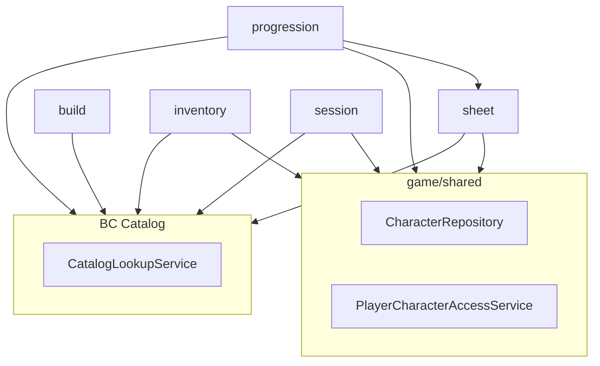

# Game BC — submódulos e domínios

Complementa [`architecture.md`](architecture.md) e [`game-advanced-plan.md`](game-advanced-plan.md).

## Problema (histórico — resolvido)

Antes do split, tudo em um único módulo de personagens virou **god module** (validator, repository, controller e inventário/progression no mesmo lugar).

## Princípio

**Um submódulo Nest = um agregado / capability do jogador**, no mesmo estilo do `catalog/` (classes, spells, …).

```
BC Game (modular monolith)
├── shared/           # ownership, repositório raiz player_character
├── sheet/            # ficha PHB (CRUD + escolhas persistidas) — CharacterSheetModule
├── build/            # criação: roll abilities
├── progression/      # level-up, preview
├── inventory/        # mochila + equipado
└── session/          # slots, condições, concentração
```

Cada submódulo:

```
<submodulo>/
├── application/      # handlers / queries
├── domain/             # regras D&D deste agregado
├── infrastructure/     # entities + repos deste agregado
├── dto/
├── *.controller.ts     # @Controller('characters') — mesmas URLs
└── *.module.ts
```

## Dependências



| De | Para | Permitido |
|----|------|-----------|
| `sheet` | `shared`, `catalog` | sim |
| `inventory` | `shared`, `catalog` | sim |
| `progression` | `shared`, `catalog`, `sheet` (domain) | sim |
| `inventory` | `sheet/infrastructure` | **não** — só via shared |
| `catalog` | `game/*` | **não** |

## URLs (inalteradas)

Todos os controllers usam `@Controller('characters')`:

| Submódulo | Rotas |
|-----------|-------|
| **sheet** | `GET/POST/PATCH/DELETE /characters`, `GET /characters/:id` |
| **build** | `POST /characters/roll-abilities` |
| **progression** | `GET/POST /characters/:id/level-up/*` |
| **inventory** | `GET/POST/PATCH/DELETE /characters/:id/inventory/*` |
| **session** | `GET/PATCH /characters/:id/state`, `POST .../spells/cast`, `POST .../rest` |

## O que fica onde

| Capability | Tabela(s) | Submódulo |
|------------|-----------|-----------|
| Núcleo da ficha | `player_character` | shared + sheet |
| Escolhas PHB | `player_character_skill`, `_species_choice`, … | sheet |
| Atributos roll | — (sem persistir) | build |
| Level-up | coluna `level` em `player_character` | progression |
| Inventário | `player_character_item` | inventory |
| Mesa ao vivo | `player_character_state` (7C) | session |

## Catalog BC (referência)

Já está dividido — **12 módulos** (`classes/`, `spells/`, …). Game deve espelhar isso.

## Checklist de migração

- [x] `game/shared` — `CharacterRepository` + `PlayerCharacterAccessService`
- [x] `game/inventory` — extrair inventário
- [x] `game/progression` — level-up
- [x] `game/build` — roll abilities
- [x] `game/sheet` — `CharacterSheetModule` em `src/game/sheet/`
- [x] `game/session` — fase 7C
- [x] Remover legado `characters.service.ts` (já removido)

**Última revisão:** 2026-07-03
