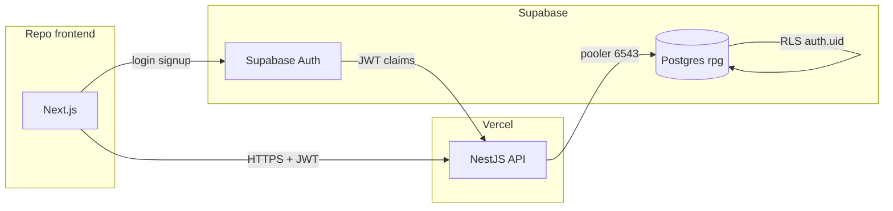

# Infraestrutura — decisão

Documento de referência para rules, skills e implementação.

**Arquitetura (BC, CQRS, DDD):** [`architecture.md`](architecture.md)

## Decisão (2026-07)

| Camada | Escolha | Motivo |
|--------|---------|--------|
| **Banco** | Supabase (Postgres) | Catálogo PHB + Auth + RLS para fichas futuras |
| **API** | NestJS na Vercel | Serverless, zero-config Nest, escala por request |
| **ORM** | TypeORM | Mapeamento `rpg.phb_*`, views, `synchronize: false` |
| **Auth** | Supabase Auth | JWT; RLS no Postgres para dados de jogador |
| **Frontend** | Next.js em **repo separado** | Este repo = SQL + API apenas |

## Diagrama



## Repositórios

| Repo | Conteúdo |
|------|----------|
| **rpg** (este) | `database/`, `src/` Nest, `.cursor/` |
| **rpg-web** (futuro) | Next.js, consome API, Supabase Auth client-side |

## Conexões

### Nest → Postgres (Supabase)

- **Produção / Vercel:** transaction pooler, porta **6543**, `?pgbouncer=true`
- **Migrations / seeds locais:** conexão direct **5432** (psql ou script)
- TypeORM: `synchronize: false`, pool `max: 1` em prod serverless

### Nest → Supabase Auth

- Validar JWT do header `Authorization: Bearer <token>`
- Usar `SUPABASE_JWT_SECRET` ou JWKS do projeto
- Rotas catálogo `phb_*`: **públicas** (sem auth)
- Rotas jogador (fase futura): guard JWT + RLS com `auth.uid()`

### Frontend → API

- CORS: `FRONTEND_URL` no Nest (domínio do Next na Vercel)
- Contrato: JSON, slugs na URL, sem expor `id` BIGINT
- Auth: Next usa `@supabase/supabase-js`; API valida mesmo JWT

## Ambientes

| Ambiente | API | DB | Auth |
|----------|-----|-----|------|
| Local | `nest start --watch` :3000 | Postgres local ou Supabase dev | Supabase project dev |
| Preview | Vercel preview URL | Supabase (branch ou dev) | Supabase dev |
| Prod | Vercel production | Supabase prod | Supabase prod |

## Variáveis (API — Vercel)

```
DATABASE_URL=postgresql://...@...pooler.supabase.com:6543/postgres?pgbouncer=true
SUPABASE_URL=https://xxx.supabase.co
SUPABASE_JWT_SECRET=...
FRONTEND_URL=https://seu-app.vercel.app
NODE_ENV=production
PORT=3000
```

## Fases

| Fase | Escopo |
|------|--------|
| **Atual** | Catálogo read-only (`GET /classes`, …), sem auth |
| **Próxima** | Supabase Auth guard, RLS em tabelas de jogador |
| **Depois** | Repo Next.js consumindo API + login Supabase |

## Rules / skills derivadas

Ver [`README.md`](../README.md#cursor--rules-e-skills) e `.cursor/rules/00-orchestrator.mdc`.

| Tema | Rule | Skill |
|------|------|-------|
| Infra geral | `00-orchestrator` | — |
| Postgres catálogo | `postgres-sql`, `phb-data-model` | `postgres-apply-catalog`, `rpg-catalog-model` |
| Supabase DB | `supabase-sql` | `supabase-connection` |
| Supabase Auth | `supabase-auth` | `supabase-auth` |
| API Vercel | `nestjs-vercel` | `nest-vercel-deploy` |
| Nest + TypeORM | `nestjs-core`, `nestjs-typeorm` | `typeorm-rpg-entities`, `nest-phb-api` |
| Contrato frontend | `api-contract` | `api-consumer-next` |
| **Arquitetura / BC** | `bounded-contexts`, `catalog-thin-layer`, `game-domain` | `nestjs-bounded-context`, `cqrs-catalog-vs-game` |
