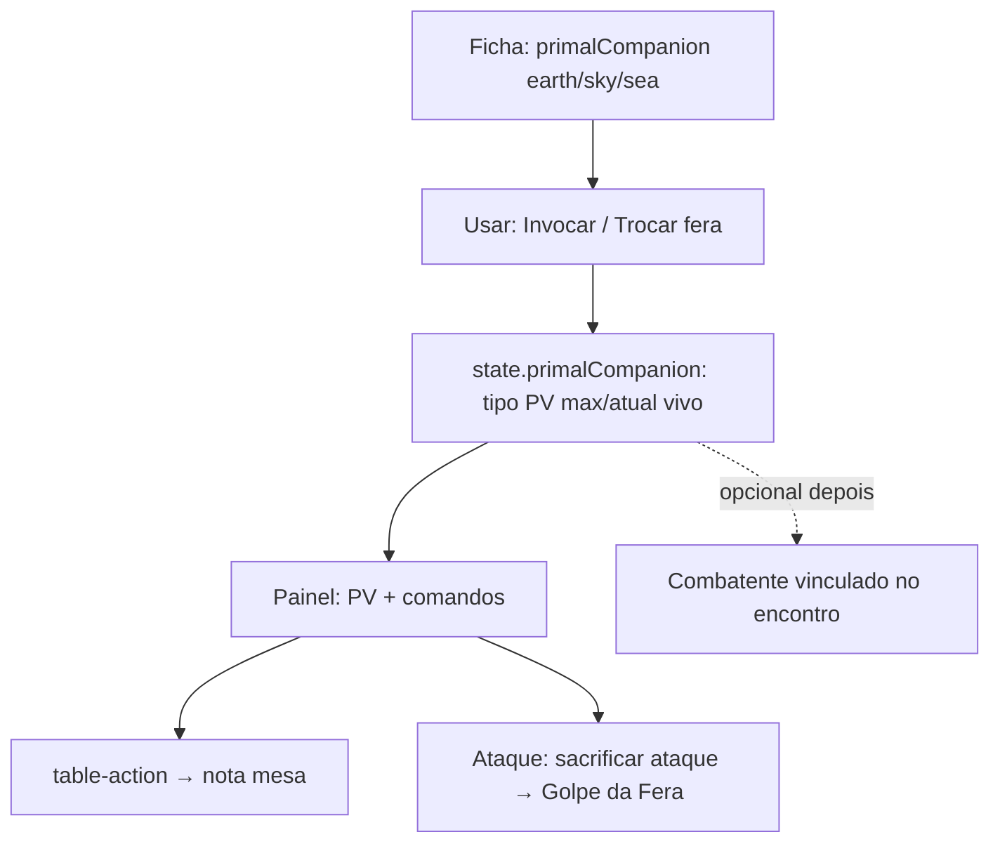

# Senhor das Feras: Companheiro Primal na mesa

**Status:** em espera — **não implementar** até pedido explícito.  
**Classe:** Patrulheiro · subclasse `beast-master` (Senhor das Feras).

## Problema hoje

- Escolha Terra / Céu / Mar existe na ficha (`option_key = primalCompanion`).
- Economia / painel: `primal-companion` só gera **nota** (“comande a fera / Golpe da Fera”).
- Não há invocação persistida, PV da fera, comandos tipados nem ataque da fera na UI.
- O jogador controla a fera “de cabeça” ou como criatura manual no encontro — fricção alta.

Critério mesa (skills `rpg-class-mesa-*`): gasto + nota + estado útil; **não** VTT (posição, turno da fera automatizado, IA).

## Ideia

Tratar o Companheiro Primal como **estado de sessão do personagem** + **atalhos de comando** no painel do Patrulheiro, reusando o que já existe (opção da ficha, `table-action`, opcionalmente combatente no encontro).

## UX alvo (fácil para o player)

No **Combate do Patrulheiro → Poderes** (Beast Master):

1. **Resumo da fera** — nome/tipo (Terra/Céu/Mar), PV `atual/máx`, vivo/morto.
2. **Invocar / Restaurar / Trocar** — ações claras (ver PHB: Usar Magia + slot para reviver; DL para trocar bloco).
3. **Comandar (Ação Bônus)** — botões: Golpe da Fera · Ajudar · Correr · Desengajar · Esquivar (L7+ extras no mesmo comando).
4. No **card de ataque do Patrulheiro** — toggle “ordenar Golpe da Fera (sacrifica 1 ataque)” → rola/nota o golpe da fera (e L11: dois golpes + bônus da Marca se aplicável, na nota).

Economia: manter uma linha “Comandar a fera” **ou** fundir no painel (evitar duplicar como Marca/Véu — preferir painel rico + Economia só se fizer sentido de bucket).

## Modelo de dados (proposta)

Sessão (`player_character_state` ou JSON de companion):

| Campo | Uso |
|-------|-----|
| `beastKind` | `earth` \| `sky` \| `sea` (espelha opção da ficha no invoke) |
| `displayName` | opcional (ex. “Lobo primal”) |
| `hpCurrent` / `hpMax` | da tabela do bloco (catálogo ou fórmula por nível do ranger) |
| `active` | invocada e presente |
| `defeatedAt` | para janela de 1 h do revive |

Catálogo: blocos Terra/Céu/Mar como SSOT (seed/tabela ou entries no mechanical catalog) — CA, PV, ataques, deslocamento — **sem** inventar stats no front.

## API (mesa)

Estender `POST …/ranger/table-action` (sem endpoint novo):

| `actionSlug` | Efeito |
|--------------|--------|
| `primal-companion-summon` | Cria/atualiza companion no state a partir da opção da ficha; nota |
| `primal-companion-restore` | Gasta slot (nível informado no DTO); revive com PV cheios após nota de 1 min |
| `primal-companion-command` | `command`: `strike` \| `help` \| `dash` \| `disengage` \| `dodge` (+ L7); nota |
| `primal-beast-strike` | Golpe da Fera (1× ou 2× no L11); opcional flag Marca; rola dano se stats no catálogo **ou** só nota + expressão |

`primal-companion` atual vira alias de “comandar” ou é deprecado em favor dos slugs tipados.

C009/C010: alinhar linhas ao fluxo (summon/restore/command); `resource_slug` só se houver pool real.

## Front

- `ranger-panel.tsx`: bloco Beast Master (como Aspecto Bestial no Portador).
- `weapon-attack-card` / opções ranger: toggle Golpe da Fera.
- Estado: ler `state.primalCompanion*` da sessão; invalidar após table-action.

## Fases sugeridas

| Fase | Entrega | Valor |
|------|---------|--------|
| **A — Tracker** | State + UI PV + Invocar/Trocar/Derrotar; comandos = nota tipada | Mesa já controla “minha fera” |
| **B — Golpe** | Rolagem/nota do Golpe da Fera no ataque + L11 | Combate da fera na ficha |
| **C — Encontro** | Botão “adicionar fera ao encontro” (combatente vinculado ao PC) | Tracker de iniciativa compartilhado |
| **D — Stats ricos** | Catálogo completo dos 3 blocos (ataques, CA) no painel | Menos consulta ao livro |

Começar por **A**; B/C/D só sob pedido.

## Critério de pronto (quando sair da espera)

- Beast Master vê a fera ativa com PV e pode invocar/atualizar sem sair da aba Ações.
- Comandar gera nota acionável (não genérica).
- Fase B: Golpe da Fera a partir do ataque do ranger.
- Specs handler + smoke painel; skills mesa / exemplares atualizados.

## Fora (agora)

- Simular turno da fera no servidor / iniciativa automática.
- Pathfinding, alcance, concentração da fera.
- Familiars / outras invocações (padrão pode reaproveitar depois).
- Substituir criaturas manuais do DM no encontro (fase C é opt-in).

## Arquivos-alvo (referência)

- `dnd-api/.../actions/ranger/subclass-actions.ts`
- `dnd-api/.../character-state` (novo campo companion)
- `dnd-api/database/seeds/...` (stats companion se catálogo)
- `dnd-front/.../panels/ranger-panel.tsx`
- `dnd-front/.../weapon-attack` (opções ranger)
