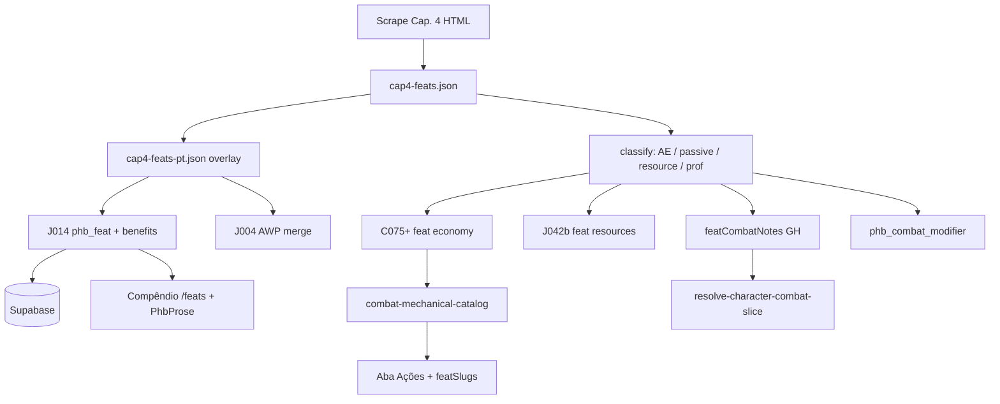

# Grim Hollow Cap. 4 — Talentos (feats)

**Início:** 2026-08-31  
**Edição:** `grim-hollow-players-guide-2024-en`  
**Scrape:** `docs/source/scrap/Chapter 4_ Character Feats…html`  
**Skills:** `rpg-catalog-model` · `rpg-class-mesa-api` · `rpg-class-mesa-front`  
**Auditoria:** `node scripts/audit-ghpg-cap4.mjs` → `_audit-cap4-coverage.json` / `_audit-cap4-per-feat.tsv`

Objetivo: fechar o gap entre **catálogo GH Cap. 4** e **mesa + compêndio + ficha**, espelhando o que já fizemos em Cap. 2 (economy/resources/passivos) e Cap. 1 (heranças).

---

## Snapshot (auditoria 2026-08-31)

| Camada | Estado |
|--------|--------|
| Scrape → extract (`cap4-feats.json`) | **41** talentos (9 origin · 13 general · 7 fighting-style · 12 epic-boon) |
| Seed `J014` | **40** (exclui `advanced-weapon-proficiency` de propósito) |
| Seed `J004` | `advanced-weapon-proficiency` **PT** + `phb_fighting_style` |
| Supabase `phb_feat` | **41/41** ✓ |
| Benefícios alinhados extract↔DB | **40/41** (`advanced-weapon-proficiency`: 2/3 — falta intro EN no J004) |
| Nomes PT no DB | **1/41** (só AWP em J004) |
| Benefícios PT | **~0** (~93 blocos EN) |
| `phb_feat_requirement` GH | **32/41** estruturados (J014b) |
| Economy `feat_id` GH | **11** ações P0 (C075) + **3** recursos (J042b) |
| `featCombatNotes` GH | **38/41** entradas (Fase D) |
| `phb_combat_modifier` GH feats | **1** (`resolutionofthe-syndicate`) |
| Antecedentes Cap. 3 → origin feat | **9/9** GH via `phb_background.feat_id` ✓ |

### Action economy no extract (15/41)

| Bucket | Feats |
|--------|-------|
| `action` | convincing-inquisitor, insightful-collector, survivor, triage-expert, iron-gut, lightning-caster, nimble-physique, syndicate-spy, thrown-weapon-master, dual-shot, mobile-combatant |
| `reaction` | free-sword-mercenarys-will, blackpowder-pistol-expert, lightning-caster, witch-hunter, opportunist |
| `bonus` | iron-gut, lightning-caster, nimble-physique, thrown-weapon-master |

**26/41** são passivos puros (sem bucket detectado) — candidatos a `featCombatNotes` / `phb_combat_modifier`.

### Gaps técnicos do extract

| Issue | Impacto |
|-------|---------|
| `anchorToSlug` compostos (`fortuneofthe-thaumaturge`, `boonofthe-*`) | Slugs feios mas **consistentes** seed↔DB |
| `parsePrerequisite` não lê `General Feat (Prerequisite: …)` | `prerequisite` null no JSON; **~30** feats com pré-req no HTML |
| `witch-hunter` — flavor de sidebar no fim da descrição | Poluir compendium; corrigir no extract |
| `advanced-weapon-proficiency` split J014/J004 | Gerador regenera J014 sem AWP; J004 é SSOT PT |

---

## Arquitetura alvo



**Princípios (iguais Cap. 2):**

1. **Catálogo** (`phb_feat` + benefits) = SSOT de texto e estrutura.
2. **Economia** (`phb_class_economy_action.feat_id`) = só ações **ativáveis** na mesa (Usar → nota/recurso).
3. **Passivos** = `featCombatNotes` (lembretes) ou `phb_combat_modifier` (número fixo: PV, CA, prof).
4. **Não** duplicar modificadores de ação padrão (Influence, Study, Attack) como botão — nota passiva basta.
5. **Compêndio** consome API de feats; **ficha** filtra por `featSlugs` + edition GH.

---

## Fase 0 — Higiene do extract (bloqueador leve)

- [x] `extract-ghpg-cap4.mjs`: `findGhpgChapterHtml(4, scrapDir, _scrapes)` ✓
- [x] Corrigir `parsePrerequisite` → `parseFeatPrerequisite` em `ghpg-html-utils.mjs` (formato GH `General Feat (Prerequisite: …)`)
- [x] Cortar flavor após benefícios (`stripAsideBlocks`, `isFlavorOrQuoteParagraph`; `witch-hunter`, epic boons, `flurry`)
- [x] Benefício plain-text (`Quick Load` em `blackpowder-pistol-expert`); continuação `Alternatively,` preservada
- [x] Regenerar `cap4-feats.json` + `J014`; `audit-ghpg-cap4.mjs` exit 0 (extract↔seed)
- [x] **Decisão slugs:** manter slugs atuais no DB (sem migração)
- [x] Aplicar `J014` no Supabase (19 feats com drift de benefícios — fase A ou apply dedicado)

**Comandos:**

```bash
node scripts/extract-ghpg-cap4.mjs
node scripts/audit-ghpg-cap4.mjs
```

---

## Fase A — Editorial PT (catálogo + compêndio)

**Meta:** jogador lê talentos GH só em PT-BR; unidades métricas na prosa.

- [x] Criar `build-ghpg-cap4-feats-pt-overlay.mjs` (padrão Cap. 2: `ghpg-prose-patterns` + glossário + `ghpg-cap4-feat-prose`)
- [x] `cap4-feats-pt.json`: `namePt`, `introPt`, `benefitsPt[]`, `prerequisitePt`
- [x] Atualizar `generate-ghpg-cap3-seeds.mjs` → `J014` com overlay PT + `DELETE` benefícios órfãos
- [x] Mesclar `advanced-weapon-proficiency` no fluxo (J004 permanece; J014 não duplica)
- [x] Aplicar `toMetricProse` nos benefits (via `translateCap4FeatBody`)
- [x] Compêndio: `feat-detail-view` + `PhbProse` já suportam — filtro `editionSlugs=grim-hollow-players-guide-2024-en` ok
- [x] Grid `/feats`: labels de categoria PT via `v_phb_feat_category` (já no banco)
- [x] Refino editorial: overrides em `ghpg-cap4-feat-overrides-pt.mjs` (22 intros + 104 benefícios curados)

**Critério:** `audit-ghpg-cap4` → `benefitsLikelyEn: 0` ✓ (nomes: heurística `ã/ç` falha em PT sem acento).

---

## Fase B — Pré-requisitos estruturados

**Meta:** elegibilidade na ficha (level-up, ASI) e cadeias de feat.

- [x] Parser de pré-requisito no extract → campos: `minLevel`, `requiredFeatSlugs[]`, `requiredAbility`, `fightingStyle`
- [x] Seed `J014b_phb_feat_requirement_ghpg.sql` (padrão `phb_feat_requirement` + `_feat` + `_skill` se couber)
- [x] Casos críticos:
  - `medicianofthe-morbus-doctore` → exige `triage-expert` + nível 4+
  - `shadowsteel-master` → exige `shadowsteel-adept`
  - General L8+ tomando fighting-style (`advanced-weapon-proficiency` Special)
  - Epic boons → nível 19+ (confirmar no livro)
- [x] Front: `feat-eligibility.ts` — bypass L8+ para fighting-style geral (AWP); API já expõe `v_phb_feat`
- [x] `fighting-style-general-feat.ts` — slug `advanced-weapon-proficiency` @ L8 (GH alinhado)

---

## Fase C — Economia de ações (mesa)

**Meta:** talentos com **uso ativo** aparecem na aba **Ações** quando o personagem possui o feat.

**Padrão:** `C050` / `C056` — `phb_class_economy_action` com `feat_id`, `economy`, `summary`, `table_action` (`spend-resource` ou handler dedicado).

### C1 — Inventário e classificação

- [x] Script `classify-ghpg-cap4-mechanics.mjs` → `_audit-cap4-mechanics.json`
- [x] Por feat/benefício: `economy` | `passive-note` | `combat-modifier` | `spell-grant` | `skip`

### C2 — Seeds economy (`C075_phb_feat_economy_ghpg_cap4.sql`)

Prioridade **P0** (ação explícita + pool ou efeito de mesa claro):

| Feat | Bucket | Mesa proposta |
|------|--------|----------------|
| `triage-expert` | action | Utilizar + kit → nota Blood and Bone |
| `fortuneofthe-thaumaturge` | free | Fortune's Fortitude — pool PB/LR (`J042b` resource) |
| `free-sword-mercenarys-will` | reaction | Hold the Ground — nota |
| `blackpowder-pistol-expert` | reaction | Countershot — nota |
| `witch-hunter` | reaction | Dodge Spells — CD + nota |
| `lightning-caster` | bonus/reaction | Quick Cast / Overcharge — nota + resource opcional |
| `iron-gut` | bonus/action | Purge Poison / Iron Stomach |
| `insightful-collector` | action | Study object — nota |
| `dual-shot` | action | segundo alvo — nota no ataque (ou toggle no card) |
| `opportunist` | reaction | Opportunity Strike |

- [x] Seed `C075` aplicado (11 ações P0)
- [x] Config em `ghpg-cap4-economy-config.mjs` + gerador `generate-ghpg-cap4-economy-seeds.mjs`

**P1** — modificadores de ação padrão (só `featCombatNotes`, **sem** economy): convincing-inquisitor, survivor, nimble-physique, syndicate-spy, thrown-weapon-master, mobile-combatant, close-combat-artillerist, flurry, prone-defense.

### C3 — Table actions (só onde precisa rolar/gastar)

- [x] `spend-resource` para pools com recurso (`fortunes-fortitude`, `lightning-immediate-response`, `iron-gut-quick-recover`)
- [ ] Feats com dado explícito: `resolutionofthe-syndicate` (Quick Strike d4) — avaliar toggle no ataque vs botão (Fase D)

### C4 — Resources (`J042b` / `J041` extensão)

| Resource slug | Feat | Fórmula |
|---------------|------|---------|
| `fortunes-fortitude` | fortuneofthe-thaumaturge | PB, recharge LR |
| `sangromancy-dice` | sangromantic-initiate | já existe em classe — **não** duplicar; só nota de feat |

- [x] `J042b_phb_resource_ghpg_cap4_feats.sql` (3 recursos P0)

---

## Fase D — Passivos tipados

**Meta:** lembretes na coluna Passivas da ficha (padrão `feat/combat-notes.ts`).

- [x] Módulo `grim-hollow-feat-combat-notes.ts` + `grim-hollow-feat-combat-notes-data.ts`
- [x] Gerador `generate-gh-cap4-feat-passives.mjs` + config `ghpg-cap4-feat-passive-config.mjs`
- [x] Wire em `featCombatNotes` → `resolve-character-combat-slice.ts` (via `classCombatNotes`)

### Candidatos `phb_combat_modifier` (número fixo)

| Feat | Modifier |
|------|----------|
| `resolutionofthe-syndicate` | `hp_per_level: 1` (+ burst no nível de aquisição) |
| `hulking-figure` | `hp_bonus` ou nota ASI + size |
| `boonof-magic-resistance` | resistências → nota (condicional) |
| `advanced-weapon-proficiency` | prof armas avançadas — **já** em `weapon-attack` domain |

- [x] `C076` — `resolutionofthe-syndicate` +1 PV/nível (`Resiliente`)
- [x] Demais: notas em passivos (38/41 feats; 3 só economy)

### Candidatos só nota (sem modifier)

- [x] `blood-hound`, `deathbound`, `survivor`, `shadowsteel-*`, `sangromantic-initiate`, epic boons ASI, etc.

---

## Fase E — Compêndio e ficha

### Compêndio (`/feats`)

- [x] Listagem GH na edição correta; busca por nome PT
- [x] Detalhe: pré-requisito estruturado + benefícios com `PhbProse` métrico
- [x] Badge de categoria (Origem / Geral / Estilo de luta / Dádiva épica) — `categoryTypeLabel` no card
- [x] Link cruzado antecedente ↔ feat origin (Cap. 3) — API `originBackgrounds` + links

### Ficha do personagem

- [x] `beyond-actions-tab`: economy filtra `featSlugs` (C075 aplicado)
- [x] Seção talentos: nomes PT; passivos via `classCombatNotes`
- [x] Level-up / ASI: elegibilidade GH com pré-requisitos B
- [x] `sangromantic-initiate`: opção `bloodMagicSpell` (J047) + economia 1/LR

### Integrações Cap. 5

- [x] `advanced-weapon-proficiency` ↔ armas avançadas J005
- [x] `shadowsteel-adept/master` ↔ foco shadowsteel J006
- [ ] `blackpowder-pistol-expert` ↔ armas de fogo (gunslinger panel?)

---

## Fase F — Verificação e CI

- [x] `audit-ghpg-cap4.mjs` — exit 0 (slugs, benefits, backgrounds)
- [x] `classify-ghpg-cap4-mechanics.mjs` — cobertura 41/41 classificados
- [x] `verify-ghpg-mechanics.mjs` — paths `extracts/grim-hollow/cap*.json`
- [x] `verify-ghpg-cap4-compendium.mjs` — smoke DB compêndio GH
- [ ] Teste API: feat detail GH retorna benefits PT
- [ ] Teste front: personagem com `blood-hound` + `triage-expert` mostra economy/passivas esperadas
- [ ] Smoke manual: compêndio 41 feats, antecedente GH mostra feat origin correto

---

## Ordem de execução recomendada

| Lote | Entrega | Valor imediato |
|------|---------|----------------|
| **0** | Extract hygiene + audit verde | SSOT confiável |
| **A** | Overlay PT + J014 regen + apply | Compêndio jogável |
| **B** | Pré-requisitos | Level-up correto |
| **D** | Passivos (notas) | Ficha útil sem botões |
| **C** | Economy P0 (~10 feats) | Ações na mesa |
| **C** | Economy P1 + resources | Pools PB/LR |
| **E** | Polish compêndio/ficha | UX completa |
| **F** | CI | Regressão |

---

## Arquivos-alvo

| Área | Paths |
|------|-------|
| Extract | `scripts/extract-ghpg-cap4.mjs`, `scripts/lib/ghpg-html-utils.mjs` |
| Overlay PT | `scripts/build-ghpg-cap4-feats-pt-overlay.mjs`, `docs/source/extracts/grim-hollow/cap4-feats-pt.json` |
| Seeds | `J014`, `J004`, `J014b`, `C075`, `J042b`, `J047` |
| API passivos | `src/game/combat/domain/feat/combat-notes.ts`, `grim-hollow-feat-combat-notes.ts` |
| API slice | `resolve-character-combat-slice.ts` |
| Front economy | `class-action-economy.ts`, `beyond-actions-tab.tsx` |
| Front compêndio | `feat-catalog/*`, `feat-eligibility.ts` |
| Auditoria | `scripts/audit-ghpg-cap4.mjs`, `scripts/classify-ghpg-cap4-mechanics.mjs` |

---

## Fora de escopo (agora)

- Renomear slugs `fortuneofthe-*` / `boonofthe-*` em produção
- Automatizar **todos** os epic boons com handlers que rolam dado no servidor
- Talentos PHB 2024 (já têm passivos parciais em `FEAT_PASSIVE_NOTES`)
- Transformações Cap. 6 — plano dedicado: `docs/plans/grim-hollow-cap6-transformations.md` (`J019` shell + `J048`–`J059` benefícios)

---

## Critério de pronto

1. **41/41** feats com nome e benefícios PT no Supabase.
2. **Pré-requisitos** estruturados para general L4+, chains (shadowsteel, medician), epic L19+.
3. **≥10** feats com economy na aba Ações; passivos dos 41 em `featCombatNotes` ou modifier.
4. Compêndio GH completo; ficha mostra lembretes + ações quando possui o talento.
5. `audit-ghpg-cap4.mjs` e testes smoke verdes.
