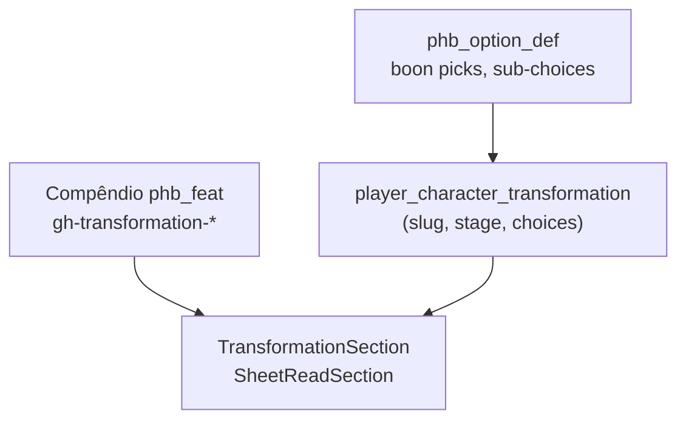

# Grim Hollow Cap. 6 — Transformações

**Início:** 2026-08-31  
**Edição:** `grim-hollow-players-guide-2024-en`  
**Scrap:** `docs/source/scrap/Chapter 6_ Transformations…html`  
**Extract:** `docs/source/extracts/grim-hollow/cap6-transformations.json`  
**Auditoria estrutural:** `docs/source/extracts/grim-hollow/_audit-cap6-structure.json`

---

## Tese

Transformação **não é talento** e **não é herança**.

| | Herança (Cap. 1) | Talentos (Cap. 4) | Transformação (Cap. 6) |
|---|------------------|-------------------|------------------------|
| **Quando** | Criação do personagem | Level-up / antecedente | Opcional, pode começar mid-campaign |
| **Progressão** | Estática (8 traços + config) | Pontual (feat único) | **4 estágios** narrativos |
| **Escolhas** | Slots fixos `heritage_trait_*` | `featOptions` pontuais | **Estágio atual** + boon(s) por estágio + flaws automáticos |
| **Persistência** | `heritage_slug` + `player_character_heritage_*` | `characterFeats` + `featOptions` | **Ainda não existe** |
| **UI ficha** | `HeritageChoicesSection` (read) | `FeatsSection` + `FeatOptionsReadList` | Alvo: **`TransformationSection`** (read) |

O compêndio (`/feats/gh-transformation-*`) serve como **referência de regras**. Na ficha, o jogador indica **qual transformação**, **estágio atual (1–4)** e **quais boons escolheu** em cada estágio — padrão **SheetReadSection**, não lista plana de 200 benefícios.

---

## Seeds (split 2026-08-31)

| Seed | Conteúdo |
|------|----------|
| **J019** | Shell: 12 linhas `phb_feat` (`category = gh-transformation`) |
| **J048** | Benefícios — Horror Aberrante |
| **J049** | Benefícios — Fada |
| **J050** | Benefícios — Corruptor |
| **J051** | Benefícios — Bruxa |
| **J052** | Benefícios — Lich |
| **J053** | Benefícios — Licantropo |
| **J054** | Benefícios — Gosma |
| **J055** | Benefícios — Primordial |
| **J056** | Benefícios — Serafim |
| **J057** | Benefícios — Carniçal de Aço Sombrio |
| **J058** | Benefícios — Espectro |
| **J059** | Benefícios — Vampiro |
| **J060** *(futuro)* | `phb_option_def` — escolhas estruturadas por transformação |
| **J061** | *(incorporado em J048–J059)* | Apêndices por transformação (Dádivas da Perdição, tabelas, feeding) |
| **J062** *(futuro)* | `phb_resource_*` / economia de mesa (marcas, mutações, convocações) |

Gerador: `node scripts/generate-ghpg-cap6-seeds.mjs`  
Extract: `node scripts/extract-ghpg-cap6.mjs`  
Overlay PT: `node scripts/build-ghpg-cap6-transformations-pt-overlay.mjs`  
Auditoria: `node scripts/audit-ghpg-cap6.mjs`

Aplicar pack: `node scripts/apply-seed-pack.mjs grim-hollow --target=supabase` (ou seeds individuais)

---

## Arquitetura alvo (ficha)



### Persistência proposta (migration futura)

```sql
-- Esboço — não implementado
player_character_transformation (
  character_id UUID PK,
  transformation_slug TEXT REFERENCES phb_feat(slug), -- ou phb_transformation
  current_stage SMALLINT CHECK (current_stage BETWEEN 1 AND 4)
);

player_character_transformation_choice (
  character_id UUID,
  stage SMALLINT,
  choice_kind TEXT,  -- 'boon' | 'sub_choice'
  anchor_id TEXT,    -- ex. Stage2BoonDaemonicBrand
  PRIMARY KEY (character_id, stage, choice_kind, anchor_id)
);
```

**Não** usar `characterFeats[]` para transformação — evita confundir com talentos de level-up e permite um único registro com estágio mutável.

### `featOptions` vs tabela dedicada

Escolhas **dentro** de um boon (tipo de dano Alma Corruptora, magia de mutação, gift ativo) → `phb_option_def` + `featOptions` com `featSlug = gh-transformation-*`, espelhando `J047` (sangromantic-initiate).

Escolha **de boon por estágio** → `player_character_transformation_choice` (herança usa slots fixos; aqui o conjunto válido depende do estágio).

---

## Análise 1 a 1

Legenda de escolha por estágio:

- **ambos** — ganha todos os boons listados
- **1 de N** — escolhe um boon; flaw automático
- **2 de N** — escolhe dois (só Shadowsteel Ghoul S2 e Vampire S2 no livro)
- **obrig + 1 de N** — um boon obrigatório + mais uma escolha

| # | Slug | PT | Boons | Regra por estágio | Apêndices / gaps extract |
|---|------|-----|-------|-------------------|--------------------------|
| 1 | `aberrant-horror` | Horror Aberrante | 8 | S1 **ambos** · S2–S4 **1 de 2** | Tabela **Unstable Form**; lista de **Aberrant Mutations** (ul/li perdidos) |
| 2 | `fey` | Fada | 12 | S1 **Fey Form + 1 de 4 cortes** · S2–S4 **1 de N** | Bloco `AchievingANewStage2`; milestones por corte |
| 3 | `fiend` | Corruptor | 10 | S1 **Alma Corruptora + 1 de 2** · S2–S4 **1 de N** | **`Gifts of Damnation`** (~12 gifts) fora do extract; PT curado em `ghpg-cap6-fiend-pt.mjs` |
| 4 | `hag` | Bruxa | 13 | S1 **Hag Form + 1 de 3 tipos** · S2–S4 **1 de N** | Covens, tokens; listas em boons |
| 5 | `lich` | Lich | 12 | S1 **Undead Form + 1 de 2** · S2–S4 **1 de N** | Frasco/filactério; spell lists |
| 6 | `lycanthrope` | Licantropo | 10 | S1 **1 de 3** (lobo/urso/rato…) · S2–S4 **1 de N** | Tipo de licantropia = escolha estrutural S1 |
| 7 | `ooze` | Gosma | 9 | S1 **Ooze Form + 1 de 2** · S2–S4 **1 de N** | — |
| 8 | `primordial` | Primordial | 9 | S1 **ambos** · S2–S4 **1 de N** | Elemento (fogo/gelo/…); tabela de DC |
| 9 | `seraph` | Serafim | 11 | S1 **Celestial Form + 1 de 2** · S2–S4 **1 de N** | Corrupção / queda |
| 10 | `shadowsteel-ghoul` | Carniçal de Aço Sombrio | 9 | S1 **1 de 2** · S2 **2 de 4** · S3–S4 **1 de N** | Única com **dois boons no mesmo estágio** |
| 11 | `specter` | Espectro | 9 | S1 **Spectral Form + 1 de 2** · S2–S4 **1 de N** | Citação sidebar ainda no extract (strip no gerador); PT falha S4 curado |
| 12 | `vampire` | Vampiro | 16 | S1 **Fanged Bite + 1 linhagem (3)** · S2 **2 de 4** · S3–S4 **1 de N** | **Linhagens** Soman/Fzeg/Strigoi; regras **Feeding**; tabelas de fraqueza |

Detalhe de anchorIds: ver `_audit-cap6-structure.json`.

---

## Gaps do extract (scrap novo)

| Issue | Impacto | Ação |
|-------|---------|------|
| `AchievingANewStage10` no Espectro | Card fantasma “Estágio 10” | `prepareTransformationStages()` ignora blocos órfãos ✓ |
| Citações de sidebar (`He faded away…`) | Prosa mecânica poluída | `stripCap6FlavorAside()` no gerador ✓; corrigir extract |
| Listas `<ul><li>` em boons | Efeitos vazios (Marca, mutações, …) | `extractStructuredProse()` + re-extract; overlay PT por anchorId |
| `Gifts of Damnation` (Fiend) | Apêndice inteiro ausente | Parser `parseAppendices()` → benefícios no J050 ✓ |
| Tabelas (Unstable Form, Fiend Form DC) | Regras incompletas no catálogo | Seeds de tabela ou benefício “Tabela: …” |
| PT | Só Fiend + Specter (parcial) curados | Um overlay `ghpg-cap6-*-pt.mjs` por transformação |
| `phb_feat_benefit` sem `anchor_id` | Ficha não filtra boon por id estável | Migration opcional `anchor_id TEXT` ou `phb_transformation_boon` |

---

## Fases de implementação

### Fase A — Catálogo ✓

- [x] Split J019 + J048–J059
- [x] Extract lê `docs/source/scrap`
- [x] Merge estágios `AchievingANewStage*`
- [x] Re-extract com listas/tabelas completas
- [x] Apêndices (Dádivas, mutações, feeding) nos seeds J048–J059
- [x] PT overlay 12/12 (`cap6-transformations-pt.json` + glossário; Fiend/Espectro curados)

### Fase B — Opções estruturadas (J060)

Por transformação, `phb_option_def` com chaves como:

- `transformationStage` — valor 1–4 (ou campo dedicado na ficha)
- `stage1Boon`, `stage2Boon`, … — `value_type = enum`, valores = anchorIds
- Sub-opções: `fiendDamageType`, `activeGiftOfDamnation`, `vampireBloodline`, `lycanthropeKind`, …

Validador API espelhando `heritage-choices.validator.ts`:

- Estágio N só aceita boons do estágio N (ou regras “2 de 4”)
- Pré-requisitos entre boons (ex.: Marca Avassaladora requer Marca Demoníaca)
- Flaws automáticos por estágio (não escolha do jogador)

### Fase C — Persistência ficha

- Migration `player_character_transformation` + choices
- DTO sheet: `transformation: { slug, stage, choices[] }`
- **Não** adicionar transformação via `characterFeats` na UI de talentos

### Fase D — UI read (padrão reads)

- `TransformationSection` em `beyond-traits-tab.tsx`
- Mostra: nome, estágio atual, tiles dos boons/flaws **ativos** (≤ estágio), links para compêndio
- Edição: painel separado (wizard ou edit sheet) — avançar estágio, trocar boon (com confirmação)

### Fase E — Mesa (opcional, pós-ficha)

- `phb_resource_*` + `C0xx` economy para ações ativas (Marca Demoníaca, Possession, …)
- Combat notes por boon ativo

---

## Compêndio vs ficha (comportamento desejado)

| Contexto | Comportamento |
|----------|----------------|
| `/feats/gh-transformation-fiend` | Texto completo: como começar, 4 estágios, todos boons/flaws, apêndices |
| Ficha — personagem estágio 2 Corruptor | Só estágios 1–2; boons escolhidos + flaws 1–2; link “ver regras completas” |
| Lista `/feats` | Cards de transformação; **não** misturar com talentos GH Cap. 4 na mesma aba de level-up |

---

## Comandos

```bash
# Scrap → extract → overlay PT → seeds → auditoria
node scripts/extract-ghpg-cap6.mjs
node scripts/build-ghpg-cap6-transformations-pt-overlay.mjs
node scripts/generate-ghpg-cap6-seeds.mjs
node scripts/audit-ghpg-cap6.mjs

# Aplicar (exemplo)
node scripts/apply-single-seed.mjs database/seeds/grim-hollow/J019_phb_feat_ghpg_transformations.sql
node scripts/apply-single-seed.mjs database/seeds/grim-hollow/J050_phb_feat_benefit_ghpg_transformation_fiend.sql
```

---

## Próximo passo recomendado

1. Aplicar **J019 + J048–J059** no Supabase.
2. Curadoria PT fina (overrides por transformação, como Cap. 4) onde o glossário ainda mistura EN.
3. Esboçar **migration Fase C** + `TransformationSection` mock (só read) antes de J060.

Cap. 4 feats permanece no plano `grim-hollow-cap4-feats.md`; este documento é o SSOT de Cap. 6.
