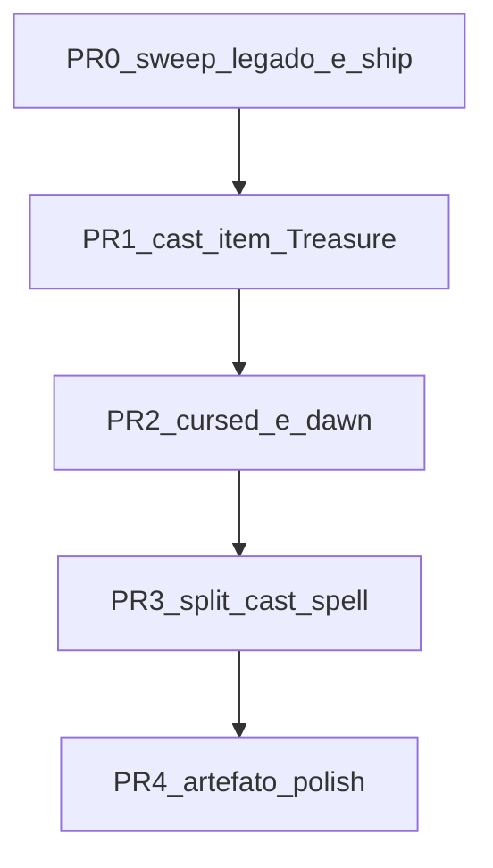

# Plano — restante itens / inventário / saúde

Operações **ainda abertas** depois da onda 2026-08-11 (cleanup Beyond, `inventory/actions`, SSOT pontual, split inventory).  
Checklist vivo: [`backlog.md`](backlog.md). Regras Treasure: [`treasure-rules-vs-sistema.md`](../architecture/treasure-rules-vs-sistema.md). Modelo mesa: [`dmg-item-mesa.md`](../architecture/dmg-item-mesa.md).

---

## Premissas

1. Sem dados em produção → editar seeds/migrations **originais**; sem `ALTER`/`DELETE` de patch.
2. SSOT de mecânica de item = seeds (`properties` / economy / resource) — sem Sets de slug no TS quando o catálogo já carrega.
3. Front (`dnd-front`) acompanha contrato na **mesma** onda quando a API muda.
4. **Zero suporte a legado** (ver secção abaixo).

---

## Zero legado — regra de ouro

Não mantemos shims, aliases, dual-path, “compat por uma release”, nem reexports mortos. Se aparecer legado, **delete** — não documente como deprecated.

| Sinal | Ação |
|-------|------|
| Rota HTTP antiga com substituto | Remover controller method + testes + docs; front só chama o contrato novo |
| `@deprecated` / `legacy` / `compat` / `backward` | Remover símbolo e todos os callers; se ainda precisar, o caller usa a API nova |
| Fallback TS “se seed não tiver X, usa Set hardcoded” | Preferir falhar ou exigir seed; dropar o Set |
| View / tabela / DTO só para formato antigo | Remover; ajustar o consumidor |
| Script / seed / doc apontando path morto | Apagar ou reescrever para o path canônico |
| Wrapper fino só para esconder rota morta | Inline no caller e delete o wrapper |

**Anti-padrões proibidos neste plano**

- `POST …/inventory/weapon-charm/*`, `…/coverage/*`, `…/:slug/artifact-regen` (mortos → só `…/inventory/actions`)
- `POST …/item/table-action`
- Dual cast: um fluxo “item legado” e outro “itemCast*” — um fluxo só
- Feature flag “useNewInventoryActions”
- Comentários `// keep for old front`

**Checklist em todo PR deste plano**

```text
[ ] rg @deprecated|legacy|compat|backward no diff e no módulo tocado
[ ] rg rotas HTTP antigas de inventário / cast
[ ] Nenhum reexport “só para não quebrar import”
[ ] Front e API no mesmo contrato; sem branch “if old”
```

---

## Já feito (não repetir)

| Item | Onde |
|------|------|
| Scrapes `docs/source/avaliar/` removidos | audits em `docs/source/phb-2024-equipment-*.md` |
| `POST …/inventory/actions` + front | `actionSlug`: charm / coverage / artifact-regen |
| `requiresTierBonus` / `enspelled` / `combatNotes` nos seeds | `D013`, `D038`, Valdas `V010`/`P008` |
| Barding Cap. 6 | `barding-*` em `S031` + `domain/barding.ts` |
| Split inventory repo/ops | ≤200 linhas; `isEnspelledAllowedSchool` **deletada** (não deprecated) |
| Wiring DMG lotes A–Z | [`dmg-wiring-status.md`](../source/dmg-wiring-status.md) |
| PR0b firearms → table-action | `reload-firearm` / `fire-chamber` |
| PR1 cast Treasure | `item-cast-rules` + `D046` + overrides CD |
| PR2a/2b cursed + dawn MVP | `D047` + Remover Maldição; DL ≈ amanhecer |
| PR3 split cast-spell | pasta `spell/` ≤200 |
| PR4 artefato polish | d6 1–5; `sentient-conflict`; `artifact-reroll` |

**Ops imediata:** varredura legado residual → ship working tree → `db:seed` / `db:setup` local.

**Legado já deletado nesta retomada:** `rage/toggle`, `reckless/toggle`, `resources/rage/recover-all`, `maneuvers/use`, `resources/risk/recover`, `firearms/reload`, `firearms/fire` + exports mortos no front.

---

## Ordem das próximas operações



Só avançar com testes do módulo verdes. Achou legado no meio → **delete na mesma PR** (não abrir “PR de limpeza depois”).

---

## PR0 — Varredura legado + ship da onda atual

1. **API:** confirmar ausência de handlers/rotas `weapon-charm/attach|detach`, `coverage/attach|detach`, `…/artifact-regen` dedicados.
2. **Front:** só `…/inventory/actions`; helpers de cliente (`attachWeaponCharm` etc.) OK se forem thin sobre o contrato novo — **não** OK se ainda baterem URL antiga.
3. **Docs/scripts:** nenhum path `avaliar/` ou rota morta.
4. **Sets/fallbacks** óbvios no módulo inventory/item (ex. perfil enspelled só em TS sem seed) → preferir seed + parse; deletar fallback se o seed já cobre.
5. `npx jest src/game/inventory --no-coverage`.
6. Commit(s) + push/PR.

---

## PR1 — Cast de item (Treasure P0 §1)

**Objetivo:** um único fluxo `POST …/spells/cast` + `itemCast*` alinhado à regra Treasure (menor círculo / sem componentes / concentração / CD do item).

| Passo | Onde | Notas |
|-------|------|--------|
| 1 | Inventariar `cast-spell.ts` + `resolve-item-cast-slot-level.ts` | Listar ramos; **apagar** ramo morto/duplicado se existir |
| 2 | SSOT no seed/economy | `spellSaveDc` / `useCasterAbility: false` em `properties` ou economy — não hardcode por slug de artefato no TS |
| 3 | Aplicar no fluxo canônico | Nota de mesa concentração/componentes; CD override na response se o canal já existir |
| 4 | Specs | varinha; artefato CD 18 via properties; sem atributo de conjuração (+0+PB) |
| 5 | Front | só se precisar exibir CD override; sem dual client |

**Não fazer:** `POST …/item/table-action`; shim “oldItemCast”.

**DoD:** §1 em `treasure-rules-vs-sistema.md` atualizado (coberto ou gap restante explícito); zero path legado de cast de item.

---

## PR2 — Amaldiçoados + amanhecer (Treasure P0 §2–3)

### 2a — Cursed

| Passo | Ação |
|-------|------|
| 1 | `properties.cursed: true` nos seeds (gerador/`D010` ou seed de wiring — célula original) |
| 2 | Patch: `attuned: false` → `400` se cursed e sem `curseBroken` |
| 3 | **Um** mecanismo de quebra: `instance_properties.curseBroken` (Mestre) **ou** magia — escolher um; não manter os dois paralelos “temporários” |
| 4 | Front: bloquear dessintonizar; sem toggle legado que ignore a regra |

### 2b — Dawn ≠ DL

| Passo | Ação |
|-------|------|
| MVP curto | Docs + UI: “cargas voltam no DL (≈ amanhecer)” |
| MVP médio | `itemRechargeAtDawn` + evento `dawn` reusando o recover de resource de item |
| Proibido | segundo pipeline de recover “só para dawn” duplicando lógica de DL |

**DoD:** cursed bloqueia detach; dawn documentado (curto OK se médio for P1).

---

## PR3 — Saúde: split `cast-spell.ts`

Skill `split-large-module`. Extrair **sem** deixar o arquivo antigo como facade morta (reexport temporário só se import público externo; senão atualizar imports e delete).

| Extrair para | Conteúdo |
|--------------|----------|
| `spell/cast-item.ts` | ramo `itemCast*` (pós-PR1) |
| `spell/cast-slot-consume.ts` | gasto de slot / free cast |
| `cast-spell.ts` | orquestra só |

Meta ≤200 linhas/arquivo. Specs do módulo session/spellcasting verdes.

`eldritch-invocations.ts` (~517): PR **separado** se não couber; mesmo critério anti-legado.

---

## PR4 — Artefato polish (Treasure P1)

1. d6 1–5 RAW na magia rolada.
2. Conflito senciente → preferir `inventory/actions` novo `actionSlug` (não endpoint dedicado).
3. Re-roll / nova aparição — um caminho; apagar qualquer “roll antigo” paralelo.

---

## Fora deste plano

- Unificar `GET /weapons` / `GET /armor` (contrato intencional).
- Combate situacional / MM modal / Companheiro Primal — [`backlog.md`](backlog.md).
- Cascata `ALTER` em produção.
- Reabrir lotes DMG “feito” sem gap concreto.
- Qualquer “camada de compatibilidade” com front/API antiga.

---

## Checklist rápido por sessão

```text
[x] PR0 varredura legado + (pendente ship commit)
[x] PR0b matar firearms/reload|fire → table-action
[x] PR1 cast item (sem dual-path)
[x] PR2a cursed
[x] PR2b dawn (MVP curto docs+UI)
[x] PR3 split cast-spell.ts
[x] PR4 artefato polish
[x] backlog.md + treasure-rules atualizados
[ ] rg legado limpo no módulo tocado
[ ] ship commit
```
