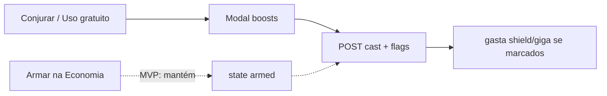

# Mísseis Mágicos: escolhas no cast

**Status:** em espera — **não implementar** até pedido explícito.

## Ideia

No **Mago dos Mísseis** (`magic-missile-mage`), ao conjurar `misseis-magicos` (slot, Dominância ou uso gratuito), perguntar se aplica **Escudo de Mísseis** e/ou **Giga-Míssil** (quando houver usos). O gasto acontece no mesmo `POST` de cast — sem obrigar armar antes na Economia.

## Escopo deste passo

- Só subclasse **magic-missile-mage** + magia **misseis-magicos**.
- **MVP:** modal **e** manter armar (`arm:missile-shield` / `arm:giga-missile`).
- Depois (fora deste plano): remover armar se o modal cobrir o fluxo.
- Não generalizar ainda para aasimar / manobras / outras subclasses (mesmo padrão pode vir depois).

## API

- Estender `CastSpellDto` / payload front: opcionais `applyMissileShield?: boolean`, `applyGigaMissile?: boolean` (ou `missileBoosts[]`).
- Em `cast-spell.ts` / `applyMagicMissileMageOnCast`:
  - Aplicar boost se flag do body **ou** `state.missileShieldArmed` / `gigaMissileArmed`.
  - Gastar o recurso correspondente (comportamento atual).
  - Rejeitar se marcar boost sem usos restantes ou personagem que não seja MM mage.
- Specs: cast com boosts no body sem armar; rejeitar sem uso.

Arquivos-alvo (referência):

- `dnd-api/src/game/session/dto/…` (`CastSpellDto`)
- `dnd-api/src/game/session/infrastructure/character-state/spell/cast-spell.ts`
- `dnd-api/src/game/combat/domain/wizard/features.ts`

## Front

- Em Conjurar / Uso gratuito de Mísseis (só MM mage): modal com checkboxes + usos restantes.
- Confirmar → `useCastSpell` com as flags (+ `freeCastResourceSlug` se free).
- Se nenhum boost disponível: cast direto sem modal (opcional).

Arquivos-alvo (referência):

- `dnd-front/.../beyond/spells/beyond-spell-row.tsx`
- `dnd-front/.../beyond/spells/beyond-spells-tab.tsx`
- `dnd-front/.../api/use-character-state.ts` / `CastSpellPayload`

## Critério de pronto (quando sair da espera)

- Cast com Escudo/Giga escolhidos no modal gasta usos e gera nota.
- Armar antigo ainda funciona.
- Specs verdes.

## Fora

- Remover linhas de armar da Economia.
- Modal genérico multi-subclasse.
- Assinatura de Magia / Dominância (já tratados à parte).
