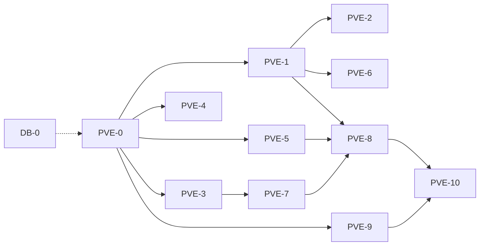

# PVE skirmish + DB greenfield — índice

**Status:** aberto (só planos; execução por pacote)  
**Não é** backlog mesa. Mesa ficha permanece fechada.

SSOT mesa: [`backlog.md`](backlog.md) · Combate legado listado: [`combat-real-deferred.md`](combat-real-deferred.md)  
Duelo PvP: [`pvp-1v1-duel.md`](pvp-1v1-duel.md)

## Produto

1. **PVE** skirmish sem mapa: magias, traços, reações, classe/sub/feat/item tipados + legado morto → 100%.
2. **DB-0** paralelo: schema declarative SSOT; apagar histórico de `database/migrations/` (nada em prod).

## Skills e rules (obrigatório em todo pacote)

Ler [`.cursor/SKILLS-ROUTING.md`](../../.cursor/SKILLS-ROUTING.md) antes de codar.

| Skill | Quando |
|-------|--------|
| `nestjs` | módulos, controllers, DTOs, Swagger |
| `typescript` | tipos, handlers |
| `typeorm` | entities, repos |
| `postgresql-sql` | schema / seeds |
| `catalog-sql-first` | seed/effect/kind/schema de catálogo |
| `domain-driven-design` | fronteira combat / session / catalog |
| `dry` / `solid` | motor compartilhado; fatiar apply |
| `testing` | Jest + specs; smoke `db:setup` no DB |
| `okf` | só se tocar `docs/okf/` |

| Rule | Uso |
|------|-----|
| `nestjs-project.mdc` | Nest |
| `game-folder-conventions.mdc` | `src/game/**` |
| `catalog-sql-first.mdc` | `database/**` |
| `file-size.mdc` | ≤150 TS preferido |
| `typescript-docs.mdc` | sem `//` docs |

Docs: `adr-effect-engine.md` · `effect-dictionary.md` · `effect-engine-read-path.md` · `sql-layout.md` · `code-standards.md`

Command `/legado`: só pacotes de limpeza morta ([`.cursor/commands/legado.md`](../../.cursor/commands/legado.md)).

**Anti-padrões:** JSONB de regra · kind `custom` · handler por slug · migration forward sem prod · seed em migration.

## Como executar

1. Pegar o **menor pacote aberto** respeitando deps.
2. Um pacote = 1–3 PRs; não misturar magias Nv 7 com BM.
3. Feito e testado → **apagar** o `.md` do pacote e tirar desta tabela (política `docs/README.md`).
4. PR cita skills/rules + DoD do pacote.

## Dependências

## Fila (fácil → difícil)

### Banco

| # | Pacote | Doc | Tam. | Dep |
|---|--------|-----|------|-----|
| DB-0 | Reorg migrations greenfield | [`db-0-reorg-migrations.md`](db-0-reorg-migrations.md) | L | — |
| DB-0a | Auditoria + fold enums/effects | [`db-0a-fold-enums-effects.md`](db-0a-fold-enums-effects.md) | M | — |
| DB-0b | Fold runtime (skirmish, flags, wild shape…) | [`db-0b-fold-runtime.md`](db-0b-fold-runtime.md) | M | DB-0a |
| DB-0c | Esvaziar migrations + docs + `db:setup` | [`db-0c-empty-verify.md`](db-0c-empty-verify.md) | S | DB-0b |

### Combate tipado

| # | Pacote | Doc | Tam. | Dep |
|---|--------|-----|------|-----|
| PVE-0 | Motor `resolveCombatSpell` | [`pve-0-combat-spell-engine.md`](pve-0-combat-spell-engine.md) | M | — |
| PVE-1a | Seeds cantrips combate | [`pve-1a-spell-cantrips.md`](pve-1a-spell-cantrips.md) | M | PVE-0 |
| PVE-1b | Seeds magias Nv 1 | [`pve-1b-spell-level-1.md`](pve-1b-spell-level-1.md) | M | PVE-1a |
| PVE-1c | Seeds magias Nv 2–3 | [`pve-1c-spell-level-2-3.md`](pve-1c-spell-level-2-3.md) | M | PVE-1b |
| PVE-2a | Seeds magias Nv 4–6 | [`pve-2a-spell-level-4-6.md`](pve-2a-spell-level-4-6.md) | M | PVE-1c |
| PVE-2b | Seeds magias Nv 7–9 + auditoria | [`pve-2b-spell-level-7-9.md`](pve-2b-spell-level-7-9.md) | M | PVE-2a |
| PVE-3a | Quebra de concentração | [`pve-3a-concentration-break.md`](pve-3a-concentration-break.md) | M | PVE-0 |
| PVE-3b | Arena escuridão + conditions no alvo | [`pve-3b-arena-conditions.md`](pve-3b-arena-conditions.md) | M | PVE-3a |
| PVE-4a | Hook `resolveIncomingHit` + Escudo/Uncanny | [`pve-4a-incoming-hit-defenses.md`](pve-4a-incoming-hit-defenses.md) | M | PVE-0 |
| PVE-4b | OA sem mapa + endpoint react | [`pve-4b-opportunity-attack.md`](pve-4b-opportunity-attack.md) | S | PVE-4a |
| PVE-5a | DTO parity + smites | [`pve-5a-attack-flags-smites.md`](pve-5a-attack-flags-smites.md) | M | PVE-0 |
| PVE-5b | Battle Master no acerto | [`pve-5b-battle-master.md`](pve-5b-battle-master.md) | M | PVE-5a |
| PVE-5c | Estilos GWF/TWF/PAM/Charger | [`pve-5c-fighting-styles.md`](pve-5c-fighting-styles.md) | M | PVE-5a |
| PVE-6a | Metamagia + Eldritch Smite | [`pve-6a-metamagic-eldritch.md`](pve-6a-metamagic-eldritch.md) | M | PVE-1c |
| PVE-6b | Itens charges combate | [`pve-6b-item-charges-combat.md`](pve-6b-item-charges-combat.md) | M | PVE-0 |
| PVE-6c | Resist/vuln/imune no HP | [`pve-6c-damage-resistances.md`](pve-6c-damage-resistances.md) | M | PVE-0 |
| PVE-7a | Spirits/companion na iniciativa | [`pve-7a-spirits-initiative.md`](pve-7a-spirits-initiative.md) | M | PVE-3a |
| PVE-7b | Arma Espiritual + Conjure 1-actor | [`pve-7b-spiritual-conjure.md`](pve-7b-spiritual-conjure.md) | M | PVE-7a |
| PVE-8 | Paridade encontro/duelo + docs | [`pve-8-surface-parity.md`](pve-8-surface-parity.md) | M | PVE-1c+5a+7a |

### Legado → 100%

| # | Pacote | Doc | Tam. | Dep |
|---|--------|-----|------|-----|
| PVE-9a | Sacred Weapon → `toggle_combat_flag` | [`pve-9a-sacred-weapon-flag.md`](pve-9a-sacred-weapon-flag.md) | M | PVE-0 |
| PVE-9b | Zerar slug branches apply/flat-override | [`pve-9b-slug-branch-cleanup.md`](pve-9b-slug-branch-cleanup.md) | L | PVE-9a |
| PVE-10a | Residuals deferred (Ward, Gunslinger, Savage…) | [`pve-10a-deferred-residuals.md`](pve-10a-deferred-residuals.md) | L | PVE-8+9b |
| PVE-10b | `/legado` combate + DoD 100% PVE | [`pve-10b-legado-dod.md`](pve-10b-legado-dod.md) | M | PVE-10a |

### Limpeza de código legado (repo-wide)

| # | Pacote | Doc | Tam. | Dep |
|---|--------|-----|------|-----|
| LEG | Backlog pai | [`legado-cleanup-backlog.md`](legado-cleanup-backlog.md) | — | — |
| LEG-1 | Pastas Game suspeitas | [`legado-1-game-folders.md`](legado-1-game-folders.md) | M | — |
| LEG-2 | Combat domain morto | [`legado-2-combat-domain.md`](legado-2-combat-domain.md) | M | LEG-1 |
| LEG-3 | Entities / Catalog | [`legado-3-entities-catalog.md`](legado-3-entities-catalog.md) | M | LEG-2 |
| LEG-4 | Session + docs planos | [`legado-4-session-docs.md`](legado-4-session-docs.md) | S–M | LEG-3 |

LEG-\* pode correr **em paralelo** ao PVE (não bloqueia magias). LEG-5 combate adapters fecha com PVE-10b.

### Padrão `resolve` (canônico vs legado)

| # | Pacote | Doc | Tam. | Dep |
|---|--------|-----|------|-----|
| RES | Backlog pai | [`resolve-pattern-backlog.md`](resolve-pattern-backlog.md) | — | — |
| RES-1 | Inventário canônico vs legado | [`resolve-1-inventory-docs.md`](resolve-1-inventory-docs.md) | S | — |
| RES-2 | Resolvers de mesa mortos | [`resolve-2-mesa-resolvers.md`](resolve-2-mesa-resolvers.md) | M | RES-1 · LEG-2 |
| RES-3 | `duel-spell-resolve` → motor | [`resolve-3-duel-spell.md`](resolve-3-duel-spell.md) | M | = PVE-0 |
| RES-4 | Maneuver/BM → catálogo | [`resolve-4-maneuver-catalog.md`](resolve-4-maneuver-catalog.md) | L | RES-2 · PVE-5b |
| RES-5 | Sufixo Nest `*.resolver.ts` | [`resolve-5-nest-suffix.md`](resolve-5-nest-suffix.md) | S | RES-2 |

**Não** renomear em massa `resolve-*` de derive (convenção do repo).

### Padrão `legac` / `legacy` (nome/stub — não domínio PHB)

| # | Pacote | Doc | Tam. | Dep |
|---|--------|-----|------|-----|
| LEGAC | Backlog pai | [`legac-pattern-backlog.md`](legac-pattern-backlog.md) | — | — |
| LEGAC-1 | Docs stale | [`legac-1-docs-stale.md`](legac-1-docs-stale.md) | S | — |
| LEGAC-2 | Seeds stub grants | [`legac-2-seed-stubs.md`](legac-2-seed-stubs.md) | M | LEGAC-1 |
| LEGAC-3 | Scripts `legacy*` | [`legac-3-scripts.md`](legac-3-scripts.md) | S | LEGAC-1 |
| LEGAC-4 | TODOs SQL slugs | [`legac-4-sql-todos.md`](legac-4-sql-todos.md) | S–M | LEGAC-2 |

**Manter:** `infernal_legacy`, `legacy_2014_name_en`. **Não** confundir com trilha LEG (`/legado` código morto).

### Quality gate (último)

| # | Pacote | Doc | Tam. | Dep |
|---|--------|-----|------|-----|
| QA | Backlog pai | [`quality-gate-backlog.md`](quality-gate-backlog.md) | — | — |
| QA-1 | Auditoria dos planos `.md` | [`quality-1-plans-audit.md`](quality-1-plans-audit.md) | S | — (já) |
| QA-2 | Gate pós-execução das trilhas | [`quality-2-post-execution.md`](quality-2-post-execution.md) | M | DB-0c+PVE-10b+LEG-4+RES-5+LEGAC-4 |

## Fora de escopo

Mapa/VTT · ranked · XP encontro · polish mesa · preservar histórico de migration

## Critério “PVE 100%”

- Magia ofensiva PHB tipada (utilitária = `slot_only` ok)
- Escape hatch mesa fechado (PVE-9)
- Residuals deferred fechados ou “nunca” justificado (PVE-10a)
- `combat-real-deferred.md` só VTT/XP (ou vazio)
- `database/migrations/` sem SQL de schema (pós DB-0c)
