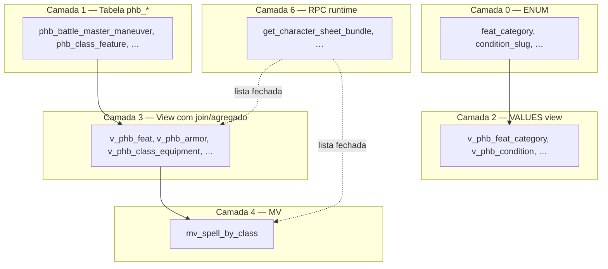

# Preview — refactor views espelho (Decisão 2 ADR)

**Status:** fase 2 aplicada (11 views removidas; entities `Phb*`).  
Inventário SSOT: [`read-model-inventory.md`](read-model-inventory.md).  
ADR: [`adr-read-model-layers.md`](../architecture/adr-read-model-layers.md).

---

## Antes → depois (números)

| Artefato | Antes | Após fase 2 |
|----------|------|-------------|
| Views SQL `v_phb_*` | 50 | **39** (−11) |
| `@ViewEntity` espelho | 11 | **0** |
| `@Entity` combat/progression | 0 | **+12** (+ spell-ref) |
| Materialized views | 1 | 1 |
| RPC JSONB | 3 | 3 |

---

## Mapa de camadas (estado alvo)



**Leitura combat mecânico (GET catalog):** `phb_*` → entity → mapper (sem view intermediária).

---

## Views removidas nesta fase (12)

| View (remove) | Tabela (entity nova ou existente) | Join no TypeORM |
|---------------|-----------------------------------|-----------------|
| `v_phb_battle_master_maneuver` | `phb_battle_master_maneuver` | — |
| `v_phb_beastborne_aspect_benefit` | `phb_beastborne_aspect_benefit` | — |
| `v_phb_dungeoneer_slayer_type` | `phb_dungeoneer_slayer_type` | — |
| `v_phb_gunslinger_maneuver` | `phb_gunslinger_maneuver` | `subclass` → slug |
| `v_phb_cunning_strike_effect` | `phb_cunning_strike_effect` | `subclass` → slug |
| `v_phb_subclass_table_action` | `phb_subclass_table_action` | `subclass` → slug |
| `v_phb_persona_mask` | `phb_persona_mask` | `subclass` → slug |
| `v_phb_class_panel_action` | `phb_class_panel_action` | `class` / `subclass` → slug |
| `v_phb_subclass_precaution_spell` | `phb_subclass_precaution_spell` | `subclass` + `spell` |
| `v_phb_class_feature` | `phb_class_feature` | `class` → slug |
| `v_phb_class_progression` | `phb_class_progression` | `class` → slug |

> **Nota:** `v_phb_class_economy_action` **permanece** (tipo E + MV futura). Só o loader deixa de misturar padrões.

---

## Views que permanecem (amostra por tipo)

| Tipo | Exemplos | Motivo |
|------|----------|--------|
| **A VALUES** | `v_phb_feat_category`, `v_phb_condition` | Decisão 1 ADR |
| **C join** | `v_phb_armor`, `v_phb_spell`, `v_phb_class` | Enriquecimento real |
| **C whitelist** | `v_phb_background_tool_option`, `v_phb_background_skill` | M:N agregável *(fase 2b opcional)* |
| **D/E agregado** | `v_phb_feat`, `v_phb_species_trait_choices` | MV na fase 3 |
| **Bundle** | `v_phb_creature_template_bundle` | MV na fase 4 |
| **MV** | `mv_spell_by_class` | Consumo listagem magias |

---

## Organização TypeORM (preview)

### Hoje

```
src/entities/
  phb-*.entity.ts              # ~28 tabelas (item, species, metamagic, …)
  views/
    v-phb-*.entity.ts          # ~39 views (incl. espelhos combat)
  phb-ability-generation-method.entity.ts   # VALUES view (ok)
src/game/combat/
  combat.module.ts             # registra 9× @ViewEntity combat
  application/load-combat-mechanical-catalog.ts
src/catalog/classes/
  classes.module.ts            # VPhbClassFeature
```

### Depois (fase 2)

```
src/entities/
  phb-*.entity.ts              # +12 combat/progression (ver lista abaixo)
  views/
    v-phb-*.entity.ts          # −12 (só projeções reais)
    mv-spell-by-class.entity.ts  # rename opcional de v-spell-by-class
  phb-ability-generation-method.entity.ts
  phb-feat-category.entity.ts    # NEW opcional: VALUES views agrupadas

src/entities/combat/           # OPCIONAL — só se passar de ~15 entities combat
  phb-battle-master-maneuver.entity.ts
  phb-gunslinger-maneuver.entity.ts
  …
```

**Recomendação:** manter **`src/entities/phb-*.entity.ts` flat** (padrão atual) — evita churn de imports. Subpasta `combat/` só se quiser agrupar visualmente depois.

### Entities novas (12 arquivos)

```
phb-battle-master-maneuver.entity.ts
phb-beastborne-aspect-benefit.entity.ts
phb-dungeoneer-slayer-type.entity.ts
phb-gunslinger-maneuver.entity.ts      # ManyToOne PhbSubclassRef
phb-cunning-strike-effect.entity.ts
phb-subclass-table-action.entity.ts
phb-persona-mask.entity.ts
phb-class-panel-action.entity.ts
phb-subclass-precaution-spell.entity.ts
phb-class-feature.entity.ts
phb-class-progression.entity.ts
```

Reutilizar refs existentes: `phb-subclass-ref.entity.ts`, `phb-class-ref.entity.ts`, `phb-spell` via id.

---

## Organização queries / módulos

| Módulo | Hoje | Depois |
|--------|------|--------|
| `game/combat/combat.module.ts` | `TypeOrmModule.forFeature([VPhbGunslinger…])` | `forFeature([PhbGunslingerManeuver, …])` |
| `load-combat-mechanical-catalog.ts` | `gunslingerRepo.find()` em view | `find({ relations: ['subclass'] })` + mapper |
| `catalog/classes/classes.module.ts` | `VPhbClassFeature` | `PhbClassFeature` + query com `where: { class: { slug } }` |
| `session/.../class-resource-character.queries.ts` | SQL em `v_phb_class_progression` | entity `PhbClassProgression` ou query infra *(lista fechada ADR)* |
| `catalog/combat-mechanical/` | delega `LoadCombatMechanicalCatalog` | sem mudança de contrato HTTP |

**Contrato HTTP** (`CombatMechanicalCatalogResponseDto`) **inalterado** — só muda a origem dos dados.

---

## Baseline SQL (preview diff)

Remover bloco `CREATE VIEW` das 12 views acima em `database/baseline/001_full_schema.sql`.

**Não** remover:
- `v_phb_class_economy_action` (MV futura)
- VALUES views
- agregados / bundles

Validação pós-diff: `db:reset` + `db:migrate:supabase` + `db:seed:supabase`.

---

## Skill / rule (agente)

| Artefato | Conteúdo |
|----------|----------|
| [`adr-read-model-layers.md`](../architecture/adr-read-model-layers.md) | Decisões 1–5 |
| [`.cursor/rules/read-model-layers.mdc`](../../.cursor/rules/read-model-layers.mdc) | Quando view vs tabela vs MV vs RPC |
| [`phb-query-views` SKILL](../../.cursor/skills/phb-query-views/SKILL.md) | Lista o que ainda é view |
| [`rpg-catalog-model` / views.md](../../.cursor/skills/rpg-catalog-model/references/views.md) | Inventário atualizado |

---

## Ordem de execução (PR)

1. **SQL** — drop 12 views no baseline  
2. **Entities** — criar 12 `phb-*`; apagar 12 `views/v-phb-*`  
3. **Modules** — `combat.module`, `classes.module`, `trace-entities-for-vercel`  
4. **Loaders / queries** — joins via relation ou `createQueryBuilder` em `catalog/` / `game/combat/`  
5. **Specs** — mock `Repository<Phb*>` em vez de `VPhb*`  
6. **Docs** — `views.md`, este plano → apagar ao concluir  

---

## Fases seguintes (fora deste PR)

| Fase | Conteúdo |
|------|----------|
| **3** | MV agregados (`mv_phb_feat`, `mv_phb_species_trait_choices`, …) |
| **4** | MV bundles (creature, vehicle, thread) |
| **2b** | Opcional: `background_skill`, `feat_granted_spell`, … (join simples restante) |

---

## Checklist Definition of Done (fase 2)

- [ ] 12 views removidas do baseline
- [ ] 12 entities tabela + modules registrados
- [ ] Zero import de `VPhbBattleMasterManeuver` (etc.) no repo
- [ ] `npm run test:cov` verde nos módulos tocados
- [ ] migrate + seed Supabase OK
- [ ] Plano apagado ou marcado concluído no [`backlog.md`](backlog.md)
