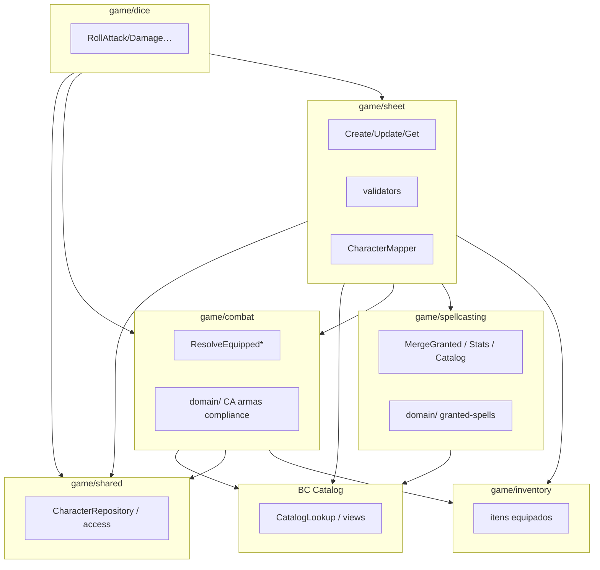

# Plano — extrair submódulos de `sheet` (combat + spellcasting)

Complementa [`game-module-structure.md`](../architecture/game-module-structure.md) e o code health (P0–P8 em [`code-health-plan.md`](code-health-plan.md)).

**Status:** M1+M2+M3 feitos · **Última revisão:** 2026-07-27

## Problema

`sheet/` já tem arquivos ≤200 e pastas por concern, mas continua um **god módulo Nest**:

- CRUD da ficha + validators
- Read-model de combate (CA, ataques, compliance)
- Magias concedidas + catálogo de grants
- Consumidores externos (`dice`) importam `sheet/infrastructure/*`

Incômodo de ownership: abrir `sheet/` e ver combate + magia + persistência juntos.

## Objetivo

Extrair **dois Nest modules** com fronteira clara e **use cases** nomeados (application), sem mudar URLs REST.

```
game/
├── sheet/          # CRUD ficha + validação + persistência de escolhas
├── combat/         # read-model equipado (CA / ataques / compliance)
├── spellcasting/   # grants + merge + stats de conjuração (CD/ataque)
├── dice/           # rolls → combat (equipped) + sheet (domain/repo)
├── inventory/
├── …
```

## Princípios

1. **Um Nest module = uma capability** com `exports` públicos.
2. **Use case = classe/função em `application/`** com nome de intenção (não “Service” genérico).
3. Domain puro continua em `domain/`; I/O de catálogo em `infrastructure/`.
4. **Validators Nest de create/update ficam em `sheet`** — só `sheet` muta escolhas.
5. Sem rename cosmético; mover + ajustar imports; specs verdes por PR.
6. Proibido: `combat` → `sheet`; `spellcasting` → `sheet` (exceto tipos DTO compartilhados se inevitável — preferir tipos em `shared` ou domain próprio).

---

## Use cases (alvo)

### Já existem (ficam em `sheet`)

| Use case | Hoje | Módulo |
|----------|------|--------|
| `ListCharacters` | `list-characters.query.ts` | sheet |
| `GetCharacter` | `get-character.query.ts` | sheet |
| `CreateCharacter` | `create-character.handler.ts` | sheet |
| `UpdateCharacter` | `update-character.handler.ts` | sheet |
| `DeleteCharacter` | `delete-character.handler.ts` | sheet |

`GetCharacter` / `Create` / `Update` **orquestram** slices de combate e spellcasting via DI dos novos módulos (mapper).

### Novos / explicitados em `combat`

| Use case | Responsabilidade | Entrada típica | Saída |
|----------|------------------|----------------|-------|
| `ResolveEquippedArmorClass` | CA com armadura/escudo/UD | personagem + itens equipados | `{ armorClass, armorClassNote }` |
| `ResolveEquippedWeaponAttacks` | Ataques passivos main/off | personagem + armas equipadas | `WeaponAttack[]` |
| `ResolveEquipmentCompliance` | Avisos + flags de treino/Força | personagem + equipamento | `{ warnings, cannotCast…, speedPenalty… }` |
| `ResolveCharacterCombatSlice` *(opcional facade)* | Agrega os três acima | mesmo input do mapper | slice do response DTO |

Implementação: classes Nest em `combat/application/` (`ResolveEquippedArmorClass`, `ResolveEquippedWeaponAttacks`, `ResolveEquipmentCompliance`) + facade `resolveCharacterCombatSlice`.

### Novos / explicitados em `spellcasting`

| Use case | Responsabilidade | Entrada típica | Saída |
|----------|------------------|----------------|-------|
| `LoadGrantedSpellCatalog` | Carregar views de grants | species/feat/subclass slugs | catalogs |
| `MergeGrantedSpells` | Sync always_prepared | spells + context | `CharacterSpellDto[]` |
| `AnnotateSpellSources` | Marcar feat/species/subclass/class | spells + sets | spells com `source` |
| `ResolveSpellcastingStats` | Ability + CD + attack bonus | ficha + catálogo | `{ ability, saveDc, attackBonus }` |
| `ResolveCharacterSpellcastingSlice` *(opcional)* | Agrega annotate + stats | entity + options | slice do response |

Domain puro (`mergeCharacterSpellsWithGrantedSources`, collectors) **move** para `spellcasting/domain/`.  
`CharacterSpellsValidator` **permanece** em `sheet` e **injeta** `LoadGrantedSpellCatalog` / helpers do módulo novo.

### Use cases de `dice` (já existem — só mudam imports)

| Use case | Depende de |
|----------|------------|
| `RollAttack` / `RollDamage` | `ResolveEquippedWeaponAttacks` (exportado por `combat`) |
| `RollSkill` / `RollSavingThrow` / `RollInitiative` | sheet/shared (sem combat) |

---

## Grafo de dependências (alvo)



| De | Para | Permitido |
|----|------|-----------|
| `dice` | `combat`, `shared` | sim |
| `dice` | `sheet` (domain/repo) | sim — ainda necessário para perícia/ST |
| `dice` | `sheet/infrastructure/equipped-*` | **não** |
| `sheet` | `combat`, `spellcasting` | sim |
| `combat` / `spellcasting` | `sheet` Nest providers | **não** |
| `progression` | `spellcasting` (ex. `maxSpellLevelFromSlots`) | sim |

---

## Inventário a mover

### M1 — `game/combat/`

| De (hoje) | Para |
|-----------|------|
| `sheet/domain/combat/*` | `combat/domain/` |
| `sheet/domain/creature-size.ts` | `combat/domain/` (hoje na raiz de `sheet/domain`) |
| `sheet/infrastructure/combat-catalog.service.ts` | `combat/infrastructure/` |
| `sheet/infrastructure/equipped-armor-class.service.ts` | `combat/application/resolve-equipped-armor-class.ts` (`ResolveEquippedArmorClass`) |
| `sheet/infrastructure/equipped-weapon-attacks.service.ts` | `combat/application/resolve-equipped-weapon-attacks.ts` (`ResolveEquippedWeaponAttacks`) |
| `sheet/infrastructure/equipped-equipment-compliance.service.ts` | `combat/application/resolve-equipment-compliance.ts` (`ResolveEquipmentCompliance`) |
| `sheet/infrastructure/mapping/map-character-combat.ts` | `combat/application/resolve-character-combat-slice.ts` (ou mapping/) |

**Fica em sheet:** validators de equipment/weapon mastery (podem importar **tipos/funções puras** de `combat/domain`).

**Exports do `CombatModule`:** `ResolveEquippedWeaponAttacks` (mínimo para dice) + os três resolve + facade do slice + `CombatCatalogService`.

**Specs:** mover `armor-class.spec`, `weapon-attack.spec`, compliance specs junto.

### M2 — `game/spellcasting/`

| De (hoje) | Para |
|-----------|------|
| `sheet/domain/spellcasting/*` | `spellcasting/domain/` |
| `sheet/infrastructure/granted-spell-catalog.service.ts` | `spellcasting/application/load-granted-spell-catalog.ts` (`LoadGrantedSpellCatalog`) |
| `sheet/infrastructure/mapping/map-character-spellcasting.ts` | `spellcasting/application/…` |

**Fica em sheet:** `validation/spells/*` (injeta catálogo/use cases).

**Ajustar:** `progression` → importar `maxSpellLevelFromSlots` de `spellcasting/domain`.

**Exports:** `LoadGrantedSpellCatalog` + re-exports application (`mergeGrantedSpells`, `annotateSpellSources`, `resolveSpellcastingStats`).

### Fora de escopo (não extrair Nest module)

- `validation/feats`, `class-options`, `background` — pastas OK; só `sheet` muta.
- DTOs HTTP de response — podem ficar em `sheet/dto` (contrato do GET character); slices de combate/magia tipados no módulo dono se ajudar.

---

## Fronteiras de PR

### PR M1 — Combat module

1. Criar `src/game/combat/` (`combat.module.ts` + pastas).
2. Mover domain + infra de combate; barrel/reexport temporário em `sheet` **só se** necessário para verde rápido — preferir atualizar imports de uma vez.
3. `CharacterSheetModule` importa `CombatModule`.
4. `CharacterDiceModule` importa `CombatModule` **e** `CharacterSheetModule` (ainda precisa de domain/repo para perícia/ST; só `equipped-*` sai do sheet).
5. Atualizar `character.mapper` / specs / `game-module-structure.md`.
6. Testes: `sheet` + `dice` + specs de combat.

**DoD M1:** `dice` não importa path `sheet/infrastructure/equipped-*`; `sheet` mais magro em providers de combate.

### PR M2 — Spellcasting module

1. Criar `src/game/spellcasting/`.
2. Mover domain granted + infra catalog + mapping slice.
3. Wire create/update/merge + mapper + spells validator.
4. `progression` aponta para novo path.
5. Docs + testes sheet/progression/granted-spells.

**DoD M2:** pasta `sheet/domain/spellcasting` vazia/removida; grants não vivem sob sheet.

### PR M3 — Naming use cases ✅

Renomear `Equipped*Service` → `ResolveEquipped*` / `ResolveEquipmentCompliance` e `GrantedSpellCatalogService` → `LoadGrantedSpellCatalog` **sem** mudar comportamento. Application wrappers para merge/annotate/stats.

---

## Estrutura-alvo de pasta

```
src/game/combat/
├── combat.module.ts
├── application/
│   ├── resolve-equipped-armor-class.ts      # ou *.use-case.ts
│   ├── resolve-equipped-weapon-attacks.ts
│   ├── resolve-equipment-compliance.ts
│   └── resolve-character-combat-slice.ts    # opcional
├── domain/
│   ├── armor-class.ts
│   ├── weapon-attack*.ts
│   ├── equipment-compliance.ts
│   └── …
└── infrastructure/
    └── combat-catalog.service.ts  # adapter de suporte

src/game/spellcasting/
├── spellcasting.module.ts
├── application/
│   ├── load-granted-spell-catalog.ts
│   ├── merge-granted-spells.ts             # thin wrap domain
│   ├── annotate-spell-sources.ts
│   ├── resolve-spellcasting-stats.ts
│   └── resolve-character-spellcasting-slice.ts
├── domain/
│   └── granted-spells/ …
└── infrastructure/
    └── (vazio — catálogo Nest vive em application/)
```

Convenção de nome: preferir verbo + substantivo (`resolve-…`, `merge-…`, `load-…`). Sufixo `.use-case.ts` **opcional** — só se o time adotar de forma consistente.

---

## Riscos

| Risco | Mitigação |
|-------|-----------|
| Ciclo `sheet` ↔ `combat` | Combat não importa sheet; sheet só DI |
| Domain sheet importa infra combat (`CharacterDomainService` → HP bonus via `CombatCatalogService`) | Mover dependência: domain sheet chama use case/port de combat, ou mover HP-bonus catalog para shared/combat export |
| Specs de application sheet mockam Resolve* | Atualizar providers para tokens do `CombatModule` |
| Weapon mastery validator usa `weapon-attack` | Import de `combat/domain` (puro) OK |

---

## Definition of done (rolling)

- [x] `CombatModule` existe; `dice` usa `combat` para equipped (ainda importa `sheet` para domain/repo)
- [x] `SpellcastingModule` existe; grants fora de `sheet/domain`
- [x] Use cases listados acima existem como arquivos `application/` (M3 naming feito)
- [x] [`game-module-structure.md`](../architecture/game-module-structure.md) atualizado
- [x] Specs sheet + dice + combat/spellcasting verdes
- [x] URLs REST inalteradas

## Não fazer neste plano

- Extrair Nest modules por pasta de validator
- Microserviços / novos endpoints
- Reescrever regras D&D
- FSD / Clean dogmático além das camadas já usadas
