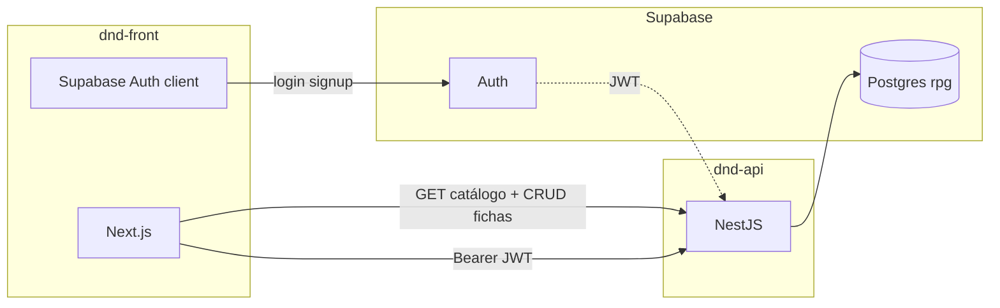

# Roadmap — produto e entrega

Documento de acompanhamento do caminho até um **app consumidor 100% baseado na API** (repo **dnd-front**).

Relacionados: [`api-plan.md`](api-plan.md) · [`game-advanced-plan.md`](game-advanced-plan.md) · [`infrastructure.md`](infrastructure.md) · [`architecture.md`](architecture.md) · [`rpg-web-plan.md`](rpg-web-plan.md) (plano **dnd-front**)

**Como usar:** marque `[x]` ao concluir. Atualize a seção **Status geral** ao fechar cada marco.

---

## Objetivo

| Repo | Papel |
|------|-------|
| **dnd-api** (este) | Postgres PHB + API NestJS + regras de ficha |
| **dnd-front** | Next.js — UI, wizard, ficha; **sem** duplicar regras PHB |

---

## Status geral

| Marco | Progresso | Notas |
|-------|-----------|-------|
| Banco PHB + seeds | **100%** | Local + Supabase (`schema rpg`) |
| Migrations dual-target | **100%** | `npm run db:migrate:all` |
| API catálogo (P0–P3) | **100%** | Ver [`api-plan.md`](api-plan.md) |
| API infra (Swagger, errors, health) | **100%** | `/api` em dev |
| Auth JWT (Identity) | **100%** | JWKS + RLS (Supabase; skip local sem `auth`) |
| Game — ficha PHB (API) | **100%** | CRUD + todas escolhas persistidas |
| Game — domínio D&D | **~85%** | HP, PB, validações ficha; aggregate/VOs opcional |
| Deploy API (Vercel) | — | Responsabilidade do time (fora do escopo atual) |
| **dnd-front** | **~15%** bootstrap | [`rpg-web-plan.md`](rpg-web-plan.md) · `dnd-work/dnd-front/` |
| Prod end-to-end | **0%** | — |

**Última revisão:** 2026-07-03 — ficha PHB completa na API (Fase 4); RLS Supabase

---

## O app pode ser 100% API?

| Camada | Fonte | Observação |
|--------|-------|------------|
| Catálogo PHB (leitura) | **API** | Todas as rotas `GET /classes`, `/spells`, … |
| Fichas (CRUD) | **API** | `Authorization: Bearer` + rotas `/characters` |
| Login / signup | **Supabase client** | Intencional — API só valida JWT |
| Regras D&D (HP, PB, validação) | **API** (`game/domain/`) | Client não recalcula |

**Hoje:** compendium + **criador de ficha PHB completo** → viável via API.  
Próximo passo natural: **Fase 5** (**dnd-front**) — plano em [`rpg-web-plan.md`](rpg-web-plan.md).

---

## Fase 1 — Banco e infra ✅

| Item | Status |
|------|--------|
| Schema `rpg` + migrations granulares | [x] |
| Seeds PHB (391 magias, 12 classes, …) | [x] |
| Supabase remoto populado | [x] |
| Scripts `db:migrate`, `db:seed`, `db:setup` | [x] |
| `.env` local + Supabase documentado | [x] |

---

## Fase 2 — API catálogo ✅

Checklist detalhado em [`api-plan.md`](api-plan.md#checklist-de-módulos-nest-srccatalog).

| Bloco | Status |
|-------|--------|
| Classes, species, backgrounds (P0) | [x] |
| Spells, equipment, feats (P1–P2) | [x] |
| Subclasses + mechanics + spells (P2) | [x] |
| Reference: alignments, languages, character-levels (P3) | [x] |
| Application layer (queries + mappers) | [x] |
| Testes unit + E2E catálogo | [x] |

---

## Fase 3 — API Identity + Game ✅

| Item | Status | Detalhe |
|------|--------|---------|
| `SupabaseAuthGuard` + `@CurrentUser()` | [x] | JWKS via `SUPABASE_URL` |
| `GET/POST/PATCH/DELETE /characters` | [x] | Filtro por `userId` na API |
| Validação slugs PHB no create/update | [x] | `CatalogLookupService` |
| HP máximo derivado (classe + CON) | [x] | `CharacterDomainService` |
| Proficiency bonus na resposta | [x] | Tabela `character-levels` |
| RLS `auth.uid()` no Postgres | [x] | `P004_player_rls.sql` (só Supabase) |
| Level-up (`PATCH` level 2–20) | [x] | HP recalcula; subclasse obrigatória no unlock |
| Log estruturado (sem stack em prod) | [x] | `HttpExceptionFilter` |
| Aggregate + VOs imutáveis | [~] | Opcional — validação em `CharacterSheetValidator` |
| `test:cov` ≥ 80% no CI | [ ] | Quando houver CI |

---

## Fase 4 — Ficha PHB completa (API) ✅

| Escolha do jogador | Catálogo (GET) | Persistência | Campo API |
|--------------------|----------------|--------------|-----------|
| Perícias da classe | `/classes/:slug/skills` | `player_character_skill` | `classSkillSlugs` |
| Traços / linhagem | `/species/:slug/trait-choices` | `player_character_species_choice` | `speciesChoices` |
| Opções de subclasse | `/subclasses/:slug/mechanics` | `player_character_subclass_option` | `subclassOptions` |
| Magias | `/classes/:slug/spells`, `/subclasses/:slug/spells` | `player_character_spell` | `characterSpells` |
| Talentos | `/feats` | `player_character_feat` | `featSlugs` |
| Equipamento inicial | equipment nested | `player_character_equipment` | `equipment` |
| Idiomas | `/languages` | `player_character_language` | `languageSlugs` |
| Método de atributos | `phb_ability_generation_method` | coluna em `player_character` | `abilityGenerationMethodSlug` |
| Perícias do antecedente | catálogo | derivado (read-only) | `backgroundSkillSlugs` |

Migrations: `090_player/P002`–`P004`. Validação: `CharacterSheetValidator`.

---

## Fase 5 — App Next.js (`rpg-web`)

**Plano mestre:** [`rpg-web-plan.md`](rpg-web-plan.md) — stack, UX/UI, skills, fases A–E.

Repo **dnd-front** (`dnd-work/dnd-front/`). Skills front em `dnd-front/.cursor/skills/`.

### 5.1 Setup

| Item | Status |
|------|--------|
| Repo `rpg-web` criado | [ ] |
| `NEXT_PUBLIC_API_URL` + Supabase env | [ ] |
| Client HTTP tipado (OpenAPI ou fetch wrapper) | [ ] |
| CORS: `FRONTEND_URL` na API | [x] (env pronto) |

### 5.2 Auth

| Item | Status |
|------|--------|
| Login / signup (`@supabase/supabase-js`) | [ ] |
| Session + refresh token | [ ] |
| Enviar `Authorization` nas rotas `/characters` | [ ] |

### 5.3 Telas — compendium (só API, sem auth)

| Tela | Rotas API | Status |
|------|-----------|--------|
| Lista de classes | `GET /classes` | [ ] |
| Detalhe classe + subclasses | `GET /classes/:slug`, `/subclasses` | [ ] |
| Magias (lista + filtro por classe) | `GET /spells`, `/classes/:slug/spells` | [ ] |
| Espécies e antecedentes | `GET /species`, `/backgrounds` | [ ] |
| Feats, skills, equipamento | `GET /feats`, `/skills`, `/weapons`, `/armor` | [ ] |

### 5.4 Telas — personagem (API + auth)

| Tela | Rotas API | Status |
|------|-----------|--------|
| Lista minhas fichas | `GET /characters` | [ ] |
| Wizard passo 1–3 (espécie, classe, antecedente) | catálogo + `POST /characters` | [ ] |
| Ficha resumo (atributos, HP, PB) | `GET /characters/:id` | [ ] |
| Editar ficha | `PATCH /characters/:id` | [ ] |
| Wizard completo PHB | depende **Fase 4** | [ ] |

### 5.5 Qualidade front

| Item | Status |
|------|--------|
| Tratamento de erros API (404 slug, 401) | [ ] |
| Loading / empty states | [ ] |
| i18n UI (PT) — nomes PHB já vêm PT da API | [ ] |
| Deploy Vercel (preview + prod) | [ ] |

---

## Fase 6 — Deploy produção

| Item | Status |
|------|--------|
| API na Vercel (`DATABASE_URL` pooler 6543) | [ ] |
| Env prod: `SUPABASE_URL`, `FRONTEND_URL` | [ ] |
| RLS ativo no Supabase prod | [ ] |
| Front na Vercel apontando API prod | [ ] |
| Smoke test: health + GET /classes + POST /characters | [ ] |

---

## Matriz rápida: o que buildar quando

| Se você quer… | Comece por… |
|---------------|-------------|
| Validar dados PHB na UI | **Fase 5.3** — compendium (API já pronta) |
| Login + ficha simples | **Fase 5.2 + 5.4** wizard mínimo |
| Ficha igual ao PHB | **Fase 4** na API, depois wizard completo |
| Subir para usuários reais | **Fase 6** + RLS (**Fase 3**) |

---

## Convenções para atualizar este doc

1. Marcar checkbox quando o item estiver **mergeado e testado** (não WIP).
2. Ajustar **Status geral** e data em **Última revisão**.
3. Detalhes de implementação REST/Swagger → [`api-plan.md`](api-plan.md).
4. Detalhes SQL/tabelas → [`data-model.md`](data-model.md).

---

## Histórico de marcos

| Data | Marco |
|------|-------|
| 2026-07-03 | Catálogo API P0–P3 completo; subclasses; refactor application layer |
| 2026-07-03 | Auth JWKS; CRUD fichas básico; HP/PB domain |
| 2026-07-03 | Supabase remoto com schema `rpg` + seeds; scripts `db:*` |
| 2026-07-03 | Ficha PHB completa: species, subclass options, feats, spells, equipment, languages, RLS |
| 2026-07-03 | Game 7A–7C (level-up, inventário, mesa); modularização BC Game; plano `rpg-web` |
