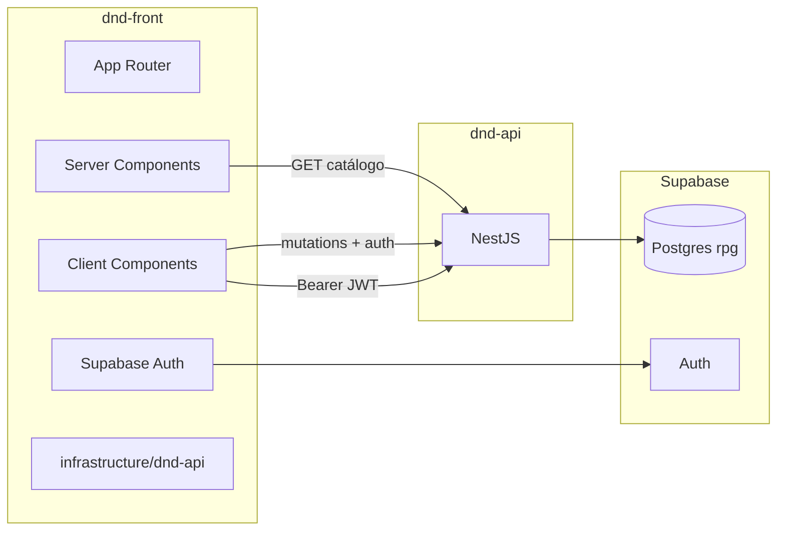

# Plano mestre — `dnd-front` (Next.js)

Documento base para o **frontend**, integração com **`dnd-api`** (API Nest neste monorepo de pastas), stack, UX/UI e skills Cursor.

| Repo | Pasta no disco | Papel |
|------|----------------|-------|
| **dnd-api** | `Projetos/dnd-work/dnd-api/` | Postgres PHB + API NestJS + regras D&D (**este projeto**) |
| **dnd-front** | `Projetos/dnd-work/dnd-front/` | UI Next.js — compendium, wizard, ficha, mesa |

Relacionados (dnd-api): [`product-roadmap.md`](product-roadmap.md) · [`api-plan.md`](api-plan.md) · [`game-module-structure.md`](game-module-structure.md)

**Como usar:** abrir `Projetos/dnd-work/dnd-workspace.code-workspace`. No front: [`../dnd-front/docs/API-INTEGRATION.md`](../dnd-front/docs/API-INTEGRATION.md).

**Última revisão:** 2026-07-03

---

## Nomenclatura

| Nome lógico | O quê | Pasta |
|-------------|-------|-------|
| **dnd-api** | API Nest + banco | `dnd-work/dnd-api/` |
| **dnd-front** | Next.js | `dnd-work/dnd-front/` |

Ambos ficam dentro de **`dnd-work/`** (D&D Work). Abra o workspace multi-root `dnd-work/dnd-workspace.code-workspace`.

---

## 1. Objetivo



---

## 2. Workspace Cursor

```
Projetos/dnd-work/
├── dnd-api/                  ← API (Nest + database/)
├── dnd-front/                ← Next.js (pnpm)
└── dnd-workspace.code-workspace
```

Skills **API** → `dnd-api/.cursor/` · Skills **front** → `dnd-front/.cursor/`

---

## 3. Stack (`dnd-front/`)

| Camada | Escolha | Status |
|--------|---------|--------|
| Next.js 16 + Turbopack | ✅ | |
| **pnpm** | ✅ | |
| Tailwind v4 + shadcn | ✅ | |
| TanStack Query, Zod, RHF | ✅ | |
| Supabase SSR | ✅ | |
| Client HTTP | `src/infrastructure/dnd-api/` | ✅ |

### Portas locais

| Serviço | URL |
|---------|-----|
| **dnd-api** | http://localhost:3000 |
| **dnd-front** | http://localhost:3001 |
| Swagger | http://localhost:3000/api |

---

## 4. Princípios

1. **dnd-api calcula, dnd-front exibe**
2. Catálogo: `catalogFetch` sem auth
3. Game: `gameFetch(path, token)`
4. Migrar wizard legado (`domain/character-sheet/`) → API

---

## 5. Arquitetura front

```
dnd-front/src/
├── app/
├── infrastructure/dnd-api/   # catalogFetch, gameFetch
├── presentation/
└── components/ui/
```

---

## 6. Rotas (Next ↔ dnd-api)

Ver [`api-plan.md`](api-plan.md) e Swagger `/api`.

| Front | API |
|-------|-----|
| `/compendium/classes` | `GET /classes` |
| `/characters` | `GET /characters` (auth) |
| `/characters/[id]/play` | state, inventory, level-up |

---

## 7. UX / UI

Tema Taverna/Masmorra — skill `ui-theme` no front. Compendium lista→detalhe; ficha 3 colunas; mesa com slots e concentração.

---

## 8. Skills Cursor

### `dnd-front/.cursor/skills/`

| Skill | Status |
|-------|--------|
| `dnd-api-client` | ✅ |
| `dnd-architecture`, `dnd-router`, `ui-shadcn`, … | ✅ |
| `dnd-catalog-pages`, `dnd-character-wizard`, `dnd-motion` | [ ] |

### `dnd-api/.cursor/skills/`

`api-consumer-next`, `dnd-glossary-pt`, `nestjs-bounded-context`, …

---

## 9. Env

**dnd-front `.env.local`:**

```env
NEXT_PUBLIC_SUPABASE_URL=...
NEXT_PUBLIC_SUPABASE_PUBLISHABLE_KEY=...
NEXT_PUBLIC_API_URL=http://localhost:3000
```

**dnd-api `.env`:** `FRONTEND_URL=http://localhost:3001` (CORS)

---

## 10. Fases

| Fase | Conteúdo | Status |
|------|----------|--------|
| A | Bootstrap + client HTTP | ✅ parcial |
| B | Compendium | [ ] |
| C | Auth + fichas API | [ ] |
| D | Mesa + wizard API | [ ] |
| E | Deploy Vercel | [ ] |

---

## 11. Comandos

```bash
# dnd-api
cd dnd-work/dnd-api && npm install && npm run start:dev

# dnd-front
cd dnd-work/dnd-front && pnpm install && pnpm dev
```

---

## 12. Histórico

| Data | Nota |
|------|------|
| 2026-07-03 | Plano inicial |
| 2026-07-03 | Nomes finais: **dnd-api** + **dnd-front** |
| 2026-07-03 | Pastas em `dnd-work/`; workspace `dnd-workspace.code-workspace` |
