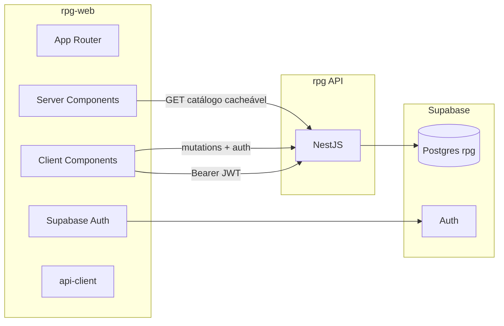

# Plano mestre — `rpg-web` (Next.js)

Documento base para **criar o repo frontend**, definir **stack**, **UX/UI**, **integração com a API** e **skills Cursor** dedicadas.

Relacionados (repo **rpg** / API): [`product-roadmap.md`](product-roadmap.md) · [`api-plan.md`](api-plan.md) · [`game-module-structure.md`](game-module-structure.md) · [`infrastructure.md`](infrastructure.md)

**Como usar:** ao abrir o projeto `rpg-web`, copie este doc para `rpg-web/docs/` (ou mantenha workspace multi-root apontando para ambos). Skills listadas na §8 devem viver em `rpg-web/.cursor/skills/`.

**Última revisão:** 2026-07-03

---

## 1. Objetivo

| Repo | Papel |
|------|-------|
| **rpg** | Postgres PHB + API NestJS + regras D&D (fonte de verdade) |
| **rpg-web** | UI Next.js — compendium, wizard, ficha, mesa; **sem** recalcular HP/PB/slots |



---

## 2. Workspace Cursor (repos irmãos)

Estrutura recomendada no disco:

```
Projetos/
├── rpg/          ← API + banco (este repo)
└── rpg-web/      ← Next.js (novo)
```

### Multi-root workspace

Criar `rpg-workspace.code-workspace` (na pasta pai ou em qualquer um dos repos):

```json
{
  "folders": [
    { "name": "rpg-api", "path": "rpg" },
    { "name": "rpg-web", "path": "rpg-web" }
  ],
  "settings": {
    "typescript.tsdk": "rpg-web/node_modules/typescript/lib"
  }
}
```

**Regra:** skills de **API** ficam em `rpg/.cursor/`; skills de **frontend** em `rpg-web/.cursor/`. O agente no workspace vê os dois — referencie paths absolutos ou `../rpg/docs/` quando precisar do contrato REST.

---

## 3. Stack técnica (decisões)

| Camada | Escolha | Motivo |
|--------|---------|--------|
| Framework | **Next.js 15** App Router | RSC para catálogo, SEO, performance |
| Linguagem | **TypeScript** strict | Alinhado à API |
| Estilo | **Tailwind CSS v4** | Velocidade + design system |
| Componentes | **shadcn/ui** (Radix) | Acessível, customizável, sem lock-in |
| Ícones | **lucide-react** | Padrão shadcn |
| Dados servidor | **fetch** nativo + cache Next | Catálogo público |
| Dados cliente | **TanStack Query v5** | Fichas, inventário, estado de mesa, optimistic UI |
| Validação forms | **Zod** + **react-hook-form** | Espelha DTOs da API |
| Auth | **@supabase/ssr** + **@supabase/supabase-js** | Session cookie + Bearer para API |
| Motion | **motion** (Framer Motion v11+) | Transições wizard, drawers, feedback |
| Lint | **ESLint** (eslint-config-next + typescript-eslint) | CI |
| Format | **Prettier** + **prettier-plugin-tailwindcss** | Ordem de classes |
| Testes (fase 2) | **Vitest** + **Testing Library**; **Playwright** e2e | Após MVP |
| Tipos API (opcional) | OpenAPI → `openapi-typescript` | Gerar de `GET /api-json` Nest |

### Portas locais

| Serviço | URL |
|---------|-----|
| API Nest | `http://localhost:3000` |
| Next dev | `http://localhost:3001` (evita conflito) |
| Swagger | `http://localhost:3000/api` |

---

## 4. Princípios (não negociáveis)

1. **API calcula, UI exibe** — HP max, PB, slots max, validação de ficha: só exibir o que a API devolve; erros 400/403/404 da API são mensagem ao usuário.
2. **Slugs na URL** — `/compendium/classes/fighter`, `/characters/[id]`; IDs UUID só onde a API exige.
3. **Catálogo sem auth** — Server Components + `fetch` sem token; revalidate longo ou `force-cache`.
4. **Game com auth** — Client ou Server com `Authorization: Bearer`; redirect `/login` se 401.
5. **PT na UI** — Nomes PHB já vêm em português da API; labels de formulário em PT; código em inglês.
6. **Sem duplicar domínio** — Não implementar point-buy, level-up ou spell slot tables no front.

---

## 5. Arquitetura do app (`rpg-web/src/`)

```
src/
├── app/                          # App Router
│   ├── (marketing)/              # landing, opcional
│   ├── (auth)/login/ signup/
│   ├── (compendium)/             # público — RSC
│   │   classes/ spells/ species/ backgrounds/ feats/ ...
│   ├── (app)/                    # autenticado
│   │   characters/               # lista + [id] ficha + mesa
│   │   characters/new/           # wizard
│   └── layout.tsx
├── components/
│   ├── ui/                       # shadcn
│   ├── compendium/               # cards, listas, filtros
│   ├── character/                # sheet, inventory, session
│   └── wizard/                   # steps
├── lib/
│   ├── api/                      # client, errors, types
│   │   catalog.ts
│   │   characters.ts
│   │   errors.ts
│   └── supabase/                 # server + browser clients
├── hooks/                        # useCharacter, useInventory, ...
└── styles/                       # globals, tokens D&D
```

### Camada API (`lib/api/`)

```typescript
// Padrão único — skill rpg-web-api-client
export async function apiFetch<T>(
  path: string,
  init?: RequestInit & { token?: string },
): Promise<T> {
  const base = process.env.NEXT_PUBLIC_API_URL!;
  const headers = new Headers(init?.headers);
  headers.set('Content-Type', 'application/json');
  if (init?.token) headers.set('Authorization', `Bearer ${init.token}`);

  const res = await fetch(`${base}${path}`, { ...init, headers });
  if (!res.ok) throw await ApiError.fromResponse(res);
  if (res.status === 204) return undefined as T;
  return res.json();
}
```

- **Catálogo:** funções puras `getClasses()`, `getClass(slug)` — usadas em RSC.
- **Game:** hooks TanStack Query que injetam token do Supabase session.

---

## 6. Mapa de rotas (Next ↔ API)

### Compendium (público)

| Rota Next | API | Notas |
|-----------|-----|-------|
| `/compendium/classes` | `GET /classes` | Paginação `?page=&limit=` |
| `/compendium/classes/[slug]` | `GET /classes/:slug` | + tabs subclasses, spells, equipment |
| `/compendium/spells` | `GET /spells` | Filtro `?search=` |
| `/compendium/spells/[slug]` | `GET /spells/:slug` | |
| `/compendium/species/[slug]` | `GET /species/:slug` | traits em sub-rota API |
| `/compendium/backgrounds/[slug]` | `GET /backgrounds/:slug` | |
| `/compendium/feats` | `GET /feats` | |
| `/compendium/equipment/weapons` | `GET /weapons` | |

### App (auth)

| Rota Next | API |
|-----------|-----|
| `/characters` | `GET /characters` |
| `/characters/new` | wizard → `POST /characters`, `POST /characters/roll-abilities` |
| `/characters/[id]` | `GET /characters/:id` |
| `/characters/[id]/edit` | `PATCH /characters/:id` |
| `/characters/[id]/inventory` | `GET/POST/PATCH/DELETE .../inventory` |
| `/characters/[id]/play` | `GET/PATCH .../state`, `POST .../spells/cast`, `POST .../rest` |
| `/characters/[id]/level-up` | `GET .../level-up/preview`, `POST .../level-up` |

Lista completa de endpoints: Swagger `http://localhost:3000/api` ou [`api-plan.md`](api-plan.md).

---

## 7. UX / UI

### Persona e tom

- Jogador de D&D 5e/2024, mesa online ou solo.
- Tom: **fantasia moderna** — legível, não “medieval fake”; confiança nos números da ficha.

### Informação visual

| Área | Padrão |
|------|--------|
| Compendium | Lista → detalhe; busca; breadcrumb `Compendium > Classes > Guerreiro` |
| Ficha | Layout **3 colunas** desktop (atributos | núcleo | combate/magia); **abas** mobile |
| Wizard | Stepper 5–7 passos; salvar rascunho local opcional; resumo antes de `POST` |
| Mesa (`/play`) | HP bar, slots por círculo, concentração destacada, condições como chips |
| Erros API | Toast + texto de `message`; 401 → login |

### Design tokens (Tailwind / CSS variables)

```css
/* Tema escuro-first (mesa de RPG) */
--background: oklch(0.14 0.02 280);
--foreground: oklch(0.95 0.01 280);
--primary: oklch(0.65 0.15 45);      /* âmbar / d20 */
--accent: oklch(0.55 0.12 300);     /* magia */
--destructive: oklch(0.55 0.2 25);
--muted: oklch(0.22 0.02 280);
--radius: 0.5rem;
```

- Fonte UI: **Inter** ou **Geist**; títulos opcional **Cinzel** ou **Literata** (uso parcimonioso).
- Cards com borda sutil + `backdrop-blur` em painéis flutuantes.

### Motion (quando usar)

| Situação | Animação | Evitar |
|----------|----------|--------|
| Troca de step wizard | slide + fade 200ms | Parallax pesado |
| Abrir drawer ficha | spring curto | Animação em listas longas compendium |
| HP / slot gasto | pulse no número | Loop infinito |
| Page transition app | `layoutId` opcional | Motion em cada card da lista |

Skill dedicada: **`rpg-web-motion`** (§8).

### Acessibilidade

- Contraste WCAG AA no tema escuro.
- Focus visible em todos os controles shadcn.
- `aria-live` em toasts de dado de ficha alterado pela API.

---

## 8. Skills Cursor — mapa completo

Skills **do frontend** vivem em `rpg-web/.cursor/skills/`. Skills **da API** permanecem em `rpg/.cursor/` — não duplicar; linkar.

### 8.1 Skills a criar em `rpg-web` (prioridade)

| Skill | Pasta | Quando usar | Conteúdo mínimo |
|-------|-------|-------------|-----------------|
| **rpg-web-api-client** | `.cursor/skills/rpg-web-api-client/` | Qualquer fetch à API | `apiFetch`, `ApiError`, auth header, base URL, tipos de erro `{ statusCode, message }` |
| **rpg-web-supabase-auth** | `.cursor/skills/rpg-web-supabase-auth/` | Login, middleware, session | `@supabase/ssr`, cookie, `getSession`, passar token ao client |
| **rpg-web-catalog-pages** | `.cursor/skills/rpg-web-catalog-pages/` | Páginas compendium | RSC, paginação, `generateStaticParams` para slugs populares, revalidate |
| **rpg-web-character-wizard** | `.cursor/skills/rpg-web-character-wizard/` | Wizard criação | Steps, Zod schemas alinhados a `CreateCharacterDto`, roll-abilities |
| **rpg-web-character-sheet** | `.cursor/skills/rpg-web-character-sheet/` | Ficha + edit | Tabs, PATCH parcial, exibir `backgroundSkillSlugs` read-only |
| **rpg-web-session-ui** | `.cursor/skills/rpg-web-session-ui/` | Mesa / play | state, cast, rest, slots UI, concentração |
| **rpg-web-ui-system** | `.cursor/skills/rpg-web-ui-system/` | Componentes visuais | shadcn install, tokens, layout, PageHeader, EmptyState |
| **rpg-web-motion** | `.cursor/skills/rpg-web-motion/` | Animações | motion patterns, reduced-motion, durações |
| **rpg-web-performance** | `.cursor/skills/rpg-web-performance/` | Otimização | RSC vs client, TanStack staleTime, prefetch, bundle, imagens |
| **rpg-web-forms** | `.cursor/skills/rpg-web-forms/` | Formulários | react-hook-form + Zod, erros 400 da API → field errors |

### 8.2 Skills reutilizadas do repo `rpg` (referência)

| Skill (em `rpg/.cursor/`) | Uso no front |
|---------------------------|--------------|
| `api-consumer-next` | CORS, env, contrato geral |
| `dnd-glossary-pt` | Labels PT consistentes |
| `supabase-auth` | Entender JWT (lado API) |

### 8.3 Rules sugeridas em `rpg-web/.cursor/rules/`

| Rule | Escopo |
|------|--------|
| `00-orchestrator.mdc` | Aponta para `docs/rpg-web-plan.md` |
| `api-client.mdc` | Sempre usar `lib/api`; nunca fetch solto |
| `no-domain-logic.mdc` | Proibir cálculo HP/PB/slots no front |
| `ui-tokens.mdc` | Cores/spacing do design system |
| `motion.mdc` | Usar skill motion; respeitar `prefers-reduced-motion` |

### 8.4 Template SKILL.md (copiar ao bootstrap)

```markdown
---
name: rpg-web-api-client
description: Cliente HTTP tipado para API Nest rpg — auth Bearer, erros, env NEXT_PUBLIC_API_URL. Use em qualquer feature que chame a API.
---

# API Client (rpg-web)

## Base
- `NEXT_PUBLIC_API_URL` — sem trailing slash
- Catálogo: sem Authorization
- `/characters/*`: Bearer do Supabase session

## Erros
- Parse `{ statusCode, message, path }`
- 401 → redirect login
- 403 → toast "Sem permissão"

## Referência
- Contrato: ../rpg/docs/api-plan.md (workspace) ou Swagger /api
```

---

## 9. Variáveis de ambiente (`rpg-web/.env.local`)

```env
# Supabase (mesmo project da API)
NEXT_PUBLIC_SUPABASE_URL=https://xxx.supabase.co
NEXT_PUBLIC_SUPABASE_ANON_KEY=eyJ...

# API Nest
NEXT_PUBLIC_API_URL=http://localhost:3000

# Site (opcional — metadata, CORS já usa FRONTEND_URL na API)
NEXT_PUBLIC_SITE_URL=http://localhost:3001
```

**Produção:** `NEXT_PUBLIC_API_URL=https://sua-api.vercel.app`

**API (repo rpg):** configurar `FRONTEND_URL=https://seu-rpg-web.vercel.app` para CORS.

---

## 10. Fases de implementação

### Fase A — Bootstrap (dia 1)

- [ ] `create-next-app` + TypeScript + Tailwind + ESLint + Prettier
- [ ] shadcn init; tema escuro
- [ ] `lib/api` + `lib/supabase`
- [ ] Layout shell (nav: Compendium | Minhas fichas | Login)
- [ ] Skills §8.1 (pelo menos api-client, ui-system, supabase-auth)
- [ ] `.cursor/rules/` mínimas

### Fase B — Compendium MVP

- [ ] `/compendium/classes` + `[slug]` com tabs (subclasses, spells)
- [ ] `/compendium/spells` + `[slug]`
- [ ] Loading skeleton + empty + 404 slug
- [ ] Skill `rpg-web-catalog-pages`

### Fase C — Auth + fichas

- [ ] Login / signup Supabase
- [ ] Middleware protegendo `(app)/`
- [ ] `GET /characters` lista
- [ ] Wizard mínimo: espécie + classe + antecedente → `POST /characters`
- [ ] Ficha resumo `GET /characters/:id`

### Fase D — Ficha completa + mesa

- [ ] Wizard PHB (skills, spells, equipment, species choices)
- [ ] `roll-abilities` no wizard
- [ ] Inventário UI
- [ ] `/play` — state, cast, rest
- [ ] Level-up flow

### Fase E — Qualidade + deploy

- [ ] Playwright smoke: compendium + login + create character
- [ ] Vercel preview + env prod
- [ ] Lighthouse (performance ≥ 90 em compendium)

---

## 11. Comandos bootstrap (referência)

```bash
# Na pasta irmã de rpg/
npx create-next-app@latest rpg-web --typescript --tailwind --eslint --app --src-dir --import-alias "@/*"

cd rpg-web
npx shadcn@latest init
npm install @supabase/supabase-js @supabase/ssr @tanstack/react-query zod react-hook-form @hookform/resolvers motion

# Prettier
npm install -D prettier prettier-plugin-tailwindcss
```

`package.json` scripts sugeridos:

```json
{
  "scripts": {
    "dev": "next dev -p 3001",
    "build": "next build",
    "lint": "eslint .",
    "format": "prettier --write \"src/**/*.{ts,tsx,css,md}\"",
    "typecheck": "tsc --noEmit"
  }
}
```

---

## 12. Checklist “pronto para codar”

| Item | Repo rpg | Repo rpg-web |
|------|----------|--------------|
| API catálogo + game | ✅ | — |
| Migrations Supabase | ✅ | — |
| Swagger `/api` | ✅ | — |
| CORS `FRONTEND_URL` | configurar ao deploy | — |
| Este plano | ✅ | copiar/linkar |
| Skills §8 | referência | criar na bootstrap |
| Supabase Auth app URL | dashboard | redirect URLs localhost:3001 |

---

## 13. Histórico

| Data | Nota |
|------|------|
| 2026-07-03 | Plano inicial pós-fechamento backend 7A–7C |
