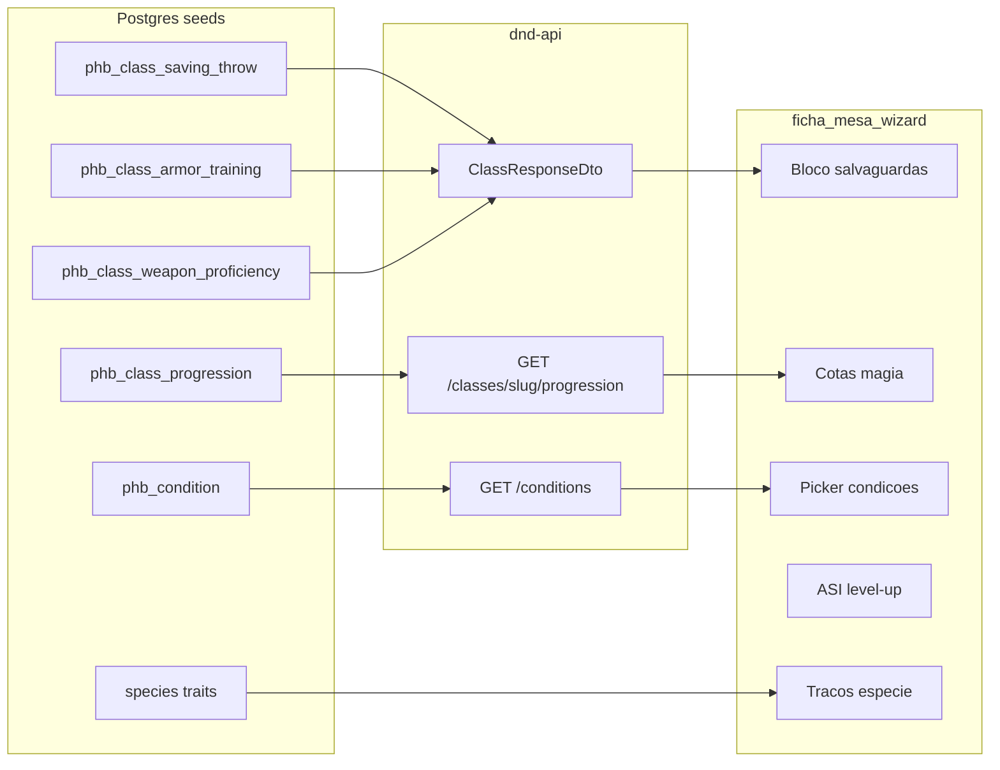

# Plano — Sheet readiness (catálogo → ficha)

Documento de planejamento para **expor e usar na ficha/mesa** dados PHB 2024 que já existem no Postgres (ou quase), mas ainda não chegam à UI de forma confiável: salvaguardas, proficiências, traços de espécie, condições, progressão/cotas de magia e ASI no level-up.

| | |
|--|--|
| **Repos** | dnd-api (views, DTOs, endpoints) + dnd-front (ficha, mesa, wizard) |
| **Última revisão** | 2026-07-19 |
| **Status** | Planejado — nenhuma fase implementada neste documento |
| **Relacionados** | [`product-roadmap.md`](product-roadmap.md) · [`game-advanced-plan.md`](game-advanced-plan.md) · [`data-model.md`](data-model.md) · front [`CHARACTER-SHEET-PLAN.md`](../../dnd-front/docs/CHARACTER-SHEET-PLAN.md) |

**Princípio:** o front **coleta escolhas** e **exibe**; a API **valida e computa**. Zero regras PHB hardcoded no front.

### Progresso desta entrega

- [x] Fase 0 — Auditoria / contrato (shapes fechados neste doc)
- [x] Fase 1 — API: salvaguardas + proficiências de classe (`ClassProficienciesQuery` + detalhe)
- [x] Fase 2 — Ficha: ST + traços de espécie
- [x] Fase 3 — Mesa: picker de condições (`GET /conditions`)
- [ ] Fase 4 — Progressão / cotas de magia
- [ ] Fase 5 — Level-up ASI guiado (+2 / +1)
- [ ] Fase 6 — Backlog (idiomas concedidos, feat options, inventário, mesa avançada)

---

## 1. Problema

O **compêndio** (classes, espécies, antecedentes, perícias, talentos, subclasses, equipamento, idiomas, magias) está completo o bastante para o hub. O wizard e a ficha MVP já criam e jogam.

Ainda assim, a mesa “parece incompleta” porque:

- Salvaguardas e treino de arma/armadura **existem no seed**, mas **não no `ClassResponseDto`** → a ficha não mostra ST nem proficiências.
- Traços fixos de espécie têm **`GET /species/:slug/traits`**, mas a ficha foca em **escolhas** (`speciesChoices`).
- Condições estão em `rpg.phb_condition` (slugs EN + nomes PT); a mesa usa **texto livre** → fácil 400 na API.
- `phb_class_progression` tem cantrips / prepared / channel divinity; a API só expõe bem **spell-slots**.
- Level-up marca marco ASI, mas manda o jogador **editar Atributos** em vez de escolher +2/+1 no fluxo.

Não falta “mais um catálogo grande”. Falta **ligar o que já está no DB à ficha**.

---

## 2. Estado atual (auditoria)

### 2.1 Já no DB (seeds / schema)

| Tabela / fonte | Conteúdo | Exposto na API? | Usado na ficha/wizard? |
|----------------|----------|-----------------|------------------------|
| `phb_class_saving_throw` | ST por classe | Não | Não |
| `phb_class_armor_training` | Categorias de armadura | Não | Não |
| `phb_class_weapon_proficiency` | Prof. de arma | Não | Não |
| `phb_class_progression` | PB, cantrips, prepared, channel divinity por nível | Parcial (slots via `v_class_spell_slots`) | Não (cotas) |
| `phb_condition` | 15 condições (slug EN, name PT) | Só validação no PATCH de state | Texto livre na UI |
| Species traits | `GET /species/:slug/traits` | Sim | Só choices na ficha |
| Class features / spells / skills / equipment | Endpoints de classe | Sim | Sim |
| Background skills / tools / feat / equipment / boosts | Endpoints de antecedente | Sim | Sim |

Referências SQL: [`database/schema.sql`](../database/schema.sql) (`phb_class_saving_throw`, `phb_class_armor_training`, `phb_class_weapon_proficiency`, `phb_class_progression`); seed condições em [`P006_player_character_state.sql`](../database/migrations/090_player/P006_player_character_state.sql).

### 2.2 Front hoje

| Área | Arquivo | Comportamento |
|------|---------|---------------|
| Salvaguardas | — | Sem bloco dedicado |
| Espécie | `sheet-read-sections.tsx` (`SpeciesChoicesSection`) | Escolhas; sem lista completa de traits |
| Condições | `table-state-section.tsx` | Input texto → split por vírgula |
| Level-up ASI | `level-up-section.tsx` | Aviso + picker de talento; ASI via seção Atributos |
| Magias (wizard) | `step-spells.tsx` | Lista opcional; sem quota cantrip/prepared |

### 2.3 Contrato desejado (decisões)

| Tema | Decisão |
|------|---------|
| ST + proficiências | Campos no **detalhe da classe** (`ClassResponseDto` / view enriquecida), não catálogo isolado |
| Progressão | `GET /classes/:slug/progression` (linhas por nível: PB, cantrips, prepared, channel divinity) — separado de spell-slots |
| Condições | `GET /conditions` (lista slug + name) + picker multi-select na mesa |
| ASI no level-up | **+2 e +1 em atributos distintos** (mesmo padrão do boost de antecedente); alternativa “talento” já existe |
| Idiomas concedidos / inventário / death saves | Fase 6 (backlog) |



---

## 3. Fases

### Fase 0 — Auditoria / contrato

**Objetivo:** fechar shapes de resposta e checklist antes de codar.

- [ ] Confirmar contagens seed (ST por classe, armor categories, weapon proficiencies, progression 1–20, conditions)
- [ ] Definir campos DTO (exemplos abaixo) e se precisa **view SQL nova** ou joins no query
- [ ] Atualizar [`api-plan.md`](api-plan.md) / contrato interno quando a Fase 1/3/4 mergear
- [ ] Marcar Fase 0 `[x]` neste doc

**Shape sugerido — detalhe de classe (Fase 1):**

```ts
savingThrowSlugs: string[];       // ex.: ['forca', 'constituicao']
savingThrowNames: string[];
armorTrainingSlugs: string[];     // ex.: ['light', 'medium', 'shield']
armorTrainingNames: string[];
weaponProficiencySlugs: string[];
weaponProficiencyNames: string[];
```

**Shape sugerido — progressão (Fase 4):**

```ts
// GET /classes/:slug/progression → { data: ClassProgressionRow[], meta }
{
  level: number;
  proficiencyBonus: number;
  cantrips: number | null;
  preparedSpells: number | null;
  channelDivinity: number | null;
}
```

**Shape sugerido — condições (Fase 3):**

```ts
// GET /conditions → { data: { slug: string; name: string }[] }
```

---

### Fase 1 — API: salvaguardas + proficiências de classe

**Objetivo:** qualquer consumidor (ficha, compêndio, labels) recebe ST e treinos no detalhe da classe.

| Camada | Trabalho |
|--------|----------|
| SQL / entity | View `v_phb_class` enriquecida **ou** queries auxiliares agregando arrays (preferir view se já for o padrão do projeto) |
| API | Estender [`ClassResponseDto`](../src/catalog/classes/dto/class-response.dto.ts), mapper, `FindClassBySlugQuery` / list se fizer sentido |
| Testes | Jest em `classes.queries.spec.ts` |
| Compêndio | Opcional: bloco no detalhe de classe (`class-detail-view.tsx`) — baixo esforço se DTO já vier preenchido |

**Done when:** `GET /classes/fighter` (ex.) devolve ST + armor + weapon arrays não vazios; testes verdes.

---

### Fase 2 — Ficha: ST + traços de espécie

**Objetivo:** leitura da ficha mostra mecânica de defesa e origem biológica.

| Camada | Trabalho |
|--------|----------|
| Front | Bloco **Salvaguardas** (proficiência da classe + modificador derivado dos atributos da ficha) em `sheet-read-sections.tsx` / `character-sheet-view.tsx` |
| Front | Seção **Traços da espécie**: consumir `GET /species/:slug/traits` + speed/size do detalhe de espécie; manter `SpeciesChoicesSection` para escolhas |
| Labels | Reutilizar catálogo de classe já cacheado (`useClassDetail` / labels existentes) |

**Done when:** ficha de Guerreiro mostra ST corretas; ficha de Elfo lista traços fixos além das choices.

---

### Fase 3 — Mesa: picker de condições

**Objetivo:** zero texto livre para condições; slugs sempre válidos.

| Camada | Trabalho |
|--------|----------|
| API | `GET /conditions` (paginado ou lista curta; entity [`phb-condition.entity.ts`](../src/game/session/infrastructure/phb-condition.entity.ts)) |
| Front | Trocar input em [`table-state-section.tsx`](../../dnd-front/src/features/character-sheet/ui/table-state-section.tsx) por multi-select (slug EN persistido, label PT na UI) |
| UX | Espelhar padrão do picker de concentração |

**Done when:** PATCH de state só envia slugs do catálogo; UI não permite digitar lixo.

---

### Fase 4 — Progressão / cotas de magia

**Objetivo:** wizard e ficha conhecem limites de cantrips / prepared do nível.

| Camada | Trabalho |
|--------|----------|
| API | `GET /classes/:slug/progression` a partir de `phb_class_progression` |
| Front wizard | [`step-spells.tsx`](../../dnd-front/src/features/create-character/ui/steps/step-spells.tsx): mostrar cotas; bloquear ou avisar acima do limite |
| API validator | Soft (aviso) → hard (400) quando maduro; **não** nesta fase: regras full known vs prepared por arquétipo |
| Ficha | Exibir cotas no bloco de magias (opcional na mesma fase) |

**Done when:** mago nível 1 vê limite de cantrips/prepared; API devolve progressão 1–20.

**Fora desta fase:** validação completa de lista prepared vs known por classe/subclasse.

---

### Fase 5 — Level-up ASI guiado

**Objetivo:** no marco ASI, escolher +2/+1 **no próprio level-up**, sem ir à seção Atributos.

| Camada | Trabalho |
|--------|----------|
| Front | Em [`level-up-section.tsx`](../../dnd-front/src/features/character-sheet/ui/level-up-section.tsx): selects +2 e +1 (atributos distintos) **ou** talento (já existente) |
| API | Aceitar boosts no payload de `POST .../level-up`; validar no serviço de progression |
| Regras | Mesmo espírito do boost de antecedente: dois atributos diferentes; não stackar +2 no mesmo |

**Done when:** level-up em nível de ASI aplica +2/+1 numa request; opção talento continua funcionando.

---

### Fase 6 — Backlog (não bloqueia 1–5)

| Item | Notas |
|------|-------|
| Idiomas concedidos (espécie / antecedente) | Hoje checklist livre no wizard; pode exigir seed/tabela |
| Mais `feat_option_def` | Só Magic Initiate, Skilled, Fey/Shadow Touched bem cobertos |
| Validação de proficiência no inventário | Mencionado em [`game-advanced-plan.md`](game-advanced-plan.md) |
| Death saves / inspiração / iniciativa | Mesa avançada / campanha |
| Fighting styles como `GET` dedicado | Hoje indireto via subclass options |

---

## 4. Fora de escopo deste plano

- Deploy produção (Fase 6 do [`product-roadmap.md`](product-roadmap.md))
- Campanha / iniciativa (7D)
- E2E browser completo
- Redesign UX/UI (ver [`UX-UI-PLAN.md`](../../dnd-front/docs/UX-UI-PLAN.md))
- Novos catálogos grandes no hub (compêndio feats/skills/equipment já entregues)

---

## 5. Ordem sugerida de implementação

1. Fase 0 (contrato) → Fase 1 (API classe) → Fase 2 (ficha ST/traits) — valor imediato na leitura
2. Fase 3 (condições) — bug de mesa frequente
3. Fase 4 (progressão) — conjuradores
4. Fase 5 (ASI) — polish de progressão
5. Fase 6 conforme demanda

---

## 6. Verify (por fase)

### API

```bash
# no dnd-api
npm test -- --testPathPattern=classes.queries.spec --no-coverage
# smoke após cada endpoint novo
curl -s http://127.0.0.1:3000/classes/fighter | jq '.savingThrowSlugs, .armorTrainingSlugs'
curl -s http://127.0.0.1:3000/classes/wizard/progression | jq '.meta, .data[0]'
curl -s http://127.0.0.1:3000/conditions | jq '.data[:3]'
```

### Front

```bash
# no dnd-front
pnpm lint && pnpm test
```

### Checklist manual

- [ ] Ficha: ST batem com a classe; traits de espécie listados
- [ ] Mesa: condições só via picker; PATCH ok
- [ ] Wizard mago: cotas visíveis (Fase 4)
- [ ] Level-up ASI: +2/+1 persiste sem editar Atributos (Fase 5)

---

## 7. Convenções

1. Marcar `[x]` na checklist de progresso **só quando mergeado e testado**.
2. Atualizar **Última revisão** e **Status** ao fechar cada fase.
3. Ao expor views TypeORM, preferir **nomes de coluna SQL** em `andWhere` de QueryBuilder em views (lição do filtro de armadura `category_slug`).
4. Documentar endpoints novos no contrato / `api-plan.md` na mesma PR da API.
